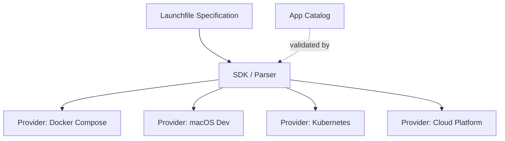

# Launchfile Design Document

**Status**: Active
**Format version**: `launch/v1`
**Last updated**: 2026-04-05

This document captures the institutional knowledge from the Launchfile design process: principles, decisions, trade-offs, known limitations, and references. It is the authoritative record of *why* the format is the way it is.

---

## 1. Design Principles

Thirteen principles organized in three categories govern every decision in the format.

### Format Philosophy

#### P-1: App-focused, not infra-focused

A Launchfile describes what an app *is* and what it *needs*, not how the infrastructure satisfies those needs. An app declares `requires: postgres`; the platform decides whether that means a Docker container, an RDS instance, or a shared cluster. The file belongs in the app repo, not in an infrastructure repo.

#### P-2: Incrementally adoptable

Three lines is a valid file (name, runtime, start command). A hundred lines can describe a multi-component monorepo with shared secrets, health checks, and startup ordering. Authors pay complexity cost only for the complexity they actually have. The single-component shorthand (fields at top level) and multi-component form (`components:` map) coexist in one schema.

#### P-3: Machine-generatable

AI can read a repository's structure (Dockerfile, package.json, requirements.txt, docker-compose.yml) and produce a valid Launchfile. The Zod schema provides validation. The format avoids constructs that are hard for language models to produce correctly (custom YAML tags, multi-document streams, complex anchors).

#### P-4: Human-writable

A developer who has never seen the format should be able to write a correct file in two minutes without reading documentation. Scalar shorthands (`requires: [postgres]`, `health: /health`, `build: "."`) cover the common case; expanded object forms are available when needed.

#### P-5: Provider-translatable

The same Launchfile can be translated to Docker Compose for local development, Kubernetes manifests for production, Fly.io config, AWS ECS task definitions, or any other platform. The format captures intent; translators map intent to platform-specific configuration.

### Syntax Philosophy

#### P-6: It's just YAML

No custom YAML tags (`!ref`, `!secret`), no DSL embedded in strings, no templating engine. The file parses with any YAML 1.2 parser. Tooling (linters, formatters, IDE support) works out of the box.

#### P-7: Simple things simple, complex things possible

The `$` syntax scales from trivial (`$url`) through moderate (`${host}:${port}`) to advanced (`${port:-5432}`). Each step adds exactly one concept: bare reference, embedded reference, default value. No step requires learning a fundamentally different syntax.

#### P-8: Familiar idioms

`$prop` comes from Bash variable expansion. Dot-paths (`$postgres.host`, `$components.backend.url`) follow JavaScript and Terraform conventions. The `:-` default separator matches POSIX shell parameter expansion. Developers recognize these patterns without explanation.

#### P-9: Unambiguous by convention

A `$` prefix always means "resolve this at deployment time." No `$` means the value is a literal string. `$$` escapes to a literal `$`. There is exactly one way to determine whether a string contains expressions: scan for unescaped `$` characters.

#### P-10: Source of truth is co-located

Environment variables injected by a resource are declared on that resource via `set_env`, not pulled from a separate env var definition. This keeps the wiring visible where the dependency is declared. When you read a `requires:` block, you see both what the app needs and how the resource properties flow into the app's environment.

### Architecture Philosophy

#### P-11: Separate intent from execution

`requires: postgres` is intent. Whether the orchestrator provisions a Docker container, creates an RDS instance, or reuses a shared cluster is execution. The format never prescribes execution strategy.

#### P-12: 12-factor by default

The format's structure naturally guides apps toward 12-factor compliance. Configuration lives in `env:`. Backing services are attached resources via `requires:`. Build, release, and run are distinct lifecycle phases via `commands:`. Port binding is explicit via `provides:`. See Section 2 for the full mapping.

#### P-13: Additive extensibility

The format evolves by adding new fields, never new syntax. A v1 parser ignores unknown fields gracefully. No existing field changes meaning across versions. The `version` header enables breaking changes if absolutely necessary, but the design minimizes the need.

---

## 1b. Governance Heuristics

These heuristics support the [governance model](GOVERNANCE.md) by making the design principles machine-applicable. They help the AI Steward evaluate proposals consistently and help Authors calibrate overrides.

### Principle Precedence

When principles conflict, higher-tier principles take priority:

- **Tier 1 (inviolable):** P-1 (app-focused, not infra-focused), P-13 (additive extensibility), P-6 (it's just YAML)
- **Tier 2 (strong):** P-11 (separate intent from execution), P-5 (provider-translatable), P-12 (12-factor by default)
- **Tier 3 (guiding):** P-2 (incrementally adoptable), P-3 (machine-generatable), P-4 (human-writable), P-7 (simple things simple), P-8 (familiar idioms), P-9 (unambiguous by convention), P-10 (source of truth co-located)

Tier 1 principles are never violated. Tier 2 principles are violated only when required to satisfy a Tier 1 principle, with documented reasoning. Tier 3 principles guide design choices but may yield to stronger constraints.

### Platform-Agnostic Litmus Test

P-1 draws the line between app concerns and infrastructure concerns. The test: **a field is platform-agnostic if changing the deployment target does not change the field's value.** `runtime: node` passes (it describes the app regardless of platform). `replicas: 3` fails (it prescribes execution strategy that varies by platform).

### Niche Field Threshold

The reject criterion "solves one app's problem but adds complexity for everyone" is quantified as: **a field is niche if fewer than 10% of catalog apps would use it.** Niche fields are not automatically rejected — they require stronger motivation (a compelling use case that cannot be solved by existing fields or orchestrator-level configuration).

**Complexity cost** distinguishes two categories: schema-only additions (new optional fields parsed by the existing engine) carry low cost. Parser or resolver changes (new syntax, new resolution rules) carry high cost and require proportionally stronger motivation.

### Uncertainty Escalation

The AI Steward assigns a confidence level to each evaluation:

- **High** — the proposal clearly passes or fails the principles with precedent support
- **Medium** — the proposal is plausible but involves trade-offs not covered by existing D-\* decisions
- **Low** — the proposal falls outside the scope of documented principles or creates novel precedent

Medium and low confidence evaluations are marked as **DEFER** and escalated to Authors for decision. The resulting Author decision becomes a new D-\* entry, expanding the precedent base.

---

## 2. 12-Factor Alignment

The Launchfile format maps naturally to the [12-Factor App](https://12factor.net/) methodology:

| 12-Factor Principle | Launchfile Field(s) | Notes |
|---|---|---|
| **I. Codebase** | (implicit) | The Launchfile lives in the app repo |
| **II. Dependencies** | `runtime`, `build`, `commands.build` | Runtime declares the language; build installs deps |
| **III. Config** | `env:` | All configuration as env vars with schema |
| **IV. Backing Services** | `requires:`, `supports:` | Attached resources with `set_env` wiring |
| **V. Build, Release, Run** | `commands.build`, `commands.release`, `commands.start` | Three distinct lifecycle stages |
| **VI. Processes** | `components:` | Each component is a process type |
| **VII. Port Binding** | `provides:` | Explicit port, protocol, and bind address |
| **VIII. Concurrency** | `components:`, `singleton` | Multiple components; `singleton` prevents scaling |
| **IX. Disposability** | `restart:`, `health:` | Fast startup, graceful shutdown, health checks |
| **X. Dev/Prod Parity** | Same file, different translators | Docker Compose for dev, K8s for prod |
| **XI. Logs** | (not in scope) | No log routing config; apps log to stdout |
| **XII. Admin Processes** | `commands.release`, `commands.seed` | One-off tasks as named commands |

**Factor XI (Logs)** is intentionally absent. Apps should write to stdout/stderr; log aggregation is an infrastructure concern. Adding log routing to the app descriptor would violate P-1 (app-focused, not infra-focused).

---

## 3. Design Decisions

Each decision records what was chosen, what was rejected, and the reasoning.

### D-1: File is named `Launchfile`, not `blueprint.yaml`

**Decision**: Use `Launchfile` as the filename, following the Dockerfile/Makefile/Procfile convention.
**Rejected**: `blueprint.yaml` (Digital.ai conflict), `app.yaml` (Google App Engine conflict), `manifest.yaml` (Cloud Foundry conflict), `deploy.yaml` (too execution-oriented).
**Why**: "Launch" captures the intent (get an app running) without conflicting with existing platform descriptors. The extensionless convention (like Dockerfile, Makefile, Procfile) is instantly recognizable to developers. The file contains YAML but the name signals it as a project artifact, not a generic config file.

### D-2: `$prop` syntax for expression references

**Decision**: Use `$prop` (bare dollar) and `${prop}` (braced) for references.
**Rejected**: `!ref prop` (YAML custom tag), `{{ prop }}` (Jinja/Handlebars), `${prop}` only (Docker Compose style), `%{prop}` (custom sigil).
**Why**: `$prop` is the shortest unambiguous syntax. It matches Bash conventions that every developer already knows. The braced form `${prop}` is needed only when embedding references in larger strings (`postgresql://${host}:${port}/${name}`). Custom YAML tags violate P-6. Template engine syntax (`{{ }}`) implies a templating pass and invites scope creep (conditionals, loops).

### D-3: `$` means resolve, no `$` means literal

**Decision**: A `$` prefix always signals runtime resolution. Absence of `$` always means the value is a literal string.
**Rejected**: Contextual interpretation (treating some fields as always-literal, others as always-expression).
**Why**: One universal rule is easier to learn and implement than field-by-field special cases. The resolver can scan any string value without knowing which field it came from. `$$` provides a clean escape hatch for literal dollar signs.

### D-4: `set_env` on resources, not `from:` on env vars

**Decision**: Resource-to-env-var wiring is declared on the resource via `set_env:`, not on the env var via a `from:` field.
**Rejected**: `from: postgres.url` on individual env var definitions.
**Why**: Co-location (P-10). When you read a `requires:` block, you see the complete picture: what the app needs and how resource properties map to env vars. The `from:` alternative would scatter wiring across the env var definitions, making it harder to understand what a resource provides.

### D-5: Proxy is a platform concern, not an app concern

**Decision**: The Launchfile does not include reverse proxy configuration (TLS, domains, path routing, rate limiting).
**Rejected**: `proxy:` or `routing:` top-level fields.
**Why**: P-11 (separate intent from execution). An app declares what ports it exposes (`provides:`); the platform decides how to route traffic to those ports. Caddy, Nginx, Traefik, Cloudflare Tunnel, AWS ALB -- these are all valid choices that the app should not constrain. The `exposed: true` field on a `provides` entry is the only hint: it tells the platform this port should be reachable from outside the host network.

### D-6: Named endpoints on `provides`

**Decision**: `provides` entries can have a `name` field (e.g., `api`, `metrics`, `admin`) for referencing specific endpoints.
**Rejected**: Positional referencing (first provides = main endpoint), unnamed-only.
**Why**: Multi-endpoint components (an app serving both an API on port 3000 and metrics on port 9090) need a way to distinguish endpoints. Names enable `$components.backend.api.url` style references and make the file self-documenting.

### D-7: Resource properties as standard vocabulary

**Decision**: Resources expose a standard set of properties (`url`, `host`, `port`, `user`, `password`, `name`) that `set_env` expressions reference.
**Rejected**: Arbitrary resource-specific property names, explicit property declarations per resource type.
**Why**: Standard vocabulary means `$url` works the same whether the resource is postgres, mysql, or redis. Orchestrators know what properties to expose for each resource type. This convention-over-configuration approach reduces boilerplate while remaining predictable.

### D-8: `supports` with `set_env` for optional capabilities

**Decision**: `supports:` declares optional resource dependencies. When the resource is available, its `set_env` values are injected. When unavailable, they are simply absent.
**Rejected**: Conditional env vars with `if:` blocks, feature flags tied to resource presence.
**Why**: The simplest model: if Redis is available, `CACHE_URL` gets set. The app checks for `CACHE_URL` at startup and enables caching if present. No conditional logic in the descriptor. The orchestrator controls activation semantics.

### D-9: Just YAML -- no custom tags

**Decision**: The format uses only standard YAML 1.2 constructs: maps, sequences, scalars.
**Rejected**: Custom YAML tags (`!ref`, `!secret`, `!include`), multi-document YAML (`---` separators for environments), YAML anchors as a first-class feature.
**Why**: P-6 and P-3. Custom tags require tag-aware parsers, break generic YAML tooling, and are difficult for AI to generate reliably. Standard YAML parses everywhere and round-trips cleanly.

### D-10: AI generates Launchfiles, not docker-compose.yml

**Decision**: Analyzers generate a Launchfile from repo analysis; translators then produce docker-compose.yml (or other platform configs) from the Launchfile.
**Rejected**: AI generating docker-compose.yml directly.
**Why**: A Launchfile is a smaller, more constrained format than docker-compose.yml. Fewer fields means fewer opportunities for AI errors. The translation from Launchfile to docker-compose is deterministic and testable, isolating AI uncertainty to the analysis phase. A bad Launchfile is easier to review and fix than a bad docker-compose.yml.

### D-11: Dot-paths follow JS/Terraform conventions

**Decision**: Multi-segment references use dot-separated paths: `$postgres.host`, `$components.backend.url`, `$secrets.jwt-key`.
**Rejected**: Slash-separated (`$postgres/host`), colon-separated (`$postgres:host`), nested braces (`${postgres}{host}`).
**Why**: Dot-paths are the most widely recognized convention for property access (JavaScript, Terraform HCL, Python, Java). They parse unambiguously and compose naturally.

### D-12: `$$` for literal dollar sign

**Decision**: `$$` in any string value resolves to a literal `$`.
**Rejected**: Backslash escape (`\$`), quoting rules, no escape mechanism.
**Why**: Matches the Makefile convention (`$$` produces a literal `$` in Make recipes). Backslash escaping is YAML-hostile (YAML already uses backslash in double-quoted strings, creating double-escaping confusion). Two dollars is easy to type and visually distinct.

### D-13: `file:` prefix for repo file references

**Decision**: References to files within the repository use a `file:` prefix: `spec.openapi: file:docs/openapi.yaml`.
**Rejected**: Bare relative paths (ambiguous with string values), `@file:` prefix, separate `files:` top-level section.
**Why**: The `file:` prefix is unambiguous (no valid YAML value would accidentally start with `file:`), familiar from URL schemes, and requires no structural changes.

### D-14: Additive extensibility -- new fields, never new syntax

**Decision**: The format evolves by adding optional fields. Existing fields never change meaning. Parsers ignore unknown fields.
**Rejected**: Version-gated syntax changes, breaking redesigns.
**Why**: P-13. Additive changes are backward-compatible. A Launchfile written for v1 continues to parse correctly in v2+.

### D-15: Routing is a deployment concern, not an app concern

**Decision**: No `paths:` or `routes:` field in the format. Path-based routing, domain mapping, and TLS termination are orchestrator responsibilities.
**Rejected**: `paths: { "/api": backend, "/": frontend }` top-level routing table.
**Why**: Expansion of D-5. Path routing varies dramatically across platforms. The orchestrator infers routing from `provides:` entries and `exposed: true`.

### D-16: `depends_on` for startup ordering

**Decision**: Components can declare startup dependencies via `depends_on:` with optional health conditions (`started`, `healthy`).
**Rejected**: Implicit ordering from `requires:` (too magical), no ordering (leaves orchestrators guessing).
**Why**: Startup ordering is a real need. Making it explicit avoids hidden coupling between `requires:` and startup behavior.

### D-17: `version` header for spec versioning

**Decision**: Optional `version: launch/v1` at the top of every file.
**Rejected**: No versioning, version in filename, separate version field.
**Why**: A version header enables parsers to select the correct schema. The `launch/` prefix namespaces the version to avoid conflicts. It is optional in v1 (defaulting to `launch/v1` when absent) to keep minimal files short.

### D-18: `sensitive` field for secrets handling

**Decision**: Env vars can be marked `sensitive: true` to signal that the value should be stored in a secrets manager, masked in logs, and excluded from non-production dumps.
**Rejected**: Separate `secrets:` env var section, naming convention (`*_SECRET` suffix detection).
**Why**: Explicit marking is more reliable than naming conventions. `generator: secret` implies `sensitive: true`.

### D-19: `set_env` only -- dropped `from:` shorthand

**Decision**: Resource-to-env-var wiring uses only `set_env:` on the resource. The earlier `from:` shorthand on env var definitions was removed.
**Rejected**: `from: postgres.url` on env vars as an alternative wiring syntax.
**Why**: "There should be one -- and preferably only one -- obvious way to do it." Having both `set_env` and `from:` creates ambiguity. Having exactly one mechanism eliminates this class of bugs.

### D-20: Running instance state is an orchestrator concern

**Decision**: A Launchfile does not encode running instance state (current replicas, assigned ports, health status, deployed commit SHA).
**Rejected**: `status:` section in the file, separate state file.
**Why**: P-1 and P-11. A Launchfile is a declaration of intent, not a record of current state. State belongs in the orchestrator's database. Mixing declaration and state creates merge conflicts, stale data, and confusion.

### D-21: AI self-healing on failed launches

**Decision**: When a launch fails, the orchestrator feeds error logs back to the AI to generate a corrected Launchfile. The format is designed to support this feedback loop.
**Rejected**: Manual-only error correction, separate error annotation format.
**Why**: P-3 (machine-generatable) extends to machine-correctable. A constrained, validated format means AI corrections are bounded and verifiable.

### D-22: YAML as the file format

**Decision**: YAML 1.2 is the file format. No wrapper, no custom syntax, no preprocessing.
**Rejected**: JSON, TOML, custom DSL, HCL.
**Why**: Six properties make YAML the best fit for an app descriptor:

1. **Compact.** No braces, no mandatory quotes, no trailing commas. A 6-line Launchfile would be 15+ lines of JSON. For a format that lives in every app repo and gets read by humans daily, density matters.
2. **Comments and multi-line text.** `#` comments explain intent. Block scalars (`|`, `>`) handle multi-line commands and descriptions without escaping. Markdown in `description` fields works naturally.
3. **Anchors, aliases, and merge keys.** `&defaults` / `*defaults` / `<<: *defaults` enable DRY patterns in multi-component apps that share configuration. See SPEC.md §YAML Compatibility for examples.
4. **JSON is valid YAML.** Any YAML 1.2 parser accepts JSON input. Developers who prefer JSON can write `{"name": "my-app", "runtime": "node"}` and it parses identically. This is a real escape hatch, not a theoretical one.
5. **Ubiquitous tooling.** Every mainstream language has a YAML parser. The YAML Language Server + JSON Schema provides IDE autocompletion and validation with zero custom tooling.
6. **Ecosystem precedent.** docker-compose.yml, GitHub Actions, Kubernetes manifests, Helm charts, CloudFormation, Ansible. Developers already read and write YAML for infrastructure-adjacent configuration. The learning curve is zero for the target audience.

TOML was considered but rejected: it lacks nested structure depth (tables-of-tables become verbose for `components` → `requires` → `set_env`), has no merge/anchor mechanism, and is less familiar to the DevOps audience. JSON was rejected for verbosity and lack of comments. A custom DSL was rejected per P-6 — the format should parse with off-the-shelf tooling.

### D-23: `outputs` field for capturing release command values

> **Placement superseded by [D-34](#d-34-capture-block-co-located-with-commands-supersedes-d-23-placement).** The capture mechanism introduced here (regex match on stdout with `pattern` / `description` / `sensitive`) is preserved verbatim, but the capture block moves from a top-level `outputs:` field into a nested `capture:` field on the expanded command form. The rationale for the move is P-10 (source of truth co-located): capture now lives next to the command it captures from, instead of reaching back into `commands:` from a separate block at component level. See D-34 for details.

**Decision**: An `outputs` map on components captures named values from `release` command stdout via regex patterns. Each output has a `pattern` (regex with one capture group), optional `description`, and optional `sensitive` flag.
**Rejected**: Separate post-deploy script, structured output format (JSON), environment variable injection.
**Why**: Many apps print generated credentials, URLs, or configuration during setup (e.g., "Admin password: abc123"). Regex capture is the simplest mechanism that works with any language and any setup script. Structured output would require apps to conform to a specific format. The `sensitive` flag enables platforms to mask passwords in their UI.

### D-24: Resource naming via optional `name` field

**Decision**: Resources in `requires` and `supports` can have an optional `name` field. When omitted, the resource's `type` serves as its name. Expression references use the name: `$primary-db.host`, `$analytics-db.host`.
**Rejected**: Requiring unique types (one postgres per app), positional indexing, automatic name generation.
**Why**: Real apps sometimes need multiple instances of the same resource type (e.g., a primary database and an analytics database). Explicit naming is the simplest unambiguous solution. Defaulting to `type` preserves backward compatibility — existing files that use `$postgres.host` continue to work.

### D-25: Shallow field-level inheritance for components

**Decision**: When `components` is present, top-level component fields serve as defaults. Each component field replaces the top-level value entirely (nullish coalescing). Arrays and objects are never deep-merged.
**Rejected**: Deep merge (recursive object merging, array concatenation), no inheritance (YAML anchors only), CSS-style cascade.
**Why**: Deep merge has surprising edge cases (does a component's `requires: [redis]` append to or replace the top-level `requires: [postgres]`?). Shallow field-level replacement has exactly one rule: "if the component defines it, use it; otherwise fall back to top-level." For complex shared config, YAML anchors (`&defaults` / `<<: *defaults`) provide explicit, visible reuse. The SDK already implements this via `??` (nullish coalescing).

### D-26: `build.secrets` as platform-resolved names

**Decision**: The `build.secrets` array contains names that the platform resolves at build time. Names may reference top-level `secrets:` entries (Launchfile-generated) or platform-managed secrets (provided out-of-band).
**Rejected**: Only Launchfile secrets (too limiting — most build secrets are pre-existing credentials), only platform secrets (loses connection to Launchfile-generated values).
**Why**: Build secrets are typically pre-existing credentials (NPM tokens, SSH keys, API tokens) that the developer provides to the platform, not values the Launchfile generates. The Launchfile declares the *need* ("this build requires an npm-token secret"), not the *source*. This keeps the format declarative while supporting both generated and external secrets.

### D-27: `exposed: false` by default

**Decision**: Endpoints declared in `provides` are internal by default. Setting `exposed: true` is required to make a port reachable from outside the host network.
**Rejected**: Default `true` (simpler for simple apps), platform-decides (ambiguous).
**Why**: Secure by default. Most components in a multi-component app are internal services (databases, workers, internal APIs). Only the frontend or API gateway should be publicly reachable. Requiring explicit opt-in for exposure prevents accidental public access.

### D-28: `spec` on provides entries only

**Decision**: The `spec` field (for API specification references like OpenAPI) exists only on `provides` entries, not at the component or top level.
**Rejected**: Component-level `spec` (existed in schema but was never used), both levels (redundant).
**Why**: An API spec describes a specific endpoint, not a whole component. A component serving both an API on port 3000 and metrics on port 9090 has different specs for each. The provides-entry level is the natural home. Removing the unused component-level field simplifies the schema.

### D-29: Discovery metadata (`repository`, `website`, `logo`, `keywords`)

**Decision**: Add optional top-level fields for project discovery: `repository` (source URL), `website` (homepage), `logo` (image URL), `keywords` (tag array).
**Rejected**: Keeping metadata in separate files (e.g. `metadata.yaml` in the catalog), embedding metadata only in the catalog and not in the spec.
**Why**: If every repo should have a Launchfile, that file becomes the natural source of truth for catalog listings. Heroku's `app.json` proved that a deployment descriptor doubles effectively as a discovery entry. These fields are purely informational — providers ignore them, catalogs consume them. Zero complexity cost: no new concepts, no parser changes, no provider obligations. Inspired by Heroku's `app.json` (`repository`, `website`, `logo`, `keywords` fields).

### D-30: Storage `size` hint

**Decision**: Add an optional `size` field to storage volumes (e.g. `size: 10GB`).
**Rejected**: Omitting size entirely (providers guess), complex size objects with min/max/quotas.
**Why**: A 100MB cache volume is very different from a 500GB media library. Without a hint, providers either over-allocate (wasteful) or under-allocate (app fails at runtime). The value is a minimum hint — providers may allocate more. Inspired by Juju's `min-size` on storage declarations. Uses a simple string format (`512MB`, `10GB`, `1TB`) that is human-readable and unambiguous.

### D-31: `example` field on environment variables

**Decision**: Add an optional `example` field to env var definitions showing expected format.
**Rejected**: Embedding examples in `description` (loses structure), `pattern` field with regex validation (too complex for a descriptor).
**Why**: `required: true` and `description: "SMTP server"` tells a developer they need a value but not what a valid value looks like. `example: "smtp.mailgun.org"` closes that gap instantly. No other deployment descriptor does this well — it's a Launchfile innovation. Purely informational for humans and AI; providers ignore it. Particularly valuable for the catalog use case where someone evaluates whether to deploy an app.

### D-32: Pipe transforms for encoding (`$ref|base64`)

**Decision**: Any resolved reference can be piped through encoding transforms using `|` (pipe): `$secrets.key|base64`, `$host|base64`. Transforms apply after resolution and compose with string interpolation: `"base64:${secrets.app-key|base64}"`.
**Rejected**:
- Dot-path encoding (`$secrets.key.base64`) — ambiguous with property navigation; breaks when applied to non-secret references (`$host.base64` looks like navigating to a `base64` sub-property); can't distinguish transforms from future property extensions like `$secrets.keypair.private`.
- Colon (`$secrets.key:base64`) — conflicts with the `:-` default/fallback syntax.
- Hash/fragment (`$secrets.key#base64`) — no chainability precedent; developers don't associate `#` with transforms.
- Function syntax (`base64($secrets.key)`) — breaks `$` prefix detection, reads inside-out for chains, requires major parser changes.
- Field-level encoding (`format: base64` on generators) — doesn't compose with string interpolation for prefixes.
**Why**: The `|` pipe operator has universal precedent in Unix, Jinja2, Ansible, Helm, and Go templates. It's unambiguous (dots navigate, pipes transform), naturally chainable (`$ref|base64|urlsafe`), has zero YAML conflicts (`|` is only special as a block scalar indicator at value-start), and works on any reference — not just secrets. The parser change is minimal (split on `|` after path parsing). Motivated by Laravel apps (Firefly III, Monica) requiring `base64:`-prefixed keys. Currently defined transforms: `base64` and `hex`. The pipeline is extensible for future additions (e.g. `urlsafe`, `sha256`). See [#12](https://github.com/launchfile/launchfile/issues/12).

### D-33: `$app.*` prefix for platform-injected app properties

**Decision**: Reserve a `$app.*` namespace in the expression syntax for platform-injected properties of the deployed app itself. The standard set is `$app.url`, `$app.host`, `$app.port`, `$app.name`, resolved at deploy time by the provider's routing strategy. The `app` prefix is checked **first** in the resolution order, ahead of `secrets` and `components`, so the reserved namespace cannot be shadowed by a user-named resource. Providers MAY expose additional `$app.*` properties as platform-specific extensions.
**Rejected**:
- **`$platform.*`** — Suggests properties *of the platform* (region, provider name) rather than *of the app as deployed*. Confuses the referent; the value the app needs is its own URL, not a description of where it lives.
- **`$self.*`** — "Self" is ambiguous in multi-component files (which component is "self"?). `$app.*` is unambiguously app-wide regardless of single- or multi-component mode.
- **`$deployment.*`** — "Deployment" is an orchestrator concept (a specific deploy event). Per P-1 the format is app-focused; the prefix should describe *the app*, not the orchestrator's deploy run. Also collides with the K8s mental model.
- **`$components.<this>.url`** — Requires a component to know its own name, doesn't work in single-component mode at all, and gives the *internal* component port rather than the externally-exposed public URL. Different concept.
- **Implicit env-var injection** (`PUBLIC_URL` set by the platform out-of-band) — Invisible to AI generators, static analysis, and humans reading the file. Violates P-3 (machine-generatable) and P-10 (source of truth co-located): the wiring needs to be visible in the file that declares the dependency.
- **Promoting four new top-level fields** (`url:`, `host:`, `port:`, `name:`) — These would be platform-determined, not author-declared. P-1 says the file describes what the app *needs*, not what the platform *will assign*. Putting them as expressions inside `env:` defaults keeps the declarative posture intact.
**Why**: Real apps in the catalog routinely need to reference their own deploy URL — Ghost (`url: required`, "Public URL of the Ghost instance"), Firefly III (`APP_URL: default: "http://localhost"`, literally hardcoded), BookStack (`APP_URL: required`), Mealie (`BASE_URL: required`), Paperclip (better-auth callback base). Today every app maintainer has to either mark this `required: true` (and force humans to fill it in) or hardcode `localhost` (which silently breaks any non-localhost deploy). The platform always knows the app's public URL; the spec just needs a way to surface it. `$app.*` extends the same convention D-7 established for resources (a small standard property vocabulary that providers translate per-platform) to the app itself. Aligns with P-1 (describes app intent — "I need my public URL in this env var"), P-3 (typed prefix is statically analyzable), P-5 (every provider translates the same expression to its own routing strategy), P-6 (no new YAML constructs, just a new prefix token inside existing string values), P-10 (the wiring is co-located with the env var that consumes it), P-11 (intent vs. execution: app expresses the need, provider decides how to assign URLs), and P-13 (additive — new entry in an existing expression vocabulary). Resolution-order placement at position 1 follows the same principle as `secrets` and `components`: reserved namespaces are checked before user-defined names so they cannot be shadowed by accident. See [L-1](#l-1-dot-path-resolution-needs-formal-grammar) for the updated 6-step order.

### D-34: Capture block co-located with commands (supersedes D-23 placement)

**Decision**: Move the capture block from a component-level `outputs:` field (D-23's original placement) into a nested `capture:` field on the expanded command form. Any command that opts into the expanded form (`{ command, timeout, capture }`) can declare named captures alongside the command they capture from. Simultaneously, introduce `commands.bootstrap` as a new well-known lifecycle stage — runs **after** `start` (distinguishing it from `release`, which runs before), user-invoked (not automatic), re-runnable, and non-deploy-failing. The capture mechanism from D-23 is preserved verbatim: `pattern` (regex with one capture group), `description`, `sensitive`. Captured values continue to land in a `$outputs.*` namespace, keeping D-23's mental model — the *values* are outputs regardless of where the capture block lives in the schema.
**Rejected**:
- **Keeping the top-level `outputs:` block as-is** — violates P-10 (source co-located). Reading `outputs.admin_password` and tracing it back to the command that produced it requires prose convention or an added `from:` field pointing at the command. The co-located form makes the source explicit from the file path: `commands.release.capture.admin_password`.
- **Top-level `outputs:` with a `from:` field disambiguating the source command** — considered and rejected during the #16 RFC review. Reach-back coupling by reference between blocks at different levels of the schema; doesn't scale as more command stages become captureable; adds a `from:` enum that grows over time. Nested `capture:` avoids all three by putting the capture next to the command at every stage.
- **Keeping `outputs:` and adding a parallel `capture:` field** — two mechanisms for the same thing, violates "exactly one obvious way." Rejected for consistency with D-19.
- **Preserving `outputs:` as a deprecated alias** — considered but rejected. The existing top-level `outputs:` field has schema presence but zero production footprint (verified: 112 Launchfiles in `catalog/apps/` and `catalog/drafts/` as of the #16 review, none declaring `outputs:`; zero spec examples demonstrating it; no catalog test fixture exercising it end-to-end). Under 0.x semver ("major version zero is for initial development; anything MAY change at any time"), removing a field with no production usage is a legitimate minor-bump change and pre-1.0 is precisely when corrections like this should land cleanly.
- **A new top-level `post_deploy:` field with three action types** (write-file, restart, exec with capture) — the original shape proposed in the #16 RFC. Scoped down on Steward review: `restart` reads as infrastructure ("how the provider runs things") rather than app intent; `exec` as a standalone action is a precedent-setting imperative primitive that deserves a careful introduction rather than a side door; and the capture-from-a-running-command case is already covered more cleanly by reusing `commands.*` with a new `bootstrap` stage. The templated file-write case (Matomo's `config.ini.php`, Paperclip's `config.json`) is held as a separate proposal pending the incubation-mechanism discussion.
**Why**: Real catalog apps need to encode imperative post-start setup that the provider can execute on user request and whose output the user needs to see. `remote-claude-concentrator` is the sharpest motivating case: its upstream README documents a mandatory `docker exec concentrator concentrator-cli create-invite --name <name> --url <public-url>` as the *only* way to create a user, because web-based registration is explicitly disabled by security design. The current Launchfile passes the catalog test harness (`health_check_passed: true`) while being silently unreachable to real users — no user can log in until a human runs the CLI command and pastes the resulting link into a browser. The spec needs a shape for this class of operational knowledge. Paperclip's `bootstrap-ceo invite --admin` and the admin-bootstrap flows of several other catalog apps (snipe-it's `php artisan app:install`, apps exposing a `createsuperuser` CLI, etc.) exhibit the same pattern. `commands.bootstrap` + nested `capture:` gives those apps a declarative home, and reusing the existing `commands.*` extensibility means the only new schema surface is one field (`capture:`) on an existing shape — minimal complexity cost for clear P-10 alignment. The `commands.bootstrap` stage is distinguishable from `commands.release` on every user-facing axis that matters: when (after start, not before), what (user-invoked, not automatic), failure mode (reported, not deploy-failing), re-runnability (yes, not stateless), and target (running component, not ephemeral release container). Aligns with P-1 (describes app need), P-3 (nested schema is statically analyzable), P-5 (every provider translates `bootstrap` to its own run-a-command-in-a-running-container primitive), P-6 (pure schema extension, no new YAML constructs), P-10 (capture is co-located with its source command), P-11 (intent vs. execution: app expresses what needs to run and what to capture, provider decides how), and P-13 (additive — new optional field on an existing schema shape, new lifecycle stage name that existing parsers already tolerate via `CommandsSchema`'s open record). See #16 for the RFC trail that produced this shape.

### D-35: `$app.authority` / `$app.scheme` / `$app.tls` promoted into the standard `$app.*` set

**Decision**: Add three properties to the standard `$app.*` vocabulary established by [D-33](#d-33-app-prefix-for-platform-injected-app-properties): `$app.authority`, `$app.scheme`, and `$app.tls`. All three are pure functions of the public URL the provider already resolves for `$app.url`, so no new resolution capability is introduced — only new names a provider populates. `$app.authority` is defined as the [WHATWG URL `host`](https://url.spec.whatwg.org/#dom-url-host): hostname plus port, with the port omitted when it is the default for the scheme. `$app.scheme` is the URL scheme (`http`/`https`). `$app.tls` is the boolean form of the scheme (`true` when `https`, else `false`). These promote three values that providers were already exposing as platform-specific `$app.*` extensions (D-33 explicitly permits those) into the portable standard set, so a catalog Launchfile may rely on them without a provider-specific dependency. **`$app.tls` is recorded here as a deliberate, bounded piece of convenience sugar** for apps whose config expects a literal boolean SSL flag (`CMD_PROTOCOL_USESSL`, `*_USE_SSL`, `FORCE_HTTPS`) rather than a scheme string — it exists *only* because the value syntax has no comparison operator to express `${app.scheme == https}` inline. It is **not** a precedent for a general "derived boolean per comparison" pattern; any future boolean-of-an-expression request is a separate decision, not an automatic extension of this one.
**Rejected**:
- **Dropping `$app.tls`, keeping only `$app.authority` + `$app.scheme`** — `authority` and `scheme` are the load-bearing pair and are justified regardless; `tls` is strictly derivable from `scheme`. But real catalog apps (HedgeDoc's `CMD_PROTOCOL_USESSL`, Discourse, Nextcloud) take a literal boolean for their SSL flag, and the value syntax cannot express `${app.scheme == https}` — without `$app.tls` every such app would have to mark the flag `required: true` (force a human) or hardcode it (break on the other scheme), which is exactly the failure `$app.*` exists to remove. The Authors' call was to keep it, with the scope fence above so it doesn't become a general comparison mechanism.
- **A general comparison/conditional operator in the value syntax** (e.g. `${app.scheme == https}`) — a far larger surface (parser change, truthiness rules, operator precedence) that P-6/P-7 weigh heavily against, to solve one recurring boolean. A single named property is the smaller, additive move.
- **Promoting these as new top-level fields** — rejected for the same reason D-33 rejected it for `$app.url`: they are platform-determined, not author-declared (P-1). They belong as expressions inside `env:` defaults.
- **Leaving them as provider-only extensions** — keeps the standard set smaller, but means a portable catalog entry like HedgeDoc cannot express its own public host/scheme without depending on one provider's extension vocabulary. The motivation is portability, so standardizing is the point.
**Why**: Reverse-proxy-aware apps need their *own public address* split into separate config fields — a host[:port] for the public domain and a scheme/boolean for SSL — so the absolute URLs they build for assets, redirects, CSP, and websockets match the address the browser actually used. HedgeDoc is the sharpest case (`CMD_DOMAIN` = host[:port], `CMD_PROTOCOL_USESSL` = SSL boolean, with `CMD_URL_ADDPORT=false` so the authority carries the port); Discourse (`DISCOURSE_HOSTNAME: required: true` today — the exact hardcode-or-force-a-human pattern) and Nextcloud (`OVERWRITEHOST` / `OVERWRITEPROTOCOL`) exhibit the same split. This is a niche field by the 10% threshold (~3–5 catalog apps), which D-33's growable-vocabulary design anticipated and which the stronger-motivation bar for niche fields is met by: the need is real, verified against the actual Launchfiles, and unsolvable by the existing single-string `$app.url`. Aligns with **P-1** (the app's own public address, not infrastructure — the same posture D-33 validated), **P-5** (pure functions of the already-resolved URL; standardizing them *increases* portability by removing provider-specific extension dependence), **P-7** (single-URL apps keep `$app.url` untouched; the new tokens add exactly one concept — split fields — only for the apps that need them), **P-9** (`$app.authority` pinned to a single normative definition, WHATWG `URL.host`, so every provider resolves it identically), and **P-13** (purely additive; unknown `$app.*` already resolve to empty string per [L-4](#l-4-resource-property-vocabulary-is-implicit), so older providers degrade gracefully). The resolver treats `$app.*` as an opaque key lookup, so this is a value-vocabulary addition with no parser or schema change — the same low complexity bar D-33 cleared. See [#58](https://github.com/launchfile/launchfile/issues/58) for the proposal and Steward verdict.

### D-36: The three homes of a varying value (P-1 litmus refinement)

**Decision**: Refine the [P-1](#p-1-app-focused-not-infra-focused) litmus from a binary (app-command vs. per-environment config) to three homes. Before classifying a *varying* value as command or config, ask whether the **provider resolves it**. A value has exactly one of three homes:

1. **App command / intent** — varies by *execution mode* (source vs. artifact); lives in `commands:`. *(What to run.)*
2. **Per-environment config** — varies by *deployment environment* (dev/staging/prod); supplied by the orchestrator as values, never declared in the file ([L-3](#l-3-no-environment-specific-overrides)). *(Which secrets/URLs/scale.)*
3. **Provider-resolved value** — varies by *provider / execution context* and is **computed by the provider**: a `storage:` mount path, an injected `$app.*` property ([D-33](#d-33-app-prefix-for-platform-injected-app-properties)/[D-35](#d-35-appauthority--appscheme--apptls-promoted-into-the-standard-app-set)), a binary resolved on the provider's `PATH`, and a provisioned resource property exposed via `set_env` (`$postgres.url`, `$host`, `$port` — [D-7](#d-7-resource-properties-as-standard-vocabulary)). The app declares the *need*; the provider supplies the *value*. *(Where the platform puts things.)*

A value that differs between two runs is **not** automatically command (mode) or config (environment) — first ask whether the provider computes it. Home #2 vs. home #3 turns on **who supplies the value**: an opaque value the orchestrator was handed or chose (a secret, a provisioned-then-injected `DATABASE_URL` value, a replica count) is home #2; a value the **provider computes** from its own routing / storage / `PATH` / resource-provisioning strategy is home #3 — even when it also differs across environments. `$app.url` and `$postgres.url` are both home #3: the provider computes each from how it exposed the app or provisioned the resource.

**Rejected**: the binary litmus (command-or-config only) — it mis-files every provider-resolved value, forcing a `storage:` path or an `$app.*` property to masquerade as command text or per-environment config; a fourth home — the three are exhaustive against the mechanisms that already exist (`commands:`, orchestrator config, and `storage:`/`$app.*`/`PATH`/resource properties).

**Why**: A [P-1](#p-1-app-focused-not-infra-focused) refinement, not a new mechanism — `storage:`, `$app.*` ([D-33](#d-33-app-prefix-for-platform-injected-app-properties)/[D-35](#d-35-appauthority--appscheme--apptls-promoted-into-the-standard-app-set)), and resource properties ([D-7](#d-7-resource-properties-as-standard-vocabulary)) already exist; the litmus only names the category they form, so the app/infra line is drawn correctly for provider-resolved values the binary mis-sorts. Reinforces [P-11](#p-11-separate-intent-from-execution) (the canonical declare-the-need / provider-decides split). Purely additive precedent ([P-13](#p-13-additive-extensibility)): zero fields, zero syntax, no existing file changes meaning, reversible. Resolves the misclassification at the root of the [D-37](#d-37-execution-mode-vs-deployment-environment-commands-vary-by-mode-config-by-environment)/[D-38](#d-38-install--dev-source-mode-commands-and-the-source-field) review — the broker's cache path is a home-#3 `storage:` value, not command text. The home-#2/#3 boundary at the [D-7](#d-7-resource-properties-as-standard-vocabulary) resource-property line is pinned to **home #3** for provider-computed properties. See [#86](https://github.com/launchfile/launchfile/issues/86).

### D-37: Execution mode vs. deployment environment (commands vary by mode, config by environment)

**Decision**: Within the command-and-config homes of [D-36](#d-36-the-three-homes-of-a-varying-value-p-1-litmus-refinement), distinguish two orthogonal axes. *Execution mode* (`source` | `artifact`) is **app knowledge, in scope** — it varies the **commands** (home #1). *Deployment environment* (dev/staging/prod) is **orchestrator knowledge, out of scope** — it varies the **config** (home #2). "dev" is a *mode*, not an environment: staging and prod share the artifact mode and differ only in config. Mode is **binary** (`source`/`artifact`); a third mode is a high-bar future RFC (a revisitable default, [P-13](#p-13-additive-extensibility)). Only commands change between modes — no field changes meaning. `prepare`/`run` always change by mode; `release`/`bootstrap`/`seed`/`test` are **mode-invariant** (a per-slot source variant is a future additive RFC, only if *intent* diverges — a differing path is a home-#3 `storage:`/`$app.*` value and a differing binary location resolves on `PATH`, neither of which is command intent). Multi-component apps use inline `components:` ([D-25](#d-25-shallow-field-level-inheritance-for-components)), not file federation; component selection is a verb argument, not a field ([D-15](#d-15-routing-is-a-deployment-concern-not-an-app-concern)/[D-20](#d-20-running-instance-state-is-an-orchestrator-concern)).

**Rejected**: treating "dev" as an environment sibling to staging/prod (mislabels a binary mode axis with open-ended environment names); a `{dev,staging,prod}` per-command map (conflates the two axes, carries duplicate values for every artifact environment); file federation / per-folder imports (reintroduces import semantics, override precedence, and path resolution).

**Why**: Sharpens [P-1](#p-1-app-focused-not-infra-focused) by naming its second app-relevant axis (mode), built on [D-36](#d-36-the-three-homes-of-a-varying-value-p-1-litmus-refinement)'s three-home litmus — which supplies the provider-resolved home a mode/environment split alone would miss. [P-11](#p-11-separate-intent-from-execution) (mode is intent; the provider selects and resolves; `$components.*` wiring resolves per provider, file unchanged). Purely additive precedent ([P-13](#p-13-additive-extensibility), zero fields). Reaffirms [D-25](#d-25-shallow-field-level-inheritance-for-components), [D-15](#d-15-routing-is-a-deployment-concern-not-an-app-concern)/[D-20](#d-20-running-instance-state-is-an-orchestrator-concern); refines [L-3](#l-3-no-environment-specific-overrides) (see its amendment) without adopting or foreclosing its `Launchfile.override` future. **12-Factor X** (dev/prod parity) is the formal underpinning — parity *is* the mode axis. See [#77](https://github.com/launchfile/launchfile/issues/77).

### D-38: `install` / `dev` source-mode commands and the `source` field

**Decision**: Add two well-known `commands:` keys and one optional component field so a Launchfile can describe running **from source** as well as **as a built artifact** (the [D-37](#d-37-execution-mode-vs-deployment-environment-commands-vary-by-mode-config-by-environment) mode axis):

- `install` — source *prepare* (the source-mode counterpart of `build`).
- `dev` — source *run* (the source-mode counterpart of `start`).
- `source:` — optional component field: the working directory for source-mode commands. Defaults to `build.context`, then repo root.

Source-mode resolution is **per component**, with precedence **`dev` > `image` > `start`**: (1) `dev` present → run from source; (2) else `image` present → run the artifact; (3) else `start` present → run from source; (4) else `validate` error (no run command). `dev` is the explicit opt-in to source mode; an `image` keeps a component in artifact mode unless `dev` overrides it (the provider never falls back to a `start` that may assume image internals it cannot reconstruct). Source *prepare* = `install ?? build`, run **on demand** (first launch or a detected dependency change), never on every `dev`; a shared prepare runs once. Artifact mode is unchanged.

**Rejected**: compound `dev:<stage>` keys (the original [#45](https://github.com/launchfile/launchfile/issues/45) form — invents a `dev:<suffix>` rule, reads worse, introduces a new typo class); a nested `dev:` map; a per-command environment map `start: { dev, prod }` (conflates the two axes [D-37](#d-37-execution-mode-vs-deployment-environment-commands-vary-by-mode-config-by-environment) separated); a `profiles:`/`environments:` override block (the full [L-3](#l-3-no-environment-specific-overrides) mechanism, unbounded scope); a separate `Launchfile.dev` file (splits the source of truth, [P-10](#p-10-source-of-truth-is-co-located)).

**Why**: `dev`/`install` describe the app's own from-source workflow (it lives in `package.json` today) — home #1 ([D-36](#d-36-the-three-homes-of-a-varying-value-p-1-litmus-refinement)), varying by mode and not by deployment target ([P-1](#p-1-app-focused-not-infra-focused)); the names mirror `package.json` ([P-8](#p-8-familiar-idioms)/[P-4](#p-4-human-writable)). Zero schema or parser change — `commands:` is an open record (the same open-key treatment as `bootstrap`, [D-34](#d-34-capture-block-co-located-with-commands-supersedes-d-23-placement)); `source:` is one additive optional field ([P-13](#p-13-additive-extensibility)/[P-6](#p-6-its-just-yaml)). The provider selects the mode and resolves the keys; artifact providers ignore them ([P-11](#p-11-separate-intent-from-execution)/[P-5](#p-5-provider-translatable)). The precedence rule is the concrete form of [D-37](#d-37-execution-mode-vs-deployment-environment-commands-vary-by-mode-config-by-environment)'s detectably-safe-fallback principle. **Supersedes [#45](https://github.com/launchfile/launchfile/issues/45)** — the flat `install`/`dev` keys replace its compound form. The SPEC field reference, the JSON-schema descriptions, and a worked example were added in the implementing PR ([#91](https://github.com/launchfile/launchfile/pull/91)). See [#79](https://github.com/launchfile/launchfile/issues/79).

### D-39: `$storage.<name>.path` for provider-resolved storage paths

**Decision**: Add a reserved expression namespace `$storage.<name>.path` that resolves to the filesystem path the provider actually provisioned for the named `storage:` volume. The declared `storage.<name>.path` stays the *canonical/container* path (a container provider honors it by mounting the volume there, so `$storage.<name>.path` equals the declared path in that mode); `$storage.<name>.path` is the *resolved* path the running provider used — equal to the declared path under a container provider, a real host directory under a native provider. Reserved namespace: checked before user-named resources (same rule as `app`/`secrets`/`components`), so a volume or resource named `storage` cannot shadow it. Unknown `$storage.*` (typo'd volume name, or a provider that doesn't populate the map) resolves to empty string, matching unknown `$app.*` ([L-4](#l-4-resource-property-vocabulary-is-implicit)). Scope is `.path` only.

**Rejected**: Exposing `$storage.<name>.size` (rejected — `size` is an author-declared hint, [D-30](#d-30-storage-size-hint), that the author already wrote, not a provider-resolved value; echoing it back would muddy the namespace's single normative meaning; a *provisioned* size that legitimately differs from the hint is a clean additive follow-up if a real app needs it). The namespace name `$volume` (rejected — `$storage` mirrors the existing top-level `storage:` field, [P-8](#p-8-familiar-idioms)/[P-9](#p-9-unambiguous-by-convention); `$volume` has no corresponding field). Hardcoding the container path into an `env:` default (breaks under any non-container provider) or pushing it into the command (the home-#1 masquerade [D-36](#d-36-the-three-homes-of-a-varying-value-p-1-litmus-refinement) rules out).

**Why**: This ships the one home-#3 value [D-36](#d-36-the-three-homes-of-a-varying-value-p-1-litmus-refinement) names ("a `storage:` mount path") but never gave a delivery mechanism — `$app.*` ([D-33](#d-33-app-prefix-for-platform-injected-app-properties)/[D-35](#d-35-appauthority--appscheme--apptls-promoted-into-the-standard-app-set)) and `$postgres.url` ([D-7](#d-7-resource-properties-as-standard-vocabulary)) already deliver their home-#3 values; storage was specified-by-implication only. Aligns with [P-1](#p-1-app-focused-not-infra-focused) (the app references *its own* storage location; the provider computes where it lives — the expression is the same across targets, only the resolved value varies), [P-11](#p-11-separate-intent-from-execution) (it *closes* a standing violation: today the resolved path can only reach the app through a command argument or a wrong hardcoded default), [P-5](#p-5-provider-translatable) (every provider translates the same expression to its own storage strategy), [P-13](#p-13-additive-extensibility)/[P-6](#p-6-its-just-yaml) (a new entry in the existing expression vocabulary — zero fields, zero syntax, no `launchfile.schema.json` change; expressions are opaque strings in existing fields, resolved as an opaque key lookup like `$app.*`), and [P-10](#p-10-source-of-truth-is-co-located) (the wiring sits next to the env var that consumes it). Real catalog apps need it today: `anythingllm` declares `STORAGE_DIR` and `storage.data.path` with the same hardcoded `/app/server/storage`; `mailpit` embeds `storage.data.path` (`/data`) in `MP_DATABASE`; `remote-claude-concentrator` (the broker [D-36](#d-36-the-three-homes-of-a-varying-value-p-1-litmus-refinement) cites) declares a `cache` volume nothing can reference. Beyond these, the whole `storage:`-declaring class is un-runnable under a native provider for want of this channel. See [#92](https://github.com/launchfile/launchfile/issues/92).

### D-40: Portable contract vs. provider specialization — the app/provider build line

**Decision**: Draw an explicit line between the **portable contract** every provider MUST honor and **provider specialization** it MAY exploit. The contract — `name`, `runtime`, `requires`/`supports`, `provides`, `env`, the lifecycle `commands` (including the source-mode `install`/`dev` of [D-38](#d-38-install--dev-source-mode-commands-and-the-source-field)), `source`, `health`, `depends_on`, `storage` — expresses intent any provider can translate. Provider specialization is permitted but **fenced**: an in-repo provider-specific build recipe and its knobs (the `build:` object's `dockerfile`/`target`/`args`/`secrets`, plus any recipe a provider discovers in the tree — Containerfile, `nixpacks.toml`, `Procfile`, `fly.toml`). A prebuilt `image:` is the related already-built-artifact case. Three rules bind every specialization:

1. **Discovered, not enumerated** (the [L-7](#l-7-runtime-has-no-version-constraint) parallel) — a provider scans the component's `source`/build context for the recipe it understands; `build.dockerfile` survives only as an optional hint for non-conventional layouts.
2. **Never the sole build path** (the [P-5](#p-5-provider-translatable) guarantee) — a Launchfile MUST remain buildable by a provider that understands none of its specializations, using only the contract (`runtime` and/or `commands`).
3. **Ignored safely** — a provider that doesn't understand a specialization falls back to the contract and still launches; it never errors on an unrecognized recipe.

`build.dockerfile`/`target`/`args`/`secrets` are **reclassified** (not removed) as OCI-family specialization hints — discovery-preferred, explicitly non-portable, never a sole build path. No general `x-<provider>:` provider-config block is admitted.

**Reduced-portability diagnostic** (the observable form of rule 2): a **static-check warning surfaced by `validate` (and equivalent "check" tooling) only — never by operational commands** (`up`, `down`, `logs`, …). It fires when an app's only build path is a provider-specific recipe (a Dockerfile) or a prebuilt `image:` with no portable `runtime`/`commands` contract. It is **non-fatal and suppressible** via an environment variable or config setting. Because operational commands never emit it, the image-first catalog (exercised via `docker compose up`) is unaffected in normal flows; only an explicit `validate` surfaces it.

**Rejected**: a general `x-<provider>:` extension block (invites arbitrary provider config into the app file — the provider-named-section slope [D-5](#d-5-proxy-is-a-platform-concern-not-an-app-concern)/[D-15](#d-15-routing-is-a-deployment-concern-not-an-app-concern)/[P-5](#p-5-provider-translatable) resist); pure discovery with no hints (breaks non-conventional layouts and multi-stage target selection); leaving `build.*` unmarked (the leak this closes); emitting the portability warning at ops time or on every command (noise — it is a check-time concern, hence validate-only and suppressible).

**Why**: States the app/infra line ([P-1](#p-1-app-focused-not-infra-focused)) as an enforceable rule rather than an inference; rule 2 is the [P-5](#p-5-provider-translatable) provider-translatability guarantee made testable. Built on [D-36](#d-36-the-three-homes-of-a-varying-value-p-1-litmus-refinement)'s three-home litmus — a `dockerfile` *fails* the platform-agnostic litmus, and that is fine: it lives behind the fence, never in the mandatory contract. Applies the same discover-don't-duplicate logic the spec chose for runtime versions ([L-7](#l-7-runtime-has-no-version-constraint)). Purely additive ([P-13](#p-13-additive-extensibility)): reclassification and documentation only — no field removed, every existing file stays valid. The `validate` warning and its suppress switch are a small implementation detail for a follow-up, not part of this precedent. See [#78](https://github.com/launchfile/launchfile/issues/78).

---

### D-41: Component selection starts the downward dependency closure

**Decision**: The component selector (the verb argument from [D-37](#d-37-execution-mode-vs-deployment-environment-commands-vary-by-mode-config-by-environment)) starts the named components **plus their transitive downward dependency closure** — each selected component's `depends_on` target components (transitively) and every closure member's `requires` backing services. It does **not** start reverse-dependencies (components that depend *on* a selected one) or unrelated components; the closure is downward only (`up backend` does not start `frontend`). Already-running dependencies are left untouched (idempotent). Selecting nothing acts on all components. A future `--no-deps` opt-out MAY start only the directly-named components for operators who manage dependencies themselves; absent that flag, the closure is started. Providers MUST compute the start-set from one shared definition (a `selectionClosure` helper in the SDK) so every provider produces the same running topology.

**Rejected**: *Satisfy-not-expand* (start only the named components; fail if a `depends_on` target is not already running) — contradicts [D-16](#d-16-depends_on-for-startup-ordering), which makes `depends_on` a hard startup prerequisite (SPEC.md: *"`depends_on` ensures `frontend` waits for `backend` to become healthy before starting"*); a selected component whose prerequisite is down is non-functional by the file's own declaration, so the headline `up <component>` would fail by default. It also pulled the two reference providers apart — Docker's `compose up <service>` starts the closure while a hand-narrowed macOS started only the named component — a [P-5](#p-5-provider-translatable) violation (same file, two running topologies). *Total/upward closure* (also starting reverse-deps) — starts components the operator neither asked for nor needs.

**Why**: Honors D-16 so a selected component can actually start. One shared `selectionClosure` definition closes the provider divergence at the source (Docker's compose default is already correct under this rule; macOS adopts the same helper). Downward-only keeps the set minimal — you get what you asked for and what it needs, never what needs it. Purely additive ([P-13](#p-13-additive-extensibility)): no schema or parser change; with no selector, behavior is unchanged. Extends D-37. See [#97](https://github.com/launchfile/launchfile/pull/97).

---

## 4. Known Limitations

Each limitation includes the problem, current stance, and future considerations.

### L-1: Dot-path resolution needs formal grammar

**Problem**: The dot-path syntax is implemented in code but lacks a formal grammar specification.
**Current stance**: The resolver code in the SDK is the de facto specification. Resolution order is: (1) `app.*` reserved platform-injected properties (D-33), (2) `secrets.*`, (3) `components.*`, (4) `storage.*` reserved provider-resolved storage paths (D-39), (5) single segment from enclosing resource, (6) multi-segment as named resource lookup, (7) fallback to enclosing resource with dotted key.
**Future**: Write a formal grammar (PEG or BNF) and publish it as part of the spec. Add a reference test suite for edge cases.

### L-2: `$prop` may trigger false warnings in YAML tooling

**Problem**: Some YAML linters warn about unquoted strings starting with `$`.
**Current stance**: Values containing `$` should be quoted in YAML (`"$url"` or `'$url'`). The schema and examples consistently use quotes for `set_env` values.
**Future**: Provide a YAML Language Server configuration snippet that suppresses these warnings for `set_env` fields.

### L-3: No environment-specific overrides

**Problem**: There is no built-in mechanism for per-environment configuration (dev vs. staging vs. production).
**Current stance**: Environment-specific values are orchestrator concerns. The orchestrator resolves env vars differently per environment. Execution mode (source vs. artifact) is app knowledge and in scope ([D-37](#d-37-execution-mode-vs-deployment-environment-commands-vary-by-mode-config-by-environment)); deployment environment (dev/staging/prod configuration) remains orchestrator knowledge and out of scope — the two are distinct axes. A value the provider *computes* (a `storage:` path, an `$app.*` property, a provisioned resource property) is home #3 ([D-36](#d-36-the-three-homes-of-a-varying-value-p-1-litmus-refinement)), not per-environment config.
**Future**: A `Launchfile.override` merge pattern, similar to `docker-compose.override.yml`, may be added — scoped to config *values* only, neither adopted nor foreclosed here.

### L-4: Resource property vocabulary is implicit

**Problem**: The standard properties (`url`, `host`, `port`, `user`, `password`, `name`) are convention, not enforced by the schema. A typo like `$hoost` passes validation and silently resolves to an empty string.
**Current stance**: The resolver returns empty string for unknown properties, which usually causes a clear app error. The GAPS.md tracks this.
**Future**: Build a machine-readable property registry per resource type with post-parse validation.

### L-5: `set_env` co-location vs. flat visibility trade-off

**Problem**: `set_env` on resources means env vars are scattered across `requires:` and `supports:` blocks.
**Current stance**: Co-location (P-10) wins over flat visibility. CLI tooling provides the flat view.
**Future**: No format changes needed.

### L-7: `runtime` has no version constraint

**Problem**: `runtime: node` declares the language but not which version. A Node 18 app deployed on Node 22 might break. Today, version pinning is handled by the Dockerfile or platform configuration, not the Launchfile.
**Current stance**: The `runtime` field is a hint and buildpack trigger (see D-5 and the spec's "Runtime, Image, and Build" section). For precise version control, use `build` with a Dockerfile that pins the version. Critically, most apps already declare their runtime version in ecosystem-standard files: `.nvmrc`, `.node-version`, `.tool-versions`, `package.json` `engines`, `.python-version`, `.ruby-version`, `Gemfile`, `go.mod`, etc. Platforms and AI analyzers should discover the version from these existing sources rather than forcing apps to duplicate it into the Launchfile.
**Future**: If discovery proves insufficient, extend `runtime` to accept an object form with a `version` field, following the same scalar-or-object shorthand pattern used throughout the spec: `runtime: node` (shorthand) or `runtime: { type: node, version: ">=20" }` (extended). This was considered during the 2026-04 spec review and deferred — the ecosystem already has version files, and duplicating that into the Launchfile violates P-10 (source of truth is co-located).

### L-6: `supports` activation semantics are orchestrator-defined

**Problem**: The format does not specify how the orchestrator decides whether to provision optional resources.
**Current stance**: Orchestrator decides. Example: if a shared Redis is already running, activate; if not, skip silently.
**Future**: A `supports.mode` field could standardize this, but risks over-specifying orchestrator behavior.

---

## 5. References

### Direct Inspirations

| Reference | Influence |
|---|---|
| Ziad Sawalha's 2015 app descriptor gist | Original `provides` / `requires` / `supports` / `commands` vocabulary. The four concepts survived intact into the final format. |
| [12-Factor App](https://12factor.net/) | Structural template: config in env vars (Factor III), backing services as attached resources (Factor IV), build/release/run stages (Factor V), port binding (Factor VII). |
| [Heroku app.json](https://devcenter.heroku.com/articles/app-json-schema) | Env var schema model: `required`, `description`, `generator`, and value metadata on environment variables. |
| [Heroku Add-ons](https://devcenter.heroku.com/articles/add-ons) | `set_env` model: the add-on (resource) sets env vars on the app, not the other way around. This became D-4 and P-10. |

### Platform Descriptors Studied

| Platform | Format | Key takeaway |
|---|---|---|
| [Docker Compose](https://docs.docker.com/compose/compose-file/) | `docker-compose.yml` | Comprehensive but infrastructure-coupled. Variable interpolation with `${VAR:-default}` influenced D-2. |
| [Render](https://docs.render.com/blueprint-spec) | `render.yaml` | Clean platform descriptor but Render-specific. `envVars` with `generateValue` inspired `generator`. |
| [Fly.io](https://fly.io/docs/reference/configuration/) | `fly.toml` | TOML-based, platform-locked. Good example of what to avoid: tightly coupled to one platform's networking model. |
| [Railway](https://docs.railway.app/reference/config-as-code) | `railway.json` / `railway.toml` | Minimal and focused. Confirmed that simple formats get adopted faster than comprehensive ones. |
| [Cloud Foundry](https://docs.cloudfoundry.org/devguide/deploy-apps/manifest.html) | `manifest.yml` | Mature but dated. `services:` model for backing services informed `requires:`. |
| [Dokku](https://dokku.com/docs/deployment/methods/dockerfiles/) | Procfile + DOKKU_SCALE | Procfile simplicity is admirable but insufficient for modern apps with resource dependencies. |
| [Coolify](https://coolify.io/docs/) | UI-driven | Demonstrated the need for a file-based alternative to UI-only configuration. |

### Standards and Specifications

| Standard | URL | Relevance |
|---|---|---|
| CNCF Score | [score.dev](https://score.dev/) | Workload specification with similar goals. More Kubernetes-oriented. Launchfile aims to be platform-agnostic. |
| Open Application Model (OAM) | [oam.dev](https://oam.dev/) | Application-centric model separating concerns between developers and operators. Influenced P-11. |
| CNAB | [cnab.io](https://cnab.io/) | Package format for cloud-native apps. More focused on distribution than description. |
| TOSCA | [docs.oasis-open.org/tosca](https://docs.oasis-open.org/tosca/TOSCA/v2.0/TOSCA-v2.0.html) | Enterprise topology standard. Too verbose but validated the `requires`/`provides` vocabulary. |

### Syntax Precedents

| Precedent | Syntax borrowed |
|---|---|
| Bash variable expansion | `$VAR`, `${VAR}`, `${VAR:-default}`, `$$` escape |
| Terraform HCL | Dot-path property access (`resource.name.property`) |
| Docker Compose interpolation | `${VAR:-default}` syntax for defaults |
| GitHub Actions expressions | `${{ }}` was studied and rejected (too verbose, implies templating) |
| YAML 1.2 specification | No custom tags, no multi-document, standard scalars only |
