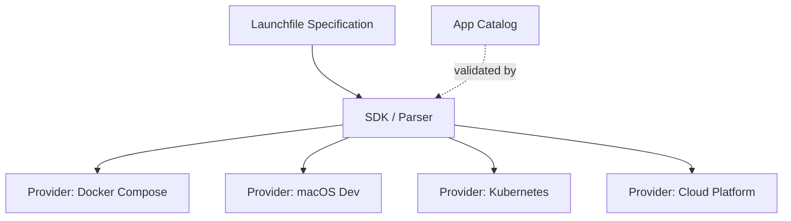

# Launchfile Design Document

**Status**: Active
**Format version**: `launch/v1`
**Last updated**: 2026-04-05

This document captures the institutional knowledge from the Launchfile design process: principles, decisions, trade-offs, known limitations, and references. It is the authoritative record of *why* the format is the way it is.

---

## 1. Design Principles

Thirteen principles organized in three categories govern every decision in the format.

### Format Philosophy

#### P-1: App-focused, not infra-focused

A Launchfile describes what an app *is* and what it *needs*, not how the infrastructure satisfies those needs. An app declares `requires: postgres`; the platform decides whether that means a Docker container, an RDS instance, or a shared cluster. The file belongs in the app repo, not in an infrastructure repo.

#### P-2: Incrementally adoptable

Three lines is a valid file (name, runtime, start command). A hundred lines can describe a multi-component monorepo with shared secrets, health checks, and startup ordering. Authors pay complexity cost only for the complexity they actually have. The single-component shorthand (fields at top level) and multi-component form (`components:` map) coexist in one schema.

#### P-3: Machine-generatable

AI can read a repository's structure (Dockerfile, package.json, requirements.txt, docker-compose.yml) and produce a valid Launchfile. The Zod schema provides validation. The format avoids constructs that are hard for language models to produce correctly (custom YAML tags, multi-document streams, complex anchors).

#### P-4: Human-writable

A developer who has never seen the format should be able to write a correct file in two minutes without reading documentation. Scalar shorthands (`requires: [postgres]`, `health: /health`, `build: "."`) cover the common case; expanded object forms are available when needed.

#### P-5: Provider-translatable

The same Launchfile can be translated to Docker Compose for local development, Kubernetes manifests for production, Fly.io config, AWS ECS task definitions, or any other platform. The format captures intent; translators map intent to platform-specific configuration.

### Syntax Philosophy

#### P-6: It's just YAML

No custom YAML tags (`!ref`, `!secret`), no DSL embedded in strings, no templating engine. The file parses with any YAML 1.2 parser. Tooling (linters, formatters, IDE support) works out of the box.

#### P-7: Simple things simple, complex things possible

The `$` syntax scales from trivial (`$url`) through moderate (`${host}:${port}`) to advanced (`${port:-5432}`). Each step adds exactly one concept: bare reference, embedded reference, default value. No step requires learning a fundamentally different syntax.

#### P-8: Familiar idioms

`$prop` comes from Bash variable expansion. Dot-paths (`$postgres.host`, `$components.backend.url`) follow JavaScript and Terraform conventions. The `:-` default separator matches POSIX shell parameter expansion. Developers recognize these patterns without explanation.

#### P-9: Unambiguous by convention

A `$` prefix always means "resolve this at deployment time." No `$` means the value is a literal string. `$$` escapes to a literal `$`. There is exactly one way to determine whether a string contains expressions: scan for unescaped `$` characters.

#### P-10: Source of truth is co-located

Environment variables injected by a resource are declared on that resource via `set_env`, not pulled from a separate env var definition. This keeps the wiring visible where the dependency is declared. When you read a `requires:` block, you see both what the app needs and how the resource properties flow into the app's environment.

### Architecture Philosophy

#### P-11: Separate intent from execution

`requires: postgres` is intent. Whether the orchestrator provisions a Docker container, creates an RDS instance, or reuses a shared cluster is execution. The format never prescribes execution strategy.

#### P-12: 12-factor by default

The format's structure naturally guides apps toward 12-factor compliance. Configuration lives in `env:`. Backing services are attached resources via `requires:`. Build, release, and run are distinct lifecycle phases via `commands:`. Port binding is explicit via `provides:`. See Section 2 for the full mapping.

#### P-13: Additive extensibility

The format evolves by adding new fields, never new syntax. A v1 parser ignores unknown fields gracefully. No existing field changes meaning across versions. The `version` header enables breaking changes if absolutely necessary, but the design minimizes the need.

---

## 1b. Governance Heuristics

These heuristics support the [governance model](GOVERNANCE.md) by making the design principles machine-applicable. They help the AI Steward evaluate proposals consistently and help Authors calibrate overrides.

### Principle Precedence

When principles conflict, higher-tier principles take priority:

- **Tier 1 (inviolable):** P-1 (app-focused, not infra-focused), P-13 (additive extensibility), P-6 (it's just YAML)
- **Tier 2 (strong):** P-11 (separate intent from execution), P-5 (provider-translatable), P-12 (12-factor by default)
- **Tier 3 (guiding):** P-2 (incrementally adoptable), P-3 (machine-generatable), P-4 (human-writable), P-7 (simple things simple), P-8 (familiar idioms), P-9 (unambiguous by convention), P-10 (source of truth co-located)

Tier 1 principles are never violated. Tier 2 principles are violated only when required to satisfy a Tier 1 principle, with documented reasoning. Tier 3 principles guide design choices but may yield to stronger constraints.

### Platform-Agnostic Litmus Test

P-1 draws the line between app concerns and infrastructure concerns. The test: **a field is platform-agnostic if changing the deployment target does not change the field's value.** `runtime: node` passes (it describes the app regardless of platform). `replicas: 3` fails (it prescribes execution strategy that varies by platform).

### Niche Field Threshold

The reject criterion "solves one app's problem but adds complexity for everyone" is quantified as: **a field is niche if fewer than 10% of catalog apps would use it.** Niche fields are not automatically rejected — they require stronger motivation (a compelling use case that cannot be solved by existing fields or orchestrator-level configuration).

**Complexity cost** distinguishes two categories: schema-only additions (new optional fields parsed by the existing engine) carry low cost. Parser or resolver changes (new syntax, new resolution rules) carry high cost and require proportionally stronger motivation.

### Uncertainty Escalation

The AI Steward assigns a confidence level to each evaluation:

- **High** — the proposal clearly passes or fails the principles with precedent support
- **Medium** — the proposal is plausible but involves trade-offs not covered by existing D-\* decisions
- **Low** — the proposal falls outside the scope of documented principles or creates novel precedent

Medium and low confidence evaluations are marked as **DEFER** and escalated to Authors for decision. The resulting Author decision becomes a new D-\* entry, expanding the precedent base.

---

## 2. 12-Factor Alignment

The Launchfile format maps naturally to the [12-Factor App](https://12factor.net/) methodology:

| 12-Factor Principle | Launchfile Field(s) | Notes |
|---|---|---|
| **I. Codebase** | (implicit) | The Launchfile lives in the app repo |
| **II. Dependencies** | `runtime`, `build`, `commands.build` | Runtime declares the language; build installs deps |
| **III. Config** | `env:` | All configuration as env vars with schema |
| **IV. Backing Services** | `requires:`, `supports:` | Attached resources with `set_env` wiring |
| **V. Build, Release, Run** | `commands.build`, `commands.release`, `commands.start` | Three distinct lifecycle stages |
| **VI. Processes** | `components:` | Each component is a process type |
| **VII. Port Binding** | `provides:` | Explicit port, protocol, and bind address |
| **VIII. Concurrency** | `components:`, `singleton` | Multiple components; `singleton` prevents scaling |
| **IX. Disposability** | `restart:`, `health:` | Fast startup, graceful shutdown, health checks |
| **X. Dev/Prod Parity** | Same file, different translators | Docker Compose for dev, K8s for prod |
| **XI. Logs** | (not in scope) | No log routing config; apps log to stdout |
| **XII. Admin Processes** | `commands.release`, `commands.seed` | One-off tasks as named commands |

**Factor XI (Logs)** is intentionally absent. Apps should write to stdout/stderr; log aggregation is an infrastructure concern. Adding log routing to the app descriptor would violate P-1 (app-focused, not infra-focused).

---

## 3. Design Decisions

Each decision records what was chosen, what was rejected, and the reasoning.

### D-1: File is named `Launchfile`, not `blueprint.yaml`

**Decision**: Use `Launchfile` as the filename, following the Dockerfile/Makefile/Procfile convention.
**Rejected**: `blueprint.yaml` (Digital.ai conflict), `app.yaml` (Google App Engine conflict), `manifest.yaml` (Cloud Foundry conflict), `deploy.yaml` (too execution-oriented).
**Why**: "Launch" captures the intent (get an app running) without conflicting with existing platform descriptors. The extensionless convention (like Dockerfile, Makefile, Procfile) is instantly recognizable to developers. The file contains YAML but the name signals it as a project artifact, not a generic config file.

### D-2: `$prop` syntax for expression references

**Decision**: Use `$prop` (bare dollar) and `${prop}` (braced) for references.
**Rejected**: `!ref prop` (YAML custom tag), `{{ prop }}` (Jinja/Handlebars), `${prop}` only (Docker Compose style), `%{prop}` (custom sigil).
**Why**: `$prop` is the shortest unambiguous syntax. It matches Bash conventions that every developer already knows. The braced form `${prop}` is needed only when embedding references in larger strings (`postgresql://${host}:${port}/${name}`). Custom YAML tags violate P-6. Template engine syntax (`{{ }}`) implies a templating pass and invites scope creep (conditionals, loops).

### D-3: `$` means resolve, no `$` means literal

**Decision**: A `$` prefix always signals runtime resolution. Absence of `$` always means the value is a literal string.
**Rejected**: Contextual interpretation (treating some fields as always-literal, others as always-expression).
**Why**: One universal rule is easier to learn and implement than field-by-field special cases. The resolver can scan any string value without knowing which field it came from. `$$` provides a clean escape hatch for literal dollar signs.

### D-4: `set_env` on resources, not `from:` on env vars

**Decision**: Resource-to-env-var wiring is declared on the resource via `set_env:`, not on the env var via a `from:` field.
**Rejected**: `from: postgres.url` on individual env var definitions.
**Why**: Co-location (P-10). When you read a `requires:` block, you see the complete picture: what the app needs and how resource properties map to env vars. The `from:` alternative would scatter wiring across the env var definitions, making it harder to understand what a resource provides.

### D-5: Proxy is a platform concern, not an app concern

**Decision**: The Launchfile does not include reverse proxy configuration (TLS, domains, path routing, rate limiting).
**Rejected**: `proxy:` or `routing:` top-level fields.
**Why**: P-11 (separate intent from execution). An app declares what ports it exposes (`provides:`); the platform decides how to route traffic to those ports. Caddy, Nginx, Traefik, Cloudflare Tunnel, AWS ALB -- these are all valid choices that the app should not constrain. The `exposed: true` field on a `provides` entry is the only hint: it tells the platform this port should be reachable from outside the host network.

### D-6: Named endpoints on `provides`

**Decision**: `provides` entries can have a `name` field (e.g., `api`, `metrics`, `admin`) for referencing specific endpoints.
**Rejected**: Positional referencing (first provides = main endpoint), unnamed-only.
**Why**: Multi-endpoint components (an app serving both an API on port 3000 and metrics on port 9090) need a way to distinguish endpoints. Names enable `$components.backend.api.url` style references and make the file self-documenting.

### D-7: Resource properties as standard vocabulary

**Decision**: Resources expose a standard set of properties (`url`, `host`, `port`, `user`, `password`, `name`) that `set_env` expressions reference.
**Rejected**: Arbitrary resource-specific property names, explicit property declarations per resource type.
**Why**: Standard vocabulary means `$url` works the same whether the resource is postgres, mysql, or redis. Orchestrators know what properties to expose for each resource type. This convention-over-configuration approach reduces boilerplate while remaining predictable.

### D-8: `supports` with `set_env` for optional capabilities

**Decision**: `supports:` declares optional resource dependencies. When the resource is available, its `set_env` values are injected. When unavailable, they are simply absent.
**Rejected**: Conditional env vars with `if:` blocks, feature flags tied to resource presence.
**Why**: The simplest model: if Redis is available, `CACHE_URL` gets set. The app checks for `CACHE_URL` at startup and enables caching if present. No conditional logic in the descriptor. The orchestrator controls activation semantics.

### D-9: Just YAML -- no custom tags

**Decision**: The format uses only standard YAML 1.2 constructs: maps, sequences, scalars.
**Rejected**: Custom YAML tags (`!ref`, `!secret`, `!include`), multi-document YAML (`---` separators for environments), YAML anchors as a first-class feature.
**Why**: P-6 and P-3. Custom tags require tag-aware parsers, break generic YAML tooling, and are difficult for AI to generate reliably. Standard YAML parses everywhere and round-trips cleanly.

### D-10: AI generates Launchfiles, not docker-compose.yml

**Decision**: Analyzers generate a Launchfile from repo analysis; translators then produce docker-compose.yml (or other platform configs) from the Launchfile.
**Rejected**: AI generating docker-compose.yml directly.
**Why**: A Launchfile is a smaller, more constrained format than docker-compose.yml. Fewer fields means fewer opportunities for AI errors. The translation from Launchfile to docker-compose is deterministic and testable, isolating AI uncertainty to the analysis phase. A bad Launchfile is easier to review and fix than a bad docker-compose.yml.

### D-11: Dot-paths follow JS/Terraform conventions

**Decision**: Multi-segment references use dot-separated paths: `$postgres.host`, `$components.backend.url`, `$secrets.jwt-key`.
**Rejected**: Slash-separated (`$postgres/host`), colon-separated (`$postgres:host`), nested braces (`${postgres}{host}`).
**Why**: Dot-paths are the most widely recognized convention for property access (JavaScript, Terraform HCL, Python, Java). They parse unambiguously and compose naturally.

### D-12: `$$` for literal dollar sign

**Decision**: `$$` in any string value resolves to a literal `$`.
**Rejected**: Backslash escape (`\$`), quoting rules, no escape mechanism.
**Why**: Matches the Makefile convention (`$$` produces a literal `$` in Make recipes). Backslash escaping is YAML-hostile (YAML already uses backslash in double-quoted strings, creating double-escaping confusion). Two dollars is easy to type and visually distinct.

### D-13: `file:` prefix for repo file references

**Decision**: References to files within the repository use a `file:` prefix: `spec.openapi: file:docs/openapi.yaml`.
**Rejected**: Bare relative paths (ambiguous with string values), `@file:` prefix, separate `files:` top-level section.
**Why**: The `file:` prefix is unambiguous (no valid YAML value would accidentally start with `file:`), familiar from URL schemes, and requires no structural changes.

### D-14: Additive extensibility -- new fields, never new syntax

**Decision**: The format evolves by adding optional fields. Existing fields never change meaning. Parsers ignore unknown fields.
**Rejected**: Version-gated syntax changes, breaking redesigns.
**Why**: P-13. Additive changes are backward-compatible. A Launchfile written for v1 continues to parse correctly in v2+.

### D-15: Routing is a deployment concern, not an app concern

**Decision**: No `paths:` or `routes:` field in the format. Path-based routing, domain mapping, and TLS termination are orchestrator responsibilities.
**Rejected**: `paths: { "/api": backend, "/": frontend }` top-level routing table.
**Why**: Expansion of D-5. Path routing varies dramatically across platforms. The orchestrator infers routing from `provides:` entries and `exposed: true`.

### D-16: `depends_on` for startup ordering

**Decision**: Components can declare startup dependencies via `depends_on:` with optional health conditions (`started`, `healthy`).
**Rejected**: Implicit ordering from `requires:` (too magical), no ordering (leaves orchestrators guessing).
**Why**: Startup ordering is a real need. Making it explicit avoids hidden coupling between `requires:` and startup behavior.

### D-17: `version` header for spec versioning

**Decision**: Optional `version: launch/v1` at the top of every file.
**Rejected**: No versioning, version in filename, separate version field.
**Why**: A version header enables parsers to select the correct schema. The `launch/` prefix namespaces the version to avoid conflicts. It is optional in v1 (defaulting to `launch/v1` when absent) to keep minimal files short.

### D-18: `sensitive` field for secrets handling

**Decision**: Env vars can be marked `sensitive: true` to signal that the value should be stored in a secrets manager, masked in logs, and excluded from non-production dumps.
**Rejected**: Separate `secrets:` env var section, naming convention (`*_SECRET` suffix detection).
**Why**: Explicit marking is more reliable than naming conventions. `generator: secret` implies `sensitive: true`.

### D-19: `set_env` only -- dropped `from:` shorthand

**Decision**: Resource-to-env-var wiring uses only `set_env:` on the resource. The earlier `from:` shorthand on env var definitions was removed.
**Rejected**: `from: postgres.url` on env vars as an alternative wiring syntax.
**Why**: "There should be one -- and preferably only one -- obvious way to do it." Having both `set_env` and `from:` creates ambiguity. Having exactly one mechanism eliminates this class of bugs.

### D-20: Running instance state is an orchestrator concern

**Decision**: A Launchfile does not encode running instance state (current replicas, assigned ports, health status, deployed commit SHA).
**Rejected**: `status:` section in the file, separate state file.
**Why**: P-1 and P-11. A Launchfile is a declaration of intent, not a record of current state. State belongs in the orchestrator's database. Mixing declaration and state creates merge conflicts, stale data, and confusion.

### D-21: AI self-healing on failed launches

**Decision**: When a launch fails, the orchestrator feeds error logs back to the AI to generate a corrected Launchfile. The format is designed to support this feedback loop.
**Rejected**: Manual-only error correction, separate error annotation format.
**Why**: P-3 (machine-generatable) extends to machine-correctable. A constrained, validated format means AI corrections are bounded and verifiable.

### D-22: YAML as the file format

**Decision**: YAML 1.2 is the file format. No wrapper, no custom syntax, no preprocessing.
**Rejected**: JSON, TOML, custom DSL, HCL.
**Why**: Six properties make YAML the best fit for an app descriptor:

1. **Compact.** No braces, no mandatory quotes, no trailing commas. A 6-line Launchfile would be 15+ lines of JSON. For a format that lives in every app repo and gets read by humans daily, density matters.
2. **Comments and multi-line text.** `#` comments explain intent. Block scalars (`|`, `>`) handle multi-line commands and descriptions without escaping. Markdown in `description` fields works naturally.
3. **Anchors, aliases, and merge keys.** `&defaults` / `*defaults` / `<<: *defaults` enable DRY patterns in multi-component apps that share configuration. See SPEC.md §YAML Compatibility for examples.
4. **JSON is valid YAML.** Any YAML 1.2 parser accepts JSON input. Developers who prefer JSON can write `{"name": "my-app", "runtime": "node"}` and it parses identically. This is a real escape hatch, not a theoretical one.
5. **Ubiquitous tooling.** Every mainstream language has a YAML parser. The YAML Language Server + JSON Schema provides IDE autocompletion and validation with zero custom tooling.
6. **Ecosystem precedent.** docker-compose.yml, GitHub Actions, Kubernetes manifests, Helm charts, CloudFormation, Ansible. Developers already read and write YAML for infrastructure-adjacent configuration. The learning curve is zero for the target audience.

TOML was considered but rejected: it lacks nested structure depth (tables-of-tables become verbose for `components` → `requires` → `set_env`), has no merge/anchor mechanism, and is less familiar to the DevOps audience. JSON was rejected for verbosity and lack of comments. A custom DSL was rejected per P-6 — the format should parse with off-the-shelf tooling.

### D-23: `outputs` field for capturing release command values

**Decision**: An `outputs` map on components captures named values from `release` command stdout via regex patterns. Each output has a `pattern` (regex with one capture group), optional `description`, and optional `sensitive` flag.
**Rejected**: Separate post-deploy script, structured output format (JSON), environment variable injection.
**Why**: Many apps print generated credentials, URLs, or configuration during setup (e.g., "Admin password: abc123"). Regex capture is the simplest mechanism that works with any language and any setup script. Structured output would require apps to conform to a specific format. The `sensitive` flag enables platforms to mask passwords in their UI.

### D-24: Resource naming via optional `name` field

**Decision**: Resources in `requires` and `supports` can have an optional `name` field. When omitted, the resource's `type` serves as its name. Expression references use the name: `$primary-db.host`, `$analytics-db.host`.
**Rejected**: Requiring unique types (one postgres per app), positional indexing, automatic name generation.
**Why**: Real apps sometimes need multiple instances of the same resource type (e.g., a primary database and an analytics database). Explicit naming is the simplest unambiguous solution. Defaulting to `type` preserves backward compatibility — existing files that use `$postgres.host` continue to work.

### D-25: Shallow field-level inheritance for components

**Decision**: When `components` is present, top-level component fields serve as defaults. Each component field replaces the top-level value entirely (nullish coalescing). Arrays and objects are never deep-merged.
**Rejected**: Deep merge (recursive object merging, array concatenation), no inheritance (YAML anchors only), CSS-style cascade.
**Why**: Deep merge has surprising edge cases (does a component's `requires: [redis]` append to or replace the top-level `requires: [postgres]`?). Shallow field-level replacement has exactly one rule: "if the component defines it, use it; otherwise fall back to top-level." For complex shared config, YAML anchors (`&defaults` / `<<: *defaults`) provide explicit, visible reuse. The SDK already implements this via `??` (nullish coalescing).

### D-26: `build.secrets` as platform-resolved names

**Decision**: The `build.secrets` array contains names that the platform resolves at build time. Names may reference top-level `secrets:` entries (Launchfile-generated) or platform-managed secrets (provided out-of-band).
**Rejected**: Only Launchfile secrets (too limiting — most build secrets are pre-existing credentials), only platform secrets (loses connection to Launchfile-generated values).
**Why**: Build secrets are typically pre-existing credentials (NPM tokens, SSH keys, API tokens) that the developer provides to the platform, not values the Launchfile generates. The Launchfile declares the *need* ("this build requires an npm-token secret"), not the *source*. This keeps the format declarative while supporting both generated and external secrets.

### D-27: `exposed: false` by default

**Decision**: Endpoints declared in `provides` are internal by default. Setting `exposed: true` is required to make a port reachable from outside the host network.
**Rejected**: Default `true` (simpler for simple apps), platform-decides (ambiguous).
**Why**: Secure by default. Most components in a multi-component app are internal services (databases, workers, internal APIs). Only the frontend or API gateway should be publicly reachable. Requiring explicit opt-in for exposure prevents accidental public access.

### D-28: `spec` on provides entries only

**Decision**: The `spec` field (for API specification references like OpenAPI) exists only on `provides` entries, not at the component or top level.
**Rejected**: Component-level `spec` (existed in schema but was never used), both levels (redundant).
**Why**: An API spec describes a specific endpoint, not a whole component. A component serving both an API on port 3000 and metrics on port 9090 has different specs for each. The provides-entry level is the natural home. Removing the unused component-level field simplifies the schema.

### D-29: Discovery metadata (`repository`, `website`, `logo`, `keywords`)

**Decision**: Add optional top-level fields for project discovery: `repository` (source URL), `website` (homepage), `logo` (image URL), `keywords` (tag array).
**Rejected**: Keeping metadata in separate files (e.g. `metadata.yaml` in the catalog), embedding metadata only in the catalog and not in the spec.
**Why**: If every repo should have a Launchfile, that file becomes the natural source of truth for catalog listings. Heroku's `app.json` proved that a deployment descriptor doubles effectively as a discovery entry. These fields are purely informational — providers ignore them, catalogs consume them. Zero complexity cost: no new concepts, no parser changes, no provider obligations. Inspired by Heroku's `app.json` (`repository`, `website`, `logo`, `keywords` fields).

### D-30: Storage `size` hint

**Decision**: Add an optional `size` field to storage volumes (e.g. `size: 10GB`).
**Rejected**: Omitting size entirely (providers guess), complex size objects with min/max/quotas.
**Why**: A 100MB cache volume is very different from a 500GB media library. Without a hint, providers either over-allocate (wasteful) or under-allocate (app fails at runtime). The value is a minimum hint — providers may allocate more. Inspired by Juju's `min-size` on storage declarations. Uses a simple string format (`512MB`, `10GB`, `1TB`) that is human-readable and unambiguous.

### D-31: `example` field on environment variables

**Decision**: Add an optional `example` field to env var definitions showing expected format.
**Rejected**: Embedding examples in `description` (loses structure), `pattern` field with regex validation (too complex for a descriptor).
**Why**: `required: true` and `description: "SMTP server"` tells a developer they need a value but not what a valid value looks like. `example: "smtp.mailgun.org"` closes that gap instantly. No other deployment descriptor does this well — it's a Launchfile innovation. Purely informational for humans and AI; providers ignore it. Particularly valuable for the catalog use case where someone evaluates whether to deploy an app.

### D-32: Pipe transforms for encoding (`$ref|base64`)

**Decision**: Any resolved reference can be piped through encoding transforms using `|` (pipe): `$secrets.key|base64`, `$host|base64`. Transforms apply after resolution and compose with string interpolation: `"base64:${secrets.app-key|base64}"`.
**Rejected**:
- Dot-path encoding (`$secrets.key.base64`) — ambiguous with property navigation; breaks when applied to non-secret references (`$host.base64` looks like navigating to a `base64` sub-property); can't distinguish transforms from future property extensions like `$secrets.keypair.private`.
- Colon (`$secrets.key:base64`) — conflicts with the `:-` default/fallback syntax.
- Hash/fragment (`$secrets.key#base64`) — no chainability precedent; developers don't associate `#` with transforms.
- Function syntax (`base64($secrets.key)`) — breaks `$` prefix detection, reads inside-out for chains, requires major parser changes.
- Field-level encoding (`format: base64` on generators) — doesn't compose with string interpolation for prefixes.
**Why**: The `|` pipe operator has universal precedent in Unix, Jinja2, Ansible, Helm, and Go templates. It's unambiguous (dots navigate, pipes transform), naturally chainable (`$ref|base64|urlsafe`), has zero YAML conflicts (`|` is only special as a block scalar indicator at value-start), and works on any reference — not just secrets. The parser change is minimal (split on `|` after path parsing). Motivated by Laravel apps (Firefly III, Monica) requiring `base64:`-prefixed keys. See [#12](https://github.com/launchfile/launchfile/issues/12).

---

## 4. Known Limitations

Each limitation includes the problem, current stance, and future considerations.

### L-1: Dot-path resolution needs formal grammar

**Problem**: The dot-path syntax is implemented in code but lacks a formal grammar specification.
**Current stance**: The resolver code in the SDK is the de facto specification. Resolution order is: (1) `secrets.*`, (2) `components.*`, (3) single segment from enclosing resource, (4) multi-segment as named resource lookup, (5) fallback to enclosing resource with dotted key.
**Future**: Write a formal grammar (PEG or BNF) and publish it as part of the spec. Add a reference test suite for edge cases.

### L-2: `$prop` may trigger false warnings in YAML tooling

**Problem**: Some YAML linters warn about unquoted strings starting with `$`.
**Current stance**: Values containing `$` should be quoted in YAML (`"$url"` or `'$url'`). The schema and examples consistently use quotes for `set_env` values.
**Future**: Provide a YAML Language Server configuration snippet that suppresses these warnings for `set_env` fields.

### L-3: No environment-specific overrides

**Problem**: There is no built-in mechanism for per-environment configuration (dev vs. staging vs. production).
**Current stance**: Environment-specific values are orchestrator concerns. The orchestrator resolves env vars differently per environment.
**Future**: A `Launchfile.override` merge pattern, similar to `docker-compose.override.yml`, may be added.

### L-4: Resource property vocabulary is implicit

**Problem**: The standard properties (`url`, `host`, `port`, `user`, `password`, `name`) are convention, not enforced by the schema. A typo like `$hoost` passes validation and silently resolves to an empty string.
**Current stance**: The resolver returns empty string for unknown properties, which usually causes a clear app error. The GAPS.md tracks this.
**Future**: Build a machine-readable property registry per resource type with post-parse validation.

### L-5: `set_env` co-location vs. flat visibility trade-off

**Problem**: `set_env` on resources means env vars are scattered across `requires:` and `supports:` blocks.
**Current stance**: Co-location (P-10) wins over flat visibility. CLI tooling provides the flat view.
**Future**: No format changes needed.

### L-7: `runtime` has no version constraint

**Problem**: `runtime: node` declares the language but not which version. A Node 18 app deployed on Node 22 might break. Today, version pinning is handled by the Dockerfile or platform configuration, not the Launchfile.
**Current stance**: The `runtime` field is a hint and buildpack trigger (see D-5 and the spec's "Runtime, Image, and Build" section). For precise version control, use `build` with a Dockerfile that pins the version. Critically, most apps already declare their runtime version in ecosystem-standard files: `.nvmrc`, `.node-version`, `.tool-versions`, `package.json` `engines`, `.python-version`, `.ruby-version`, `Gemfile`, `go.mod`, etc. Platforms and AI analyzers should discover the version from these existing sources rather than forcing apps to duplicate it into the Launchfile.
**Future**: If discovery proves insufficient, extend `runtime` to accept an object form with a `version` field, following the same scalar-or-object shorthand pattern used throughout the spec: `runtime: node` (shorthand) or `runtime: { type: node, version: ">=20" }` (extended). This was considered during the 2026-04 spec review and deferred — the ecosystem already has version files, and duplicating that into the Launchfile violates P-10 (source of truth is co-located).

### L-6: `supports` activation semantics are orchestrator-defined

**Problem**: The format does not specify how the orchestrator decides whether to provision optional resources.
**Current stance**: Orchestrator decides. Example: if a shared Redis is already running, activate; if not, skip silently.
**Future**: A `supports.mode` field could standardize this, but risks over-specifying orchestrator behavior.

---

## 5. References

### Direct Inspirations

| Reference | Influence |
|---|---|
| Ziad Sawalha's 2015 app descriptor gist | Original `provides` / `requires` / `supports` / `commands` vocabulary. The four concepts survived intact into the final format. |
| [12-Factor App](https://12factor.net/) | Structural template: config in env vars (Factor III), backing services as attached resources (Factor IV), build/release/run stages (Factor V), port binding (Factor VII). |
| [Heroku app.json](https://devcenter.heroku.com/articles/app-json-schema) | Env var schema model: `required`, `description`, `generator`, and value metadata on environment variables. |
| [Heroku Add-ons](https://devcenter.heroku.com/articles/add-ons) | `set_env` model: the add-on (resource) sets env vars on the app, not the other way around. This became D-4 and P-10. |

### Platform Descriptors Studied

| Platform | Format | Key takeaway |
|---|---|---|
| [Docker Compose](https://docs.docker.com/compose/compose-file/) | `docker-compose.yml` | Comprehensive but infrastructure-coupled. Variable interpolation with `${VAR:-default}` influenced D-2. |
| [Render](https://docs.render.com/blueprint-spec) | `render.yaml` | Clean platform descriptor but Render-specific. `envVars` with `generateValue` inspired `generator`. |
| [Fly.io](https://fly.io/docs/reference/configuration/) | `fly.toml` | TOML-based, platform-locked. Good example of what to avoid: tightly coupled to one platform's networking model. |
| [Railway](https://docs.railway.app/reference/config-as-code) | `railway.json` / `railway.toml` | Minimal and focused. Confirmed that simple formats get adopted faster than comprehensive ones. |
| [Cloud Foundry](https://docs.cloudfoundry.org/devguide/deploy-apps/manifest.html) | `manifest.yml` | Mature but dated. `services:` model for backing services informed `requires:`. |
| [Dokku](https://dokku.com/docs/deployment/methods/dockerfiles/) | Procfile + DOKKU_SCALE | Procfile simplicity is admirable but insufficient for modern apps with resource dependencies. |
| [Coolify](https://coolify.io/docs/) | UI-driven | Demonstrated the need for a file-based alternative to UI-only configuration. |

### Standards and Specifications

| Standard | URL | Relevance |
|---|---|---|
| CNCF Score | [score.dev](https://score.dev/) | Workload specification with similar goals. More Kubernetes-oriented. Launchfile aims to be platform-agnostic. |
| Open Application Model (OAM) | [oam.dev](https://oam.dev/) | Application-centric model separating concerns between developers and operators. Influenced P-11. |
| CNAB | [cnab.io](https://cnab.io/) | Package format for cloud-native apps. More focused on distribution than description. |
| TOSCA | [docs.oasis-open.org/tosca](https://docs.oasis-open.org/tosca/TOSCA/v2.0/TOSCA-v2.0.html) | Enterprise topology standard. Too verbose but validated the `requires`/`provides` vocabulary. |

### Syntax Precedents

| Precedent | Syntax borrowed |
|---|---|
| Bash variable expansion | `$VAR`, `${VAR}`, `${VAR:-default}`, `$$` escape |
| Terraform HCL | Dot-path property access (`resource.name.property`) |
| Docker Compose interpolation | `${VAR:-default}` syntax for defaults |
| GitHub Actions expressions | `${{ }}` was studied and rejected (too verbose, implies templating) |
| YAML 1.2 specification | No custom tags, no multi-document, standard scalars only |
