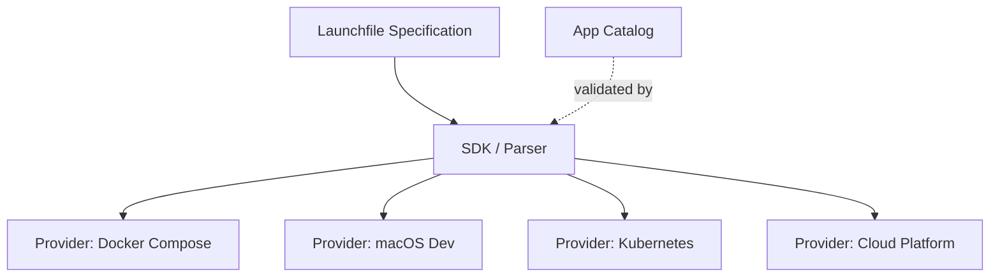

# Launchfile Design Document

**Status**: Active
**Format version**: `launch/v1`
**Last updated**: 2026-04-05

This document captures the institutional knowledge from the Launchfile design process: principles, decisions, trade-offs, known limitations, and references. It is the authoritative record of *why* the format is the way it is.

```mermaid
graph TD
    SPEC["Launchfile Specification"] --> SDK["SDK / Parser"]
    SDK --> P1["Provider: Docker Compose"]
    SDK --> P2["Provider: macOS Dev"]
    SDK --> P3["Provider: Kubernetes"]
    SDK --> P4["Provider: Cloud Platform"]
    CATALOG["App Catalog"] -.->|"validated by"| SDK
```

---

## 1. Design Principles

Fourteen principles organized in three categories govern every decision in the format.

### Format Philosophy

#### P-1: App-focused, not infra-focused

A Launchfile describes what an app *is* and what it *needs*, not how the infrastructure satisfies those needs. An app declares `requires: postgres`; the platform decides whether that means a Docker container, an RDS instance, or a shared cluster. The file belongs in the app repo, not in an infrastructure repo.

#### P-2: Incrementally adoptable

Three lines is a valid file (name, runtime, start command). A hundred lines can describe a multi-component monorepo with shared secrets, health checks, and startup ordering. Authors pay complexity cost only for the complexity they actually have. The single-component shorthand (fields at top level) and multi-component form (`components:` map) coexist in one schema.

#### P-3: Machine-generatable

AI can read a repository's structure (Dockerfile, package.json, requirements.txt, docker-compose.yml) and produce a valid Launchfile. The Zod schema provides validation. The format avoids constructs that are hard for language models to produce correctly (custom YAML tags, multi-document streams, complex anchors).

#### P-4: Human-writable

A developer who has never seen the format should be able to write a correct file in two minutes without reading documentation. Scalar shorthands (`requires: [postgres]`, `health: /health`, `build: "."`) cover the common case; expanded object forms are available when needed.

#### P-5: Provider-translatable

The same Launchfile can be translated to Docker Compose for local development, Kubernetes manifests for production, Fly.io config, AWS ECS task definitions, or any other platform. The format captures intent; translators map intent to platform-specific configuration.

### Syntax Philosophy

#### P-6: It's just YAML

No custom YAML tags (`!ref`, `!secret`), no DSL embedded in strings, no templating engine. The file parses with any YAML 1.2 parser. Tooling (linters, formatters, IDE support) works out of the box.

#### P-7: Simple things simple, complex things possible

The `$` syntax scales from trivial (`$url`) through moderate (`${host}:${port}`) to advanced (`${port:-5432}`). Each step adds exactly one concept: bare reference, embedded reference, default value. No step requires learning a fundamentally different syntax.

#### P-8: Familiar idioms

`$prop` comes from Bash variable expansion. Dot-paths (`$postgres.host`, `$components.backend.url`) follow JavaScript and Terraform conventions. The `:-` default separator matches POSIX shell parameter expansion. Developers recognize these patterns without explanation.

#### P-9: Unambiguous by convention

A `$` prefix always means "resolve this at deployment time." No `$` means the value is a literal string. `$$` escapes to a literal `$`. There is exactly one way to determine whether a string contains expressions: scan for unescaped `$` characters.

#### P-10: Source of truth is co-located

Environment variables injected by a resource are declared on that resource via `set_env`, not pulled from a separate env var definition. This keeps the wiring visible where the dependency is declared. When you read a `requires:` block, you see both what the app needs and how the resource properties flow into the app's environment.

### Architecture Philosophy

#### P-11: Separate intent from execution

`requires: postgres` is intent. Whether the orchestrator provisions a Docker container, creates an RDS instance, or reuses a shared cluster is execution. The format never prescribes execution strategy.

#### P-12: 12-factor by default

The format's structure naturally guides apps toward 12-factor compliance. Configuration lives in `env:`. Backing services are attached resources via `requires:`. Build, release, and run are distinct lifecycle phases via `commands:`. Port binding is explicit via `provides:`. See Section 2 for the full mapping.

#### P-13: Additive extensibility

The format evolves by adding new fields, never new syntax. A v1 parser ignores unknown fields gracefully. No existing field changes meaning across versions. The `version` header enables breaking changes if absolutely necessary, but the design minimizes the need.

#### P-14: Legible evolution

New capability is additive ([P-13](#p-13-additive-extensibility)). When a field or value must be sunset, the deprecation is *machine-readable* — it carries the version it was deprecated in, the version that removes it, its replacement, and a migration hint — sufficient for tooling to report which parts of a given file are deprecated or scheduled for removal, preview what a target version breaks before an upgrade, and drive the migration. No upgrade silently breaks a file; removal happens only at a major version of the format — a `launch/vN` bump ([D-17](#d-17-version-header-for-spec-versioning)), never a package release. Deprecation may warn; removal must migrate; never break.

---

## 1b. Governance Heuristics

These heuristics support the [governance model](GOVERNANCE.md) by making the design principles machine-applicable. They help the AI Steward evaluate proposals consistently and help Authors calibrate overrides.

### Principle Precedence

When principles conflict, higher-tier principles take priority:

- **Tier 1 (inviolable):** P-1 (app-focused, not infra-focused), P-13 (additive extensibility), P-14 (legible evolution), P-6 (it's just YAML)
- **Tier 2 (strong):** P-11 (separate intent from execution), P-5 (provider-translatable), P-12 (12-factor by default)
- **Tier 3 (guiding):** P-2 (incrementally adoptable), P-3 (machine-generatable), P-4 (human-writable), P-7 (simple things simple), P-8 (familiar idioms), P-9 (unambiguous by convention), P-10 (source of truth co-located)

Tier 1 principles are never violated. Tier 2 principles are violated only when required to satisfy a Tier 1 principle, with documented reasoning. Tier 3 principles guide design choices but may yield to stronger constraints.

### Platform-Agnostic Litmus Test

P-1 draws the line between app concerns and infrastructure concerns. The test: **a field is platform-agnostic if changing the deployment target does not change the field's value.** `runtime: node` passes (it describes the app regardless of platform). `replicas: 3` fails (it prescribes execution strategy that varies by platform).

### Niche Field Threshold

The reject criterion "solves one app's problem but adds complexity for everyone" is quantified as: **a field is niche if fewer than 10% of catalog apps would use it.** Niche fields are not automatically rejected — they require stronger motivation (a compelling use case that cannot be solved by existing fields or orchestrator-level configuration).

**Complexity cost** distinguishes two categories: schema-only additions (new optional fields parsed by the existing engine) carry low cost. Parser or resolver changes (new syntax, new resolution rules) carry high cost and require proportionally stronger motivation.

### Uncertainty Escalation

The AI Steward's confidence measures **grounding completeness**, not comfort:

- **High** — every load-bearing factual claim in the proposal was verified against the repository (code, catalog, spec), and the escalation table below yields a route
- **Medium / Low** — a load-bearing fact could not be verified, or the table routes the question to "Author-owned"

Confidence is never lowered because a question is hard — only because it is unverifiable or reserved to Authors.

**Pre-check, before the table**: a proposal that changes the Steward's own operating rules — the evaluation process, this table, the verdict policy — always routes to the Authors with a recommendation, regardless of any Steward verdict. The Steward never self-ratifies a change to its own authority. The table below then informs the recommendation.

The escalation table is applied top-down; the first matching row wins, and every verdict names the row it routed through:

| # | Condition | Route |
|---|-----------|-------|
| 1 | The open question is **factual** — settleable by reading code, catalog, or spec | The Steward resolves it. Factual questions are never deferred. |
| 2 | The proposal requires **changing the meaning of ratified P-\*/D-\* text** (amending, not applying), or **forecloses an option the record explicitly reserves to Authors** (e.g. expanding an enumeration the record calls a "high-bar future RFC") | **DEFER**, naming the exact sentence that must change and why the Steward cannot change it. |
| 3 | Provider-conduct or provider-API work with **zero format/schema/parser change** and a **settled precedent family** — an existing D-\* class covering the same conduct or channel species (the [D-43](#d-43-source-acquisition--repository-as-canonical-origin-baseline-ref-as-a--fragment) / [D-50](#d-50-storagenamecontent-operator--operator-supplied-volume-content-bound-by-the-orchestrator-or-refused) / [D-52](#d-52-a-required-environment-variable-is-operator-supplied--providers-must-not-fabricate-one) orchestrator-channel family is the worked example) | The Steward renders **ACCEPT or REJECT** directly. Under-specified semantics are bound in the verdict's required implementing shape, not used to withhold or reject. If the work also touches a pinned classification, the verdict additionally binds a new `D-*` entry recording the applied reading; the entry lands via the implementing PR the Authors approve. (#290 is the worked example: `$app.*` stays [D-36](#d-36-the-three-homes-of-a-varying-value-p-1-litmus-refinement) home #3, the orchestrator-supplied URL a delegated input to the provider's computation — a reading pending ratification via #290's implementing PR.) |
| 4 | The proposal touches a **pinned classification** — a boundary the record fixes explicitly, such as [D-36](#d-36-the-three-homes-of-a-varying-value-p-1-litmus-refinement)'s three homes — or otherwise **creates novel precedent**, outside any settled precedent family | **DEFER** to Authors, presenting the candidate readings with evidence for each. Novel precedent is Author-decided; the Author's call becomes the new `D-*` entry. |
| 5 | The residual question is genuinely **value-laden** ("is this boundary where we want it", "is this niche worth its complexity") | **DEFER**, stating the value question in one sentence. |

Author override remains available on every verdict, including directly-rendered ones. A DEFER's resulting Author decision becomes a new D-\* entry, expanding the precedent base.

---

## 2. 12-Factor Alignment

The Launchfile format maps naturally to the [12-Factor App](https://12factor.net/) methodology:

| 12-Factor Principle | Launchfile Field(s) | Notes |
|---|---|---|
| **I. Codebase** | (implicit) | The Launchfile lives in the app repo |
| **II. Dependencies** | `runtime`, `build`, `commands.build` | Runtime declares the language; build installs deps |
| **III. Config** | `env:` | All configuration as env vars with schema |
| **IV. Backing Services** | `requires:`, `supports:` | Attached resources with `set_env` wiring |
| **V. Build, Release, Run** | `commands.build`, `commands.release`, `commands.start` | Three distinct lifecycle stages |
| **VI. Processes** | `components:` | Each component is a process type |
| **VII. Port Binding** | `provides:` | Explicit port, protocol, and bind address |
| **VIII. Concurrency** | `components:`, `singleton` | Multiple components; `singleton` prevents scaling |
| **IX. Disposability** | `restart:`, `health:` | Fast startup, graceful shutdown, health checks |
| **X. Dev/Prod Parity** | Same file, different translators | Docker Compose for dev, K8s for prod |
| **XI. Logs** | (not in scope) | No log routing config; apps log to stdout |
| **XII. Admin Processes** | `commands.release`, `commands.seed` | One-off tasks as named commands |

**Factor XI (Logs)** is intentionally absent. Apps should write to stdout/stderr; log aggregation is an infrastructure concern. Adding log routing to the app descriptor would violate P-1 (app-focused, not infra-focused).

---

## 3. Design Decisions

Each decision records what was chosen, what was rejected, and the reasoning.

### D-1: File is named `Launchfile`, not `blueprint.yaml`

**Decision**: Use `Launchfile` as the filename, following the Dockerfile/Makefile/Procfile convention.
**Rejected**: `blueprint.yaml` (Digital.ai conflict), `app.yaml` (Google App Engine conflict), `manifest.yaml` (Cloud Foundry conflict), `deploy.yaml` (too execution-oriented).
**Why**: "Launch" captures the intent (get an app running) without conflicting with existing platform descriptors. The extensionless convention (like Dockerfile, Makefile, Procfile) is instantly recognizable to developers. The file contains YAML but the name signals it as a project artifact, not a generic config file.

### D-2: `$prop` syntax for expression references

**Decision**: Use `$prop` (bare dollar) and `${prop}` (braced) for references.
**Rejected**: `!ref prop` (YAML custom tag), `{{ prop }}` (Jinja/Handlebars), `${prop}` only (Docker Compose style), `%{prop}` (custom sigil).
**Why**: `$prop` is the shortest unambiguous syntax. It matches Bash conventions that every developer already knows. The braced form `${prop}` is needed only when embedding references in larger strings (`postgresql://${host}:${port}/${name}`). Custom YAML tags violate P-6. Template engine syntax (`{{ }}`) implies a templating pass and invites scope creep (conditionals, loops).

### D-3: `$` means resolve, no `$` means literal

**Decision**: A `$` prefix always signals runtime resolution. Absence of `$` always means the value is a literal string.
**Rejected**: Contextual interpretation (treating some fields as always-literal, others as always-expression).
**Why**: One universal rule is easier to learn and implement than field-by-field special cases. The resolver can scan any string value without knowing which field it came from. `$$` provides a clean escape hatch for literal dollar signs.

### D-4: `set_env` on resources, not `from:` on env vars

**Decision**: Resource-to-env-var wiring is declared on the resource via `set_env:`, not on the env var via a `from:` field.
**Rejected**: `from: postgres.url` on individual env var definitions.
**Why**: Co-location (P-10). When you read a `requires:` block, you see the complete picture: what the app needs and how resource properties map to env vars. The `from:` alternative would scatter wiring across the env var definitions, making it harder to understand what a resource provides.

### D-5: Proxy is a platform concern, not an app concern

**Decision**: The Launchfile does not include reverse proxy configuration (TLS, domains, path routing, rate limiting).
**Rejected**: `proxy:` or `routing:` top-level fields.
**Why**: P-11 (separate intent from execution). An app declares what ports it exposes (`provides:`); the platform decides how to route traffic to those ports. Caddy, Nginx, Traefik, Cloudflare Tunnel, AWS ALB -- these are all valid choices that the app should not constrain. The `exposed: true` field on a `provides` entry is the only hint: it tells the platform this port should be reachable from outside the host network.

### D-6: Named endpoints on `provides`

**Decision**: `provides` entries can have a `name` field (e.g., `api`, `metrics`, `admin`) for referencing specific endpoints.
**Rejected**: Positional referencing (first provides = main endpoint), unnamed-only.
**Why**: Multi-endpoint components (an app serving both an API on port 3000 and metrics on port 9090) need a way to distinguish endpoints. Names enable `$components.backend.api.url` style references and make the file self-documenting.

### D-7: Resource properties as standard vocabulary

**Decision**: Resources expose a standard set of properties (`url`, `host`, `port`, `user`, `password`, `name`) that `set_env` expressions reference.
**Rejected**: Arbitrary resource-specific property names, explicit property declarations per resource type.
**Why**: Standard vocabulary means `$url` works the same whether the resource is postgres, mysql, or redis. Orchestrators know what properties to expose for each resource type. This convention-over-configuration approach reduces boilerplate while remaining predictable.

### D-8: `supports` with `set_env` for optional capabilities

**Decision**: `supports:` declares optional resource dependencies. When the resource is available, its `set_env` values are injected. When unavailable, they are simply absent.
**Rejected**: Conditional env vars with `if:` blocks, feature flags tied to resource presence.
**Why**: The simplest model: if Redis is available, `CACHE_URL` gets set. The app checks for `CACHE_URL` at startup and enables caching if present. No conditional logic in the descriptor. The orchestrator controls activation semantics.

### D-9: Just YAML -- no custom tags

**Decision**: The format uses only standard YAML 1.2 constructs: maps, sequences, scalars.
**Rejected**: Custom YAML tags (`!ref`, `!secret`, `!include`), multi-document YAML (`---` separators for environments), YAML anchors as a first-class feature.
**Why**: P-6 and P-3. Custom tags require tag-aware parsers, break generic YAML tooling, and are difficult for AI to generate reliably. Standard YAML parses everywhere and round-trips cleanly.

### D-10: AI generates Launchfiles, not docker-compose.yml

**Decision**: Analyzers generate a Launchfile from repo analysis; translators then produce docker-compose.yml (or other platform configs) from the Launchfile.
**Rejected**: AI generating docker-compose.yml directly.
**Why**: A Launchfile is a smaller, more constrained format than docker-compose.yml. Fewer fields means fewer opportunities for AI errors. The translation from Launchfile to docker-compose is deterministic and testable, isolating AI uncertainty to the analysis phase. A bad Launchfile is easier to review and fix than a bad docker-compose.yml.

### D-11: Dot-paths follow JS/Terraform conventions

**Decision**: Multi-segment references use dot-separated paths: `$postgres.host`, `$components.backend.url`, `$secrets.jwt-key`.
**Rejected**: Slash-separated (`$postgres/host`), colon-separated (`$postgres:host`), nested braces (`${postgres}{host}`).
**Why**: Dot-paths are the most widely recognized convention for property access (JavaScript, Terraform HCL, Python, Java). They parse unambiguously and compose naturally.

### D-12: `$$` for literal dollar sign

**Decision**: `$$` in any string value resolves to a literal `$`.
**Rejected**: Backslash escape (`\$`), quoting rules, no escape mechanism.
**Why**: Matches the Makefile convention (`$$` produces a literal `$` in Make recipes). Backslash escaping is YAML-hostile (YAML already uses backslash in double-quoted strings, creating double-escaping confusion). Two dollars is easy to type and visually distinct.

### D-13: `file:` prefix for repo file references

**Decision**: References to files within the repository use a `file:` prefix: `spec.openapi: file:docs/openapi.yaml`.
**Rejected**: Bare relative paths (ambiguous with string values), `@file:` prefix, separate `files:` top-level section.
**Why**: The `file:` prefix is unambiguous (no valid YAML value would accidentally start with `file:`), familiar from URL schemes, and requires no structural changes.

### D-14: Additive extensibility -- new fields, never new syntax

**Decision**: The format evolves by adding optional fields. Existing fields never change meaning. Parsers ignore unknown fields.
**Rejected**: Version-gated syntax changes, breaking redesigns.
**Why**: P-13. Additive changes are backward-compatible. A Launchfile written for v1 continues to parse correctly in v2+.

### D-15: Routing is a deployment concern, not an app concern

**Decision**: No `paths:` or `routes:` field in the format. Path-based routing, domain mapping, and TLS termination are orchestrator responsibilities.
**Rejected**: `paths: { "/api": backend, "/": frontend }` top-level routing table.
**Why**: Expansion of D-5. Path routing varies dramatically across platforms. The orchestrator infers routing from `provides:` entries and `exposed: true`.

### D-16: `depends_on` for startup ordering

**Decision**: Components can declare startup dependencies via `depends_on:` with optional health conditions (`started`, `healthy`).
**Rejected**: Implicit ordering from `requires:` (too magical), no ordering (leaves orchestrators guessing).
**Why**: Startup ordering is a real need. Making it explicit avoids hidden coupling between `requires:` and startup behavior.

### D-17: `version` header for spec versioning

**Decision**: Optional `version: launch/v1` at the top of every file.
**Rejected**: No versioning, version in filename, separate version field.
**Why**: A version header enables parsers to select the correct schema. The `launch/` prefix namespaces the version to avoid conflicts. It is optional in v1 (defaulting to `launch/v1` when absent) to keep minimal files short.

### D-18: `sensitive` field for secrets handling

**Decision**: Env vars can be marked `sensitive: true` to signal that the value should be stored in a secrets manager, masked in logs, and excluded from non-production dumps.
**Rejected**: Separate `secrets:` env var section, naming convention (`*_SECRET` suffix detection).
**Why**: Explicit marking is more reliable than naming conventions. `generator: secret` implies `sensitive: true`.

### D-19: `set_env` only -- dropped `from:` shorthand

**Decision**: Resource-to-env-var wiring uses only `set_env:` on the resource. The earlier `from:` shorthand on env var definitions was removed.
**Rejected**: `from: postgres.url` on env vars as an alternative wiring syntax.
**Why**: "There should be one -- and preferably only one -- obvious way to do it." Having both `set_env` and `from:` creates ambiguity. Having exactly one mechanism eliminates this class of bugs.

### D-20: Running instance state is an orchestrator concern

**Decision**: A Launchfile does not encode running instance state (current replicas, assigned ports, health status, deployed commit SHA).
**Rejected**: `status:` section in the file, separate state file.
**Why**: P-1 and P-11. A Launchfile is a declaration of intent, not a record of current state. State belongs in the orchestrator's database. Mixing declaration and state creates merge conflicts, stale data, and confusion.

### D-21: AI self-healing on failed launches

**Decision**: When a launch fails, the orchestrator feeds error logs back to the AI to generate a corrected Launchfile. The format is designed to support this feedback loop.
**Rejected**: Manual-only error correction, separate error annotation format.
**Why**: P-3 (machine-generatable) extends to machine-correctable. A constrained, validated format means AI corrections are bounded and verifiable.

### D-22: YAML as the file format

**Decision**: YAML 1.2 is the file format. No wrapper, no custom syntax, no preprocessing.
**Rejected**: JSON, TOML, custom DSL, HCL.
**Why**: Six properties make YAML the best fit for an app descriptor:

1. **Compact.** No braces, no mandatory quotes, no trailing commas. A 6-line Launchfile would be 15+ lines of JSON. For a format that lives in every app repo and gets read by humans daily, density matters.
2. **Comments and multi-line text.** `#` comments explain intent. Block scalars (`|`, `>`) handle multi-line commands and descriptions without escaping. Markdown in `description` fields works naturally.
3. **Anchors, aliases, and merge keys.** `&defaults` / `*defaults` / `<<: *defaults` enable DRY patterns in multi-component apps that share configuration. See SPEC.md §YAML Compatibility for examples.
4. **JSON is valid YAML.** Any YAML 1.2 parser accepts JSON input. Developers who prefer JSON can write `{"name": "my-app", "runtime": "node"}` and it parses identically. This is a real escape hatch, not a theoretical one.
5. **Ubiquitous tooling.** Every mainstream language has a YAML parser. The YAML Language Server + JSON Schema provides IDE autocompletion and validation with zero custom tooling.
6. **Ecosystem precedent.** docker-compose.yml, GitHub Actions, Kubernetes manifests, Helm charts, CloudFormation, Ansible. Developers already read and write YAML for infrastructure-adjacent configuration. The learning curve is zero for the target audience.

TOML was considered but rejected: it lacks nested structure depth (tables-of-tables become verbose for `components` → `requires` → `set_env`), has no merge/anchor mechanism, and is less familiar to the DevOps audience. JSON was rejected for verbosity and lack of comments. A custom DSL was rejected per P-6 — the format should parse with off-the-shelf tooling.

### D-23: `outputs` field for capturing release command values

> **Placement superseded by [D-34](#d-34-capture-block-co-located-with-commands-supersedes-d-23-placement).** The capture mechanism introduced here (regex match on stdout with `pattern` / `description` / `sensitive`) is preserved verbatim, but the capture block moves from a top-level `outputs:` field into a nested `capture:` field on the expanded command form. The rationale for the move is P-10 (source of truth co-located): capture now lives next to the command it captures from, instead of reaching back into `commands:` from a separate block at component level. See D-34 for details.

**Decision**: An `outputs` map on components captures named values from `release` command stdout via regex patterns. Each output has a `pattern` (regex with one capture group), optional `description`, and optional `sensitive` flag.
**Rejected**: Separate post-deploy script, structured output format (JSON), environment variable injection.
**Why**: Many apps print generated credentials, URLs, or configuration during setup (e.g., "Admin password: abc123"). Regex capture is the simplest mechanism that works with any language and any setup script. Structured output would require apps to conform to a specific format. The `sensitive` flag enables platforms to mask passwords in their UI.

### D-24: Resource naming via optional `name` field

**Decision**: Resources in `requires` and `supports` can have an optional `name` field. When omitted, the resource's `type` serves as its name. Expression references use the name: `$primary-db.host`, `$analytics-db.host`.
**Rejected**: Requiring unique types (one postgres per app), positional indexing, automatic name generation.
**Why**: Real apps sometimes need multiple instances of the same resource type (e.g., a primary database and an analytics database). Explicit naming is the simplest unambiguous solution. Defaulting to `type` preserves backward compatibility — existing files that use `$postgres.host` continue to work.

### D-25: Shallow field-level inheritance for components

**Decision**: When `components` is present, top-level component fields serve as defaults. Each component field replaces the top-level value entirely (nullish coalescing). Arrays and objects are never deep-merged.
**Rejected**: Deep merge (recursive object merging, array concatenation), no inheritance (YAML anchors only), CSS-style cascade.
**Why**: Deep merge has surprising edge cases (does a component's `requires: [redis]` append to or replace the top-level `requires: [postgres]`?). Shallow field-level replacement has exactly one rule: "if the component defines it, use it; otherwise fall back to top-level." For complex shared config, YAML anchors (`&defaults` / `<<: *defaults`) provide explicit, visible reuse. The SDK already implements this via `??` (nullish coalescing).

### D-26: `build.secrets` as platform-resolved names

**Decision**: The `build.secrets` array contains names that the platform resolves at build time. Names may reference top-level `secrets:` entries (Launchfile-generated) or platform-managed secrets (provided out-of-band).
**Rejected**: Only Launchfile secrets (too limiting — most build secrets are pre-existing credentials), only platform secrets (loses connection to Launchfile-generated values).
**Why**: Build secrets are typically pre-existing credentials (NPM tokens, SSH keys, API tokens) that the developer provides to the platform, not values the Launchfile generates. The Launchfile declares the *need* ("this build requires an npm-token secret"), not the *source*. This keeps the format declarative while supporting both generated and external secrets.

### D-27: `exposed: false` by default

**Decision**: Endpoints declared in `provides` are internal by default. Setting `exposed: true` is required to make a port reachable from outside the host network.
**Rejected**: Default `true` (simpler for simple apps), platform-decides (ambiguous).
**Why**: Secure by default. Most components in a multi-component app are internal services (databases, workers, internal APIs). Only the frontend or API gateway should be publicly reachable. Requiring explicit opt-in for exposure prevents accidental public access.

### D-28: `spec` on provides entries only

**Decision**: The `spec` field (for API specification references like OpenAPI) exists only on `provides` entries, not at the component or top level.
**Rejected**: Component-level `spec` (existed in schema but was never used), both levels (redundant).
**Why**: An API spec describes a specific endpoint, not a whole component. A component serving both an API on port 3000 and metrics on port 9090 has different specs for each. The provides-entry level is the natural home. Removing the unused component-level field simplifies the schema.

### D-29: Discovery metadata (`repository`, `website`, `logo`, `keywords`)

**Decision**: Add optional top-level fields for project discovery: `repository` (source URL), `website` (homepage), `logo` (image URL), `keywords` (tag array).
**Rejected**: Keeping metadata in separate files (e.g. `metadata.yaml` in the catalog), embedding metadata only in the catalog and not in the spec.
**Why**: If every repo should have a Launchfile, that file becomes the natural source of truth for catalog listings. Heroku's `app.json` proved that a deployment descriptor doubles effectively as a discovery entry. These fields are purely informational — providers ignore them, catalogs consume them. Zero complexity cost: no new concepts, no parser changes, no provider obligations. Inspired by Heroku's `app.json` (`repository`, `website`, `logo`, `keywords` fields).

### D-30: Storage `size` hint

**Decision**: Add an optional `size` field to storage volumes (e.g. `size: 10GB`).
**Rejected**: Omitting size entirely (providers guess), complex size objects with min/max/quotas.
**Why**: A 100MB cache volume is very different from a 500GB media library. Without a hint, providers either over-allocate (wasteful) or under-allocate (app fails at runtime). The value is a minimum hint — providers may allocate more. Inspired by Juju's `min-size` on storage declarations. Uses a simple string format (`512MB`, `10GB`, `1TB`) that is human-readable and unambiguous.

### D-31: `example` field on environment variables

**Decision**: Add an optional `example` field to env var definitions showing expected format.
**Rejected**: Embedding examples in `description` (loses structure), `pattern` field with regex validation (too complex for a descriptor).
**Why**: `required: true` and `description: "SMTP server"` tells a developer they need a value but not what a valid value looks like. `example: "smtp.mailgun.org"` closes that gap instantly. No other deployment descriptor does this well — it's a Launchfile innovation. Purely informational for humans and AI; providers ignore it. Particularly valuable for the catalog use case where someone evaluates whether to deploy an app.

### D-32: Pipe transforms for encoding (`$ref|base64`)

**Decision**: Any resolved reference can be piped through encoding transforms using `|` (pipe): `$secrets.key|base64`, `$host|base64`. Transforms apply after resolution and compose with string interpolation: `"base64:${secrets.app-key|base64}"`.
**Rejected**:
- Dot-path encoding (`$secrets.key.base64`) — ambiguous with property navigation; breaks when applied to non-secret references (`$host.base64` looks like navigating to a `base64` sub-property); can't distinguish transforms from future property extensions like `$secrets.keypair.private`.
- Colon (`$secrets.key:base64`) — conflicts with the `:-` default/fallback syntax.
- Hash/fragment (`$secrets.key#base64`) — no chainability precedent; developers don't associate `#` with transforms.
- Function syntax (`base64($secrets.key)`) — breaks `$` prefix detection, reads inside-out for chains, requires major parser changes.
- Field-level encoding (`format: base64` on generators) — doesn't compose with string interpolation for prefixes.
**Why**: The `|` pipe operator has universal precedent in Unix, Jinja2, Ansible, Helm, and Go templates. It's unambiguous (dots navigate, pipes transform), naturally chainable (`$ref|base64|urlsafe`), has zero YAML conflicts (`|` is only special as a block scalar indicator at value-start), and works on any reference — not just secrets. The parser change is minimal (split on `|` after path parsing). Motivated by Laravel apps (Firefly III, Monica) requiring `base64:`-prefixed keys. Currently defined transforms: `base64` and `hex`. The pipeline is extensible for future additions (e.g. `urlsafe`, `sha256`). See [#12](https://github.com/launchfile/launchfile/issues/12).

### D-33: `$app.*` prefix for platform-injected app properties

**Decision**: Reserve a `$app.*` namespace in the expression syntax for platform-injected properties of the deployed app itself. The standard set is `$app.url`, `$app.host`, `$app.port`, `$app.name`, resolved at deploy time by the provider's routing strategy. The `app` prefix is checked **first** in the resolution order, ahead of `secrets` and `components`, so the reserved namespace cannot be shadowed by a user-named resource. Providers MAY expose additional `$app.*` properties as platform-specific extensions.
**Rejected**:
- **`$platform.*`** — Suggests properties *of the platform* (region, provider name) rather than *of the app as deployed*. Confuses the referent; the value the app needs is its own URL, not a description of where it lives.
- **`$self.*`** — "Self" is ambiguous in multi-component files (which component is "self"?). `$app.*` is unambiguously app-wide regardless of single- or multi-component mode.
- **`$deployment.*`** — "Deployment" is an orchestrator concept (a specific deploy event). Per P-1 the format is app-focused; the prefix should describe *the app*, not the orchestrator's deploy run. Also collides with the K8s mental model.
- **`$components.<this>.url`** — Requires a component to know its own name, doesn't work in single-component mode at all, and gives the *internal* component port rather than the externally-exposed public URL. Different concept.
- **Implicit env-var injection** (`PUBLIC_URL` set by the platform out-of-band) — Invisible to AI generators, static analysis, and humans reading the file. Violates P-3 (machine-generatable) and P-10 (source of truth co-located): the wiring needs to be visible in the file that declares the dependency.
- **Promoting four new top-level fields** (`url:`, `host:`, `port:`, `name:`) — These would be platform-determined, not author-declared. P-1 says the file describes what the app *needs*, not what the platform *will assign*. Putting them as expressions inside `env:` defaults keeps the declarative posture intact.
**Why**: Real apps in the catalog routinely need to reference their own deploy URL — Ghost (`url: required`, "Public URL of the Ghost instance"), Firefly III (`APP_URL: default: "http://localhost"`, literally hardcoded), BookStack (`APP_URL: required`), Mealie (`BASE_URL: required`), Paperclip (better-auth callback base). Today every app maintainer has to either mark this `required: true` (and force humans to fill it in) or hardcode `localhost` (which silently breaks any non-localhost deploy). The platform always knows the app's public URL; the spec just needs a way to surface it. `$app.*` extends the same convention D-7 established for resources (a small standard property vocabulary that providers translate per-platform) to the app itself. Aligns with P-1 (describes app intent — "I need my public URL in this env var"), P-3 (typed prefix is statically analyzable), P-5 (every provider translates the same expression to its own routing strategy), P-6 (no new YAML constructs, just a new prefix token inside existing string values), P-10 (the wiring is co-located with the env var that consumes it), P-11 (intent vs. execution: app expresses the need, provider decides how to assign URLs), and P-13 (additive — new entry in an existing expression vocabulary). Resolution-order placement at position 1 follows the same principle as `secrets` and `components`: reserved namespaces are checked before user-defined names so they cannot be shadowed by accident. See [L-1](#l-1-dot-path-resolution-needs-formal-grammar) for the updated 6-step order.

### D-34: Capture block co-located with commands (supersedes D-23 placement)

**Decision**: Move the capture block from a component-level `outputs:` field (D-23's original placement) into a nested `capture:` field on the expanded command form. Any command that opts into the expanded form (`{ command, timeout, capture }`) can declare named captures alongside the command they capture from. Simultaneously, introduce `commands.bootstrap` as a new well-known lifecycle stage — runs **after** `start` (distinguishing it from `release`, which runs before), user-invoked (not automatic), re-runnable, and non-deploy-failing. The capture mechanism from D-23 is preserved verbatim: `pattern` (regex with one capture group), `description`, `sensitive`. Captured values continue to land in a `$outputs.*` namespace, keeping D-23's mental model — the *values* are outputs regardless of where the capture block lives in the schema.
**Rejected**:
- **Keeping the top-level `outputs:` block as-is** — violates P-10 (source co-located). Reading `outputs.admin_password` and tracing it back to the command that produced it requires prose convention or an added `from:` field pointing at the command. The co-located form makes the source explicit from the file path: `commands.release.capture.admin_password`.
- **Top-level `outputs:` with a `from:` field disambiguating the source command** — considered and rejected during the #16 RFC review. Reach-back coupling by reference between blocks at different levels of the schema; doesn't scale as more command stages become captureable; adds a `from:` enum that grows over time. Nested `capture:` avoids all three by putting the capture next to the command at every stage.
- **Keeping `outputs:` and adding a parallel `capture:` field** — two mechanisms for the same thing, violates "exactly one obvious way." Rejected for consistency with D-19.
- **Preserving `outputs:` as a deprecated alias** — considered but rejected. The existing top-level `outputs:` field has schema presence but zero production footprint (verified: 112 Launchfiles in `catalog/apps/` and `catalog/drafts/` as of the #16 review, none declaring `outputs:`; zero spec examples demonstrating it; no catalog test fixture exercising it end-to-end). Under 0.x semver ("major version zero is for initial development; anything MAY change at any time"), removing a field with no production usage is a legitimate minor-bump change and pre-1.0 is precisely when corrections like this should land cleanly.
- **A new top-level `post_deploy:` field with three action types** (write-file, restart, exec with capture) — the original shape proposed in the #16 RFC. Scoped down on Steward review: `restart` reads as infrastructure ("how the provider runs things") rather than app intent; `exec` as a standalone action is a precedent-setting imperative primitive that deserves a careful introduction rather than a side door; and the capture-from-a-running-command case is already covered more cleanly by reusing `commands.*` with a new `bootstrap` stage. The templated file-write case (Matomo's `config.ini.php`, Paperclip's `config.json`) is held as a separate proposal pending the incubation-mechanism discussion.
**Why**: Real catalog apps need to encode imperative post-start setup that the provider can execute on user request and whose output the user needs to see. `remote-claude-concentrator` is the sharpest motivating case: its upstream README documents a mandatory `docker exec concentrator concentrator-cli create-invite --name <name> --url <public-url>` as the *only* way to create a user, because web-based registration is explicitly disabled by security design. The current Launchfile passes the catalog test harness (`health_check_passed: true`) while being silently unreachable to real users — no user can log in until a human runs the CLI command and pastes the resulting link into a browser. The spec needs a shape for this class of operational knowledge. Paperclip's `bootstrap-ceo invite --admin` and the admin-bootstrap flows of several other catalog apps (snipe-it's `php artisan app:install`, apps exposing a `createsuperuser` CLI, etc.) exhibit the same pattern. `commands.bootstrap` + nested `capture:` gives those apps a declarative home, and reusing the existing `commands.*` extensibility means the only new schema surface is one field (`capture:`) on an existing shape — minimal complexity cost for clear P-10 alignment. The `commands.bootstrap` stage is distinguishable from `commands.release` on every user-facing axis that matters: when (after start, not before), what (user-invoked, not automatic), failure mode (reported, not deploy-failing), re-runnability (yes, not stateless), and target (running component, not ephemeral release container). Aligns with P-1 (describes app need), P-3 (nested schema is statically analyzable), P-5 (every provider translates `bootstrap` to its own run-a-command-in-a-running-container primitive), P-6 (pure schema extension, no new YAML constructs), P-10 (capture is co-located with its source command), P-11 (intent vs. execution: app expresses what needs to run and what to capture, provider decides how), and P-13 (additive — new optional field on an existing schema shape, new lifecycle stage name that existing parsers already tolerate via `CommandsSchema`'s open record). See #16 for the RFC trail that produced this shape.

### D-35: `$app.authority` / `$app.scheme` / `$app.tls` promoted into the standard `$app.*` set

**Decision**: Add three properties to the standard `$app.*` vocabulary established by [D-33](#d-33-app-prefix-for-platform-injected-app-properties): `$app.authority`, `$app.scheme`, and `$app.tls`. All three are pure functions of the public URL the provider already resolves for `$app.url`, so no new resolution capability is introduced — only new names a provider populates. `$app.authority` is defined as the [WHATWG URL `host`](https://url.spec.whatwg.org/#dom-url-host): hostname plus port, with the port omitted when it is the default for the scheme. `$app.scheme` is the URL scheme (`http`/`https`). `$app.tls` is the boolean form of the scheme (`true` when `https`, else `false`). These promote three values that providers were already exposing as platform-specific `$app.*` extensions (D-33 explicitly permits those) into the portable standard set, so a catalog Launchfile may rely on them without a provider-specific dependency. **`$app.tls` is recorded here as a deliberate, bounded piece of convenience sugar** for apps whose config expects a literal boolean SSL flag (`CMD_PROTOCOL_USESSL`, `*_USE_SSL`, `FORCE_HTTPS`) rather than a scheme string — it exists *only* because the value syntax has no comparison operator to express `${app.scheme == https}` inline. It is **not** a precedent for a general "derived boolean per comparison" pattern; any future boolean-of-an-expression request is a separate decision, not an automatic extension of this one.
**Rejected**:
- **Dropping `$app.tls`, keeping only `$app.authority` + `$app.scheme`** — `authority` and `scheme` are the load-bearing pair and are justified regardless; `tls` is strictly derivable from `scheme`. But real catalog apps (HedgeDoc's `CMD_PROTOCOL_USESSL`, Discourse, Nextcloud) take a literal boolean for their SSL flag, and the value syntax cannot express `${app.scheme == https}` — without `$app.tls` every such app would have to mark the flag `required: true` (force a human) or hardcode it (break on the other scheme), which is exactly the failure `$app.*` exists to remove. The Authors' call was to keep it, with the scope fence above so it doesn't become a general comparison mechanism.
- **A general comparison/conditional operator in the value syntax** (e.g. `${app.scheme == https}`) — a far larger surface (parser change, truthiness rules, operator precedence) that P-6/P-7 weigh heavily against, to solve one recurring boolean. A single named property is the smaller, additive move.
- **Promoting these as new top-level fields** — rejected for the same reason D-33 rejected it for `$app.url`: they are platform-determined, not author-declared (P-1). They belong as expressions inside `env:` defaults.
- **Leaving them as provider-only extensions** — keeps the standard set smaller, but means a portable catalog entry like HedgeDoc cannot express its own public host/scheme without depending on one provider's extension vocabulary. The motivation is portability, so standardizing is the point.
**Why**: Reverse-proxy-aware apps need their *own public address* split into separate config fields — a host[:port] for the public domain and a scheme/boolean for SSL — so the absolute URLs they build for assets, redirects, CSP, and websockets match the address the browser actually used. HedgeDoc is the sharpest case (`CMD_DOMAIN` = host[:port], `CMD_PROTOCOL_USESSL` = SSL boolean, with `CMD_URL_ADDPORT=false` so the authority carries the port); Discourse (`DISCOURSE_HOSTNAME: required: true` today — the exact hardcode-or-force-a-human pattern) and Nextcloud (`OVERWRITEHOST` / `OVERWRITEPROTOCOL`) exhibit the same split. This is a niche field by the 10% threshold (~3–5 catalog apps), which D-33's growable-vocabulary design anticipated and which the stronger-motivation bar for niche fields is met by: the need is real, verified against the actual Launchfiles, and unsolvable by the existing single-string `$app.url`. Aligns with **P-1** (the app's own public address, not infrastructure — the same posture D-33 validated), **P-5** (pure functions of the already-resolved URL; standardizing them *increases* portability by removing provider-specific extension dependence), **P-7** (single-URL apps keep `$app.url` untouched; the new tokens add exactly one concept — split fields — only for the apps that need them), **P-9** (`$app.authority` pinned to a single normative definition, WHATWG `URL.host`, so every provider resolves it identically), and **P-13** (purely additive; unknown `$app.*` already resolve to empty string per [L-4](#l-4-resource-property-vocabulary-is-implicit), so older providers degrade gracefully). The resolver treats `$app.*` as an opaque key lookup, so this is a value-vocabulary addition with no parser or schema change — the same low complexity bar D-33 cleared. See [#58](https://github.com/launchfile/launchfile/issues/58) for the proposal and Steward verdict.

### D-36: The three homes of a varying value (P-1 litmus refinement)

**Decision**: Refine the [P-1](#p-1-app-focused-not-infra-focused) litmus from a binary (app-command vs. per-environment config) to three homes. Before classifying a *varying* value as command or config, ask whether the **provider resolves it**. A value has exactly one of three homes:

1. **App command / intent** — varies by *execution mode* (source vs. artifact); lives in `commands:`. *(What to run.)*
2. **Per-environment config** — varies by *deployment environment* (dev/staging/prod); supplied by the orchestrator as values, never declared in the file ([L-3](#l-3-no-environment-specific-overrides)). *(Which secrets/URLs/scale.)*
3. **Provider-resolved value** — varies by *provider / execution context* and is **computed by the provider**: a `storage:` mount path, an injected `$app.*` property ([D-33](#d-33-app-prefix-for-platform-injected-app-properties)/[D-35](#d-35-appauthority--appscheme--apptls-promoted-into-the-standard-app-set)), a binary resolved on the provider's `PATH`, and a provisioned resource property exposed via `set_env` (`$postgres.url`, `$host`, `$port` — [D-7](#d-7-resource-properties-as-standard-vocabulary)). The app declares the *need*; the provider supplies the *value*. *(Where the platform puts things.)*

A value that differs between two runs is **not** automatically command (mode) or config (environment) — first ask whether the provider computes it. Home #2 vs. home #3 turns on **who supplies the value**: an opaque value the orchestrator was handed or chose (a secret, a provisioned-then-injected `DATABASE_URL` value, a replica count) is home #2; a value the **provider computes** from its own routing / storage / `PATH` / resource-provisioning strategy is home #3 — even when it also differs across environments. `$app.url` and `$postgres.url` are both home #3: the provider computes each from how it exposed the app or provisioned the resource.

**Rejected**: the binary litmus (command-or-config only) — it mis-files every provider-resolved value, forcing a `storage:` path or an `$app.*` property to masquerade as command text or per-environment config; a fourth home — the three are exhaustive against the mechanisms that already exist (`commands:`, orchestrator config, and `storage:`/`$app.*`/`PATH`/resource properties).

**Why**: A [P-1](#p-1-app-focused-not-infra-focused) refinement, not a new mechanism — `storage:`, `$app.*` ([D-33](#d-33-app-prefix-for-platform-injected-app-properties)/[D-35](#d-35-appauthority--appscheme--apptls-promoted-into-the-standard-app-set)), and resource properties ([D-7](#d-7-resource-properties-as-standard-vocabulary)) already exist; the litmus only names the category they form, so the app/infra line is drawn correctly for provider-resolved values the binary mis-sorts. Reinforces [P-11](#p-11-separate-intent-from-execution) (the canonical declare-the-need / provider-decides split). Purely additive precedent ([P-13](#p-13-additive-extensibility)): zero fields, zero syntax, no existing file changes meaning, reversible. Resolves the misclassification at the root of the [D-37](#d-37-execution-mode-vs-deployment-environment-commands-vary-by-mode-config-by-environment)/[D-38](#d-38-install--dev-source-mode-commands-and-the-source-field) review — the broker's cache path is a home-#3 `storage:` value, not command text. The home-#2/#3 boundary at the [D-7](#d-7-resource-properties-as-standard-vocabulary) resource-property line is pinned to **home #3** for provider-computed properties. See [#86](https://github.com/launchfile/launchfile/issues/86).

### D-37: Execution mode vs. deployment environment (commands vary by mode, config by environment)

**Decision**: Within the command-and-config homes of [D-36](#d-36-the-three-homes-of-a-varying-value-p-1-litmus-refinement), distinguish two orthogonal axes. *Execution mode* (`source` | `artifact`) is **app knowledge, in scope** — it varies the **commands** (home #1). *Deployment environment* (dev/staging/prod) is **orchestrator knowledge, out of scope** — it varies the **config** (home #2). "dev" is a *mode*, not an environment: staging and prod share the artifact mode and differ only in config. Mode is **binary** (`source`/`artifact`); a third mode is a high-bar future RFC (a revisitable default, [P-13](#p-13-additive-extensibility)). Only commands change between modes — no field changes meaning. `prepare`/`run` always change by mode; `release`/`bootstrap`/`seed`/`test` are **mode-invariant** (a per-slot source variant is a future additive RFC, only if *intent* diverges — a differing path is a home-#3 `storage:`/`$app.*` value and a differing binary location resolves on `PATH`, neither of which is command intent). Multi-component apps use inline `components:` ([D-25](#d-25-shallow-field-level-inheritance-for-components)), not file federation; component selection is a verb argument, not a field ([D-15](#d-15-routing-is-a-deployment-concern-not-an-app-concern)/[D-20](#d-20-running-instance-state-is-an-orchestrator-concern)).

**Rejected**: treating "dev" as an environment sibling to staging/prod (mislabels a binary mode axis with open-ended environment names); a `{dev,staging,prod}` per-command map (conflates the two axes, carries duplicate values for every artifact environment); file federation / per-folder imports (reintroduces import semantics, override precedence, and path resolution).

**Why**: Sharpens [P-1](#p-1-app-focused-not-infra-focused) by naming its second app-relevant axis (mode), built on [D-36](#d-36-the-three-homes-of-a-varying-value-p-1-litmus-refinement)'s three-home litmus — which supplies the provider-resolved home a mode/environment split alone would miss. [P-11](#p-11-separate-intent-from-execution) (mode is intent; the provider selects and resolves; `$components.*` wiring resolves per provider, file unchanged). Purely additive precedent ([P-13](#p-13-additive-extensibility), zero fields). Reaffirms [D-25](#d-25-shallow-field-level-inheritance-for-components), [D-15](#d-15-routing-is-a-deployment-concern-not-an-app-concern)/[D-20](#d-20-running-instance-state-is-an-orchestrator-concern); refines [L-3](#l-3-no-environment-specific-overrides) (see its amendment) without adopting or foreclosing its `Launchfile.override` future. **12-Factor X** (dev/prod parity) is the formal underpinning — parity *is* the mode axis. See [#77](https://github.com/launchfile/launchfile/issues/77).

### D-38: `install` / `dev` source-mode commands and the `source` field

**Decision**: Add two well-known `commands:` keys and one optional component field so a Launchfile can describe running **from source** as well as **as a built artifact** (the [D-37](#d-37-execution-mode-vs-deployment-environment-commands-vary-by-mode-config-by-environment) mode axis):

- `install` — source *prepare* (the source-mode counterpart of `build`).
- `dev` — source *run* (the source-mode counterpart of `start`).
- `source:` — optional component field: the working directory for source-mode commands. Defaults to `build.context`, then repo root.

Source-mode resolution is **per component**, with precedence **`dev` > `image` > `start`**: (1) `dev` present → run from source; (2) else `image` present → run the artifact; (3) else `start` present → run from source; (4) else `validate` error (no run command). `dev` is the explicit opt-in to source mode; an `image` keeps a component in artifact mode unless `dev` overrides it (the provider never falls back to a `start` that may assume image internals it cannot reconstruct). Source *prepare* = `install ?? build`, run **on demand** (first launch or a detected dependency change), never on every `dev`; a shared prepare runs once. Artifact mode is unchanged.

**Rejected**: compound `dev:<stage>` keys (the original [#45](https://github.com/launchfile/launchfile/issues/45) form — invents a `dev:<suffix>` rule, reads worse, introduces a new typo class); a nested `dev:` map; a per-command environment map `start: { dev, prod }` (conflates the two axes [D-37](#d-37-execution-mode-vs-deployment-environment-commands-vary-by-mode-config-by-environment) separated); a `profiles:`/`environments:` override block (the full [L-3](#l-3-no-environment-specific-overrides) mechanism, unbounded scope); a separate `Launchfile.dev` file (splits the source of truth, [P-10](#p-10-source-of-truth-is-co-located)).

**Why**: `dev`/`install` describe the app's own from-source workflow (it lives in `package.json` today) — home #1 ([D-36](#d-36-the-three-homes-of-a-varying-value-p-1-litmus-refinement)), varying by mode and not by deployment target ([P-1](#p-1-app-focused-not-infra-focused)); the names mirror `package.json` ([P-8](#p-8-familiar-idioms)/[P-4](#p-4-human-writable)). Zero schema or parser change — `commands:` is an open record (the same open-key treatment as `bootstrap`, [D-34](#d-34-capture-block-co-located-with-commands-supersedes-d-23-placement)); `source:` is one additive optional field ([P-13](#p-13-additive-extensibility)/[P-6](#p-6-its-just-yaml)). The provider selects the mode and resolves the keys; artifact providers ignore them ([P-11](#p-11-separate-intent-from-execution)/[P-5](#p-5-provider-translatable)). The precedence rule is the concrete form of [D-37](#d-37-execution-mode-vs-deployment-environment-commands-vary-by-mode-config-by-environment)'s detectably-safe-fallback principle. **Supersedes [#45](https://github.com/launchfile/launchfile/issues/45)** — the flat `install`/`dev` keys replace its compound form. The SPEC field reference, the JSON-schema descriptions, and a worked example were added in the implementing PR ([#91](https://github.com/launchfile/launchfile/pull/91)). See [#79](https://github.com/launchfile/launchfile/issues/79).

### D-39: `$storage.<name>.path` for provider-resolved storage paths

**Decision**: Add a reserved expression namespace `$storage.<name>.path` that resolves to the filesystem path the provider actually provisioned for the named `storage:` volume. The declared `storage.<name>.path` stays the *canonical/container* path (a container provider honors it by mounting the volume there, so `$storage.<name>.path` equals the declared path in that mode); `$storage.<name>.path` is the *resolved* path the running provider used — equal to the declared path under a container provider, a real host directory under a native provider. Reserved namespace: checked before user-named resources (same rule as `app`/`secrets`/`components`), so a volume or resource named `storage` cannot shadow it. Unknown `$storage.*` (typo'd volume name, or a provider that doesn't populate the map) resolves to empty string, matching unknown `$app.*` ([L-4](#l-4-resource-property-vocabulary-is-implicit)). Scope is `.path` only.

**Rejected**: Exposing `$storage.<name>.size` (rejected — `size` is an author-declared hint, [D-30](#d-30-storage-size-hint), that the author already wrote, not a provider-resolved value; echoing it back would muddy the namespace's single normative meaning; a *provisioned* size that legitimately differs from the hint is a clean additive follow-up if a real app needs it). The namespace name `$volume` (rejected — `$storage` mirrors the existing top-level `storage:` field, [P-8](#p-8-familiar-idioms)/[P-9](#p-9-unambiguous-by-convention); `$volume` has no corresponding field). Hardcoding the container path into an `env:` default (breaks under any non-container provider) or pushing it into the command (the home-#1 masquerade [D-36](#d-36-the-three-homes-of-a-varying-value-p-1-litmus-refinement) rules out).

**Why**: This ships the one home-#3 value [D-36](#d-36-the-three-homes-of-a-varying-value-p-1-litmus-refinement) names ("a `storage:` mount path") but never gave a delivery mechanism — `$app.*` ([D-33](#d-33-app-prefix-for-platform-injected-app-properties)/[D-35](#d-35-appauthority--appscheme--apptls-promoted-into-the-standard-app-set)) and `$postgres.url` ([D-7](#d-7-resource-properties-as-standard-vocabulary)) already deliver their home-#3 values; storage was specified-by-implication only. Aligns with [P-1](#p-1-app-focused-not-infra-focused) (the app references *its own* storage location; the provider computes where it lives — the expression is the same across targets, only the resolved value varies), [P-11](#p-11-separate-intent-from-execution) (it *closes* a standing violation: today the resolved path can only reach the app through a command argument or a wrong hardcoded default), [P-5](#p-5-provider-translatable) (every provider translates the same expression to its own storage strategy), [P-13](#p-13-additive-extensibility)/[P-6](#p-6-its-just-yaml) (a new entry in the existing expression vocabulary — zero fields, zero syntax, no `launchfile.schema.json` change; expressions are opaque strings in existing fields, resolved as an opaque key lookup like `$app.*`), and [P-10](#p-10-source-of-truth-is-co-located) (the wiring sits next to the env var that consumes it). Real catalog apps need it today: `anythingllm` declares `STORAGE_DIR` and `storage.data.path` with the same hardcoded `/app/server/storage`; `mailpit` embeds `storage.data.path` (`/data`) in `MP_DATABASE`; `remote-claude-concentrator` (the broker [D-36](#d-36-the-three-homes-of-a-varying-value-p-1-litmus-refinement) cites) declares a `cache` volume nothing can reference. Beyond these, the whole `storage:`-declaring class is un-runnable under a native provider for want of this channel. See [#92](https://github.com/launchfile/launchfile/issues/92).

### D-40: Portable contract vs. provider specialization — the app/provider build line

**Decision**: Draw an explicit line between the **portable contract** every provider MUST honor and **provider specialization** it MAY exploit. The contract — `name`, `runtime`, `requires`/`supports`, `provides`, `env`, the lifecycle `commands` (including the source-mode `install`/`dev` of [D-38](#d-38-install--dev-source-mode-commands-and-the-source-field)), `source`, `health`, `depends_on`, `storage` — expresses intent any provider can translate. Provider specialization is permitted but **fenced**: an in-repo provider-specific build recipe and its knobs (the `build:` object's `dockerfile`/`target`/`args`/`secrets`, plus any recipe a provider discovers in the tree — Containerfile, `nixpacks.toml`, `Procfile`, `fly.toml`). A prebuilt `image:` is the related already-built-artifact case. Three rules bind every specialization:

1. **Discovered, not enumerated** (the [L-7](#l-7-runtime-has-no-version-constraint) parallel) — a provider scans the component's `source`/build context for the recipe it understands; `build.dockerfile` survives only as an optional hint for non-conventional layouts.
2. **Never the sole build path** (the [P-5](#p-5-provider-translatable) guarantee) — a Launchfile MUST remain buildable by a provider that understands none of its specializations, using only the contract (`runtime` and/or `commands`).
3. **Ignored safely** — a provider that doesn't understand a specialization falls back to the contract and still launches; it never errors on an unrecognized recipe.

`build.dockerfile`/`target`/`args`/`secrets` are **reclassified** (not removed) as OCI-family specialization hints — discovery-preferred, explicitly non-portable, never a sole build path. No general `x-<provider>:` provider-config block is admitted.

**Reduced-portability diagnostic** (the observable form of rule 2): a **static-check warning surfaced by `validate` (and equivalent "check" tooling) only — never by operational commands** (`up`, `down`, `logs`, …). It fires when an app's only build path is a provider-specific recipe (a Dockerfile) or a prebuilt `image:` with no portable `runtime`/`commands` contract. It is **non-fatal and suppressible** via an environment variable or config setting. Because operational commands never emit it, the image-first catalog (exercised via `docker compose up`) is unaffected in normal flows; only an explicit `validate` surfaces it.

**Rejected**: a general `x-<provider>:` extension block (invites arbitrary provider config into the app file — the provider-named-section slope [D-5](#d-5-proxy-is-a-platform-concern-not-an-app-concern)/[D-15](#d-15-routing-is-a-deployment-concern-not-an-app-concern)/[P-5](#p-5-provider-translatable) resist); pure discovery with no hints (breaks non-conventional layouts and multi-stage target selection); leaving `build.*` unmarked (the leak this closes); emitting the portability warning at ops time or on every command (noise — it is a check-time concern, hence validate-only and suppressible).

**Why**: States the app/infra line ([P-1](#p-1-app-focused-not-infra-focused)) as an enforceable rule rather than an inference; rule 2 is the [P-5](#p-5-provider-translatable) provider-translatability guarantee made testable. Built on [D-36](#d-36-the-three-homes-of-a-varying-value-p-1-litmus-refinement)'s three-home litmus — a `dockerfile` *fails* the platform-agnostic litmus, and that is fine: it lives behind the fence, never in the mandatory contract. Applies the same discover-don't-duplicate logic the spec chose for runtime versions ([L-7](#l-7-runtime-has-no-version-constraint)). Purely additive ([P-13](#p-13-additive-extensibility)): reclassification and documentation only — no field removed, every existing file stays valid. The `validate` warning and its suppress switch are a small implementation detail for a follow-up, not part of this precedent. See [#78](https://github.com/launchfile/launchfile/issues/78).

---

### D-41: Component selection starts the downward dependency closure

**Decision**: The component selector (the verb argument from [D-37](#d-37-execution-mode-vs-deployment-environment-commands-vary-by-mode-config-by-environment)) starts the named components **plus their transitive downward dependency closure** — each selected component's `depends_on` target components (transitively) and every closure member's `requires` backing services. It does **not** start reverse-dependencies (components that depend *on* a selected one) or unrelated components; the closure is downward only (`up backend` does not start `frontend`). Already-running dependencies are left untouched (idempotent). Selecting nothing acts on all components. A future `--no-deps` opt-out MAY start only the directly-named components for operators who manage dependencies themselves; absent that flag, the closure is started. Providers MUST compute the start-set from one shared definition (a `selectionClosure` helper in the SDK) so every provider produces the same running topology.

**Rejected**: *Satisfy-not-expand* (start only the named components; fail if a `depends_on` target is not already running) — contradicts [D-16](#d-16-depends_on-for-startup-ordering), which makes `depends_on` a hard startup prerequisite (SPEC.md: *"`depends_on` ensures `frontend` waits for `backend` to become healthy before starting"*); a selected component whose prerequisite is down is non-functional by the file's own declaration, so the headline `up <component>` would fail by default. It also pulled the two reference providers apart — Docker's `compose up <service>` starts the closure while a hand-narrowed macOS started only the named component — a [P-5](#p-5-provider-translatable) violation (same file, two running topologies). *Total/upward closure* (also starting reverse-deps) — starts components the operator neither asked for nor needs.

**Why**: Honors D-16 so a selected component can actually start. One shared `selectionClosure` definition closes the provider divergence at the source (Docker's compose default is already correct under this rule; macOS adopts the same helper). Downward-only keeps the set minimal — you get what you asked for and what it needs, never what needs it. Purely additive ([P-13](#p-13-additive-extensibility)): no schema or parser change; with no selector, behavior is unchanged. Extends D-37. See [#97](https://github.com/launchfile/launchfile/pull/97).

---

### D-42: Deprecation metadata model — the P-14 mechanism

**Decision**: Every deprecation the spec declares carries machine-readable metadata with four semantic parts: the version the field or value was **deprecated in**, the version that **removes it** (always a major version, per [P-14](#p-14-legible-evolution)), its **replacement**, and a **migration hint**. The metadata MUST be sufficient for tooling to (a) report which parts of a given file are deprecated or scheduled for removal, (b) preview what a target version breaks before an upgrade, and (c) drive or automate the migration. These three capabilities are the normative tooling contract; the CLI surface that delivers them (`lint`, `doctor`, `upgrade --dry-run`, `migrate`, or anything else) is SDK/CLI UX, not spec. Exact schema field names are settled by the first implementing schema PR — the semantics, not the spellings, are the precedent.

**Rejected**: *Normative CLI command names in the principle* (binds the spec to one reference implementation's UX — against [P-1](#p-1-app-focused-not-infra-focused)/[P-11](#p-11-separate-intent-from-execution); the capability contract is what matters). *Minor-with-notice removal* (an Author value call, answered strict: removal only at a major version — a minor-version escape hatch reintroduces the silent-ish break the principle exists to forbid; flexibility is expressed as the length of the deprecation window, never as which version may remove). *Ad-hoc prose deprecation* (the pre-P-14 status quo — a one-off removal justified by 0.x semver, invisible to tooling, is exactly the illegible evolution this forecloses).

**Why**: [P-14](#p-14-legible-evolution) is the subtractive complement of [D-14](#d-14-additive-extensibility----new-fields-never-new-syntax)'s additive path and gives the [D-17](#d-17-version-header-for-spec-versioning)/[P-13](#p-13-additive-extensibility) `version`-header escape hatch the discipline it lacked. Structured metadata serves [P-3](#p-3-machine-generatable) (tooling tracks the lifecycle) and [P-4](#p-4-human-writable) (an author writes nothing — the metadata lives in the schema — and is warned with a migration, never surprised). Carries the #113 invariant verbatim: deprecation may warn, removal must migrate, never break. First application: the `host.docker → container_runtime` deprecation ([#120](https://github.com/launchfile/launchfile/issues/120)). See [#117](https://github.com/launchfile/launchfile/issues/117).

---

### D-43: Source acquisition — `repository:` as canonical origin, baseline ref as a `#` fragment

**Decision**: Define where a source-needing build gets its tree, closing the remote-provider gap in [D-40](#d-40-portable-contract-vs-provider-specialization--the-appprovider-build-line)'s portable contract ([#107](https://github.com/launchfile/launchfile/issues/107) finding 2: a remote provider had "nothing portable to clone from"). Three-step precedence, normative in PROVIDERS.md § Source acquisition: (1) an **orchestrator-supplied source** (URL+ref, tarball, or tree) always wins — the home-#2 channel ([D-36](#d-36-the-three-homes-of-a-varying-value-p-1-litmus-refinement)) for forks, mirrors, and per-environment refs; (2) else the **attached context** — a Launchfile read from within the app's own source tree uses that tree, which a remote provider MAY ship as its build context (attached ⇔ read from the app's own checkout; a file fetched standalone into a cache/temp directory is detached); (3) else the existing **`repository:`** field is the canonical origin the provider MAY fetch — promoted from display metadata to normative source origin (a clarified meaning, not a changed one; it passes the D-36 platform-agnostic litmus — stable across deployment targets → home #1). For git-hosted URLs, the substring after the first `#` is a **baseline ref** (branch/tag/SHA; bare URL = default branch). The fragment is *identity, not config*: it lets one app ship multiple Launchfiles as distinct variants (stable vs. edge), each ref-stable across every target — the same axis logic [D-37](#d-37-execution-mode-vs-deployment-environment-commands-vary-by-mode-config-by-environment) used for mode. Rule 1 always overrides the fragment — **baseline default, never a lock**. The fragment rule is scoped to git-hosted URLs (elsewhere it has no defined meaning and is ignored) and names only *which ref*, never a directory — the in-tree working directory stays [D-38](#d-38-install--dev-source-mode-commands-and-the-source-field)'s `source:`. Translation-only providers record the origin they would acquire instead of fetching. The D-40 reduced-portability diagnostic gains a second case — source-needing, detached, no `repository:` — with identical `validate`-only, suppressible treatment. **Scope fence** (the [D-35](#d-35-appauthority--appscheme--apptls-promoted-into-the-standard-app-set) pattern): a ref is admitted into the origin URL *because variants are distinct app declarations* — this is not a general "baseline config in-file" precedent; any future "identity" claim for a value that does not create a distinct declarable variant is a separate decision, not an extension of this one.

**Rejected**: *Strictly orchestrator-supplied origin* (the [#109](https://github.com/launchfile/launchfile/issues/109) seed's home-#2 fork) — a detached, contract-carrying catalog file would never be self-sufficient on a remote provider, a permanent dent in [P-5](#p-5-provider-translatable) invisible in the file, and it ignores that 84/113 catalog files already declare `repository:`; it survives as precedence rule 1 rather than the sole mechanism. *In-file `source.repo` + `source.ref` fields* — `source.repo` duplicates `repository:` ([P-9](#p-9-unambiguous-by-convention)); a free-standing ref field fails the D-36 litmus (deploy-varying → home #2 → [L-3](#l-3-no-environment-specific-overrides)); industry precedent is one-sided against it (no surveyed app-owned format — Heroku app.json, fly.toml, render.yaml, waypoint.hcl — makes an in-file repo+ref load-bearing; the documented regrets are all on this side: Waypoint's repo-coupling/secrets warning, Render's in-file `branch` vs. preview environments, Heroku's fork-stability rationale for inferred origin). *Docker's `#ref:folder` subdirectory extension* — the in-tree directory is already `source:` (D-38); one concept per field. *A mandatory `repository:`* — origin is only ever a fallback; attached and orchestrator-supplied flows need no URL, and 29/113 catalog files legitimately omit it (all image-only).

**Why**: Makes [D-40](#d-40-portable-contract-vs-provider-specialization--the-appprovider-build-line) rule 2 satisfiable off-box — without an acquisition step, "every provider MUST be able to build from the contract" silently excluded every non-local provider the moment no `image:` exists ([P-5](#p-5-provider-translatable)); note the gap gates *both* build paths, portable contract and D-40-fenced specialization alike, since both need the tree (the catalog's two source-only apps — `remote-claude-concentrator` and the `hedgedoc-v2` draft — are both specialization-flavored: hedgedoc-v2 carries `runtime` + `start`/`release` + per-component Dockerfiles but no portable `build`/`install`, so strictly *zero* catalog apps hold a complete portable-contract build path today; its `develop` baseline lived in a YAML comment for want of this field). [P-1](#p-1-app-focused-not-infra-focused)/[D-36](#d-36-the-three-homes-of-a-varying-value-p-1-litmus-refinement) — origin is app knowledge exactly where it is stable (the canonical repo, the variant's baseline); everything deploy-varying stays orchestrator-side via rule 1. [P-8](#p-8-familiar-idioms) — the `#ref` fragment is the Docker build-context / Compose / npm idiom. [P-9](#p-9-unambiguous-by-convention) — one field, one meaning, one normative parse rule. [P-13](#p-13-additive-extensibility) — zero new fields, zero schema change (`repository` is already `format: uri`; a fragment is valid URI syntax); bare URLs keep today's semantics; every existing file stays valid. Beyond unblocking the two source-only apps, a normative origin gives third-party-image apps (`pocketbase` via `muchobien`, `bookstack`/`grocy` via LinuxServer — upstreams publishing no official image) an upstream-trusted build path once they grow contracts, the direction D-40's diagnostic already pushes. Direct input to RFC C ([#78](https://github.com/launchfile/launchfile/issues/78)) and the cross-invocation state model (§8): the provider contract now names what a non-local provider is handed vs. what it reads from the file. See [#109](https://github.com/launchfile/launchfile/issues/109).

---

### D-44: `host:` capability entries — `container_runtime` syntax and coordinates

**Decision**: The concrete syntax for the host-capability boundary ratified in [#113](https://github.com/launchfile/launchfile/issues/113): a `requires:`/`supports:` entry may be a **capability** — `- host: { container_runtime: docker }` with optional `set_env` — alongside the existing backing-service form. Four rules bind every capability entry. (1) The `host:` marker is **required** on every privileged entry, so the privilege surface is machine-extractable from the file itself with zero tooling; `launchfile validate` emits a `host capabilities requested: […]` summary as the enforceable floor. (2) The value names an **interface, never a product**: `container_runtime: docker` = the Docker Engine API (a Podman-compatible socket satisfies it), `any` = runtime-agnostic; the vocabulary is open ([L-4](#l-4-resource-property-vocabulary-is-implicit)-style). (3) Required vs optional = `requires` vs `supports`, extending [D-8](#d-8-supports-with-set_env-for-optional-capabilities) (Android `uses-feature android:required` / browser-extension `permissions` vs `optional_permissions` precedent). (4) Wiring reuses `set_env` ([D-4](#d-4-set_env-on-resources-not-from-on-env-vars), refined by [D-19](#d-19-set_env-only----dropped-from-shorthand)): a granted capability exposes the provider-supplied coordinates `$socket`/`$url`/`$api` — home-#3 values per [D-36](#d-36-the-three-homes-of-a-varying-value-p-1-litmus-refinement), parallel to `$postgres.url` ([D-7](#d-7-resource-properties-as-standard-vocabulary)). The legacy top-level `host:` block's keys (`network`/`filesystem`/`privileged`) are also expressible as capability entries (the ratified fold); the block itself **remains valid** — its deprecation was executed in [D-54](#d-54-the-legacy-host-block-is-deprecated-in-favor-of-capability-entries) ([#120](https://github.com/launchfile/launchfile/issues/120)), under [P-14](#p-14-legible-evolution)/[D-42](#d-42-deprecation-metadata-model--the-p-14-mechanism): the whole block is deprecated in `launch/v1` and removed in `launch/v2`, and stays valid and unchanged in meaning until then. `PROVIDERS.md` gains the matching **grant/refuse** fulfillment mode: grant = mount/forward the coordinate and populate the properties; refuse = a clear surfaced message, never a silent drop.

**Rejected**: *A flatter entry form* (`- container_runtime: docker` without the `host:` envelope) — loses the machine-extractable privilege marker #113 made the security floor; a capability would be indistinguishable from an unknown backing-service type. *A product-named value* (the old `host.docker` spelling) — re-breaks [P-1](#p-1-app-focused-not-infra-focused); the interface name is the portable statement, exactly as `requires: postgres` names a protocol. *A separate top-level block as the only spelling* (status quo) — a capability is a need in one of two moods, and needs live in `requires`/`supports`; a parallel block would split the app's dependency statement across two mechanisms. *Marker enforcement as a hard `validate` error* — starts as a warning; the summary emission is the hard gate, and enforcement can harden additively ([P-13](#p-13-additive-extensibility)). *`$host` as the connection-string coordinate* — collides with [D-7](#d-7-resource-properties-as-standard-vocabulary), where `$host` is a **hostname** (`$postgres.host`); D-7's premise is one name, one meaning. `$url` carries the connection string and parallels `$postgres.url`, the D-7 precedent this entry already cites.

**Why**: Implements the #113-ratified boundary: from the app's chair, "I need a Docker socket" and "I need postgres" are the same kind of statement — one mechanism, two fulfillment modes (provision + wire vs grant/refuse) ([P-1](#p-1-app-focused-not-infra-focused), [P-11](#p-11-separate-intent-from-execution)). The required marker keeps the privilege surface legible to tooling and reviewers ([P-3](#p-3-machine-generatable)); the `validate` summary makes it observable before any lint exists. Purely additive ([P-13](#p-13-additive-extensibility)): no existing file changes meaning; the legacy block remains valid, and stays valid through the [P-14](#p-14-legible-evolution) deprecation executed as [D-54](#d-54-the-legacy-host-block-is-deprecated-in-favor-of-capability-entries) ([#120](https://github.com/launchfile/launchfile/issues/120), closed) — deprecation warns; only removal at `launch/v2` subtracts. Scope is the first capability only — `container_runtime`, catalog-tested (Diun, Portainer, Dockge, Beszel socket consumers; wg-easy for `privileged`); device, host mount, and multicast (G-9/G-11/G-12) reuse this shape when filed. See [#118](https://github.com/launchfile/launchfile/issues/118); ratifying parent [#113](https://github.com/launchfile/launchfile/issues/113), recorded as [D-53](#d-53-host-capabilities-are-a-grantrefuse-fulfillment-mode-of-requiressupports--the-ratified-boundary).

---

### D-45: Reserved — unknown-field preservation

**Status**: Reserved; no decision recorded. The proposal that would occupy this slot — [#171](https://github.com/launchfile/launchfile/issues/171), pinning down what P-13's "unknown fields are ignored" actually obliges — was deferred pending rework, and the number is held so the record stays stable when it returns.

---

### D-46: Resource property registry — vocabulary is standard but open

**Decision**: Ratify the resource property vocabulary of SPEC.md § Resource Property Vocabulary as a machine-readable registry, `spec/schema/resource-properties.json`: resource type → property → one-line semantics. The registry's content is exactly the documented vocabulary — no property is added, removed, or redefined by the registry itself. Three rules govern it:

1. **The vocabulary for a known type is OPEN.** SPEC.md already permits provider-extension properties for `$app.*` ([D-33](#d-33-app-prefix-for-platform-injected-app-properties)); the same posture applies to known resource types — a provider MAY expose properties beyond the registry. Enforcement is therefore **warn-only, never an error**: SDK lint advises that a property is "not in the standard vocabulary" for the type, listing the known set, so a typo is caught while a deliberate extension is advised, not accused. Unknown resource *types* stay fully open with no warnings — [L-4](#l-4-resource-property-vocabulary-is-implicit)'s "any string is accepted" is preserved verbatim.
2. **Semantics notes are descriptive only.** A note records the documented meaning and existing provider latitude (e.g. `url`'s TLS mode is provider latitude) — it never settles a semantic the spec leaves undefined. Settling one is a spec decision that must be argued as its own change, not smuggled in as registry metadata.
3. **One vocabulary, consistency-checked.** The SPEC.md prose table stays canonical; the registry and the SDK's runtime copy are asserted equal to it by an SDK test, so drift between the forms fails CI.

**Rejected**: *Closed vocabulary / hard validation error* — rejects legitimate provider extensions and breaks files that work today, against [P-13](#p-13-additive-extensibility). *Warning on unknown resource types* — collapses the deliberate openness of the type namespace (L-4). *Generating the prose table from the JSON* — couples the ratified document's wording to build tooling; a CI consistency check gets the same single-source guarantee without it. *Resolver change (error or placeholder on unknown property)* — resolution semantics (unknown resolves to empty string) are load-bearing for forward compatibility ([D-33](#d-33-app-prefix-for-platform-injected-app-properties) relies on older providers degrading gracefully).

**Why**: The registry is the machine-checkable form of what [P-3](#p-3-machine-generatable) promises — and machine-generated files are the population most exposed to a typo that silently resolves to `""`. For a human author, the warning with the valid property list is [P-4](#p-4-human-writable)'s two-minute fix instead of a runtime debugging session. Zero YAML change ([P-6](#p-6-its-just-yaml)) and purely additive ([P-13](#p-13-additive-extensibility)): no file that validates today stops validating. The lint check reuses the existing warn-only surface established by [D-24](#d-24-resource-naming-via-optional-name-field)'s divergent-resource check. Delivers [L-4](#l-4-resource-property-vocabulary-is-implicit)'s stated Future and closes catalog gap G-6 (GAPS.md: all `set_env` users affected). Note this does not reopen what [D-7](#d-7-resource-properties-as-standard-vocabulary) rejected: D-7 declined *author-side* property declarations per resource type — configuration in the app-facing file. The registry publishes the same convention **spec-side**, adding no author-facing declaration and changing no property's meaning.

---

### D-47: `generator: secret` output is 32 bytes, hex-encoded (64 lowercase characters)

**Decision**: `generator: secret` produces **32 bytes of cryptographically random data, hex-encoded as 64 lowercase hexadecimal characters**. Case is specified because leaving it open would reproduce, one layer down, the same divergence this decision closes one layer up: two conforming providers emitting different values, and anything doing a string comparison, hash lookup, or checksum disagreeing ([P-9](#p-9-unambiguous-by-convention)). It costs nothing — all three implementations already emit lowercase. Previously the spec said only "cryptographically random hex string" — charset defined, length unspecified — so any output length was conforming and providers diverged. The definition matches the reference docker provider's existing behavior (`compose-generator.ts:50-54` already emits 32 bytes / 64 hex chars — a no-op ratification there), the upstream-recommended `openssl rand -hex 32` convention, and every documented catalog requirement: outline's hex-encoded 32-byte key exactly, rallly's ≥32-character minimum at 2× margin, and the Laravel apps' (firefly-iii, monica, snipe-it) exact 32-byte AES-256-CBC key via the existing `|base64` transform ([D-32](#d-32-pipe-transforms-for-encoding-refbase64)) — which also makes SPEC.md's own worked `APP_KEY` example unconditionally correct.

**Rejected**:
- *Ratifying a 16-byte de-facto standard* — no such de-facto exists: the reference docker provider ships 32 bytes / 64 hex chars (`providers/docker/src/compose-generator.ts:50-54`); the other two in-tree providers emitted neither hex nor a shared length (base64url and 32 alphanumeric chars), so there was no smaller incumbent to ratify — only divergence to close.
- *Per-secret `length`/`encoding` constraint fields* — deferred on demand, not on precedent. [D-32](#d-32-pipe-transforms-for-encoding-refbase64) rejected field-level *encoding* on one specific ground — it does not compose with string interpolation for prefixes (the `"base64:${...}"` case) — so it fences a future `encoding:` field and says nothing about `length:`, which does not interact with interpolation at all. Stated precisely so a future proposer is not sent to argue against a decision that never covered their field. With the default defined, no current catalog app needs them. A demand-gated follow-up: the live demand signal is human-typed admin passwords (pihole's `WEBPASSWORD`, photoprism's `PHOTOPRISM_ADMIN_PASSWORD` — a 64-char hex string is a poor value for a human to type), and any refiling must first reconcile with D-32's rejection.

**Why**: The undefined length was the [P-5](#p-5-provider-translatable) failure in the wild — three in-tree providers, three incompatible outputs, one spec sentence — and a defined output is what makes the same file work on every provider. Key size is app knowledge, deployment-target-invariant ([P-1](#p-1-app-focused-not-infra-focused)); the fix is one sentence of normative prose with zero YAML change ([P-6](#p-6-its-just-yaml)); and the rule has no exceptions — `secret` means 32 bytes hex, everywhere ([P-9](#p-9-unambiguous-by-convention)). Under [P-13](#p-13-additive-extensibility) this is a **provider-contract tightening that leaves file compatibility fully intact**: no field changes meaning, every existing valid Launchfile remains valid, and secrets are minted per-instance and never recorded in the file — so the definition changes provider conformance, not file compatibility. The two providers whose output changes (macos-dev, aws) were already non-conforming to the shipped "hex string" wording. The value is not merely a defensible choice: `catalog/test/src/launch-to-compose.ts` already generates exactly 32 bytes hex, and 25 of the 26 `catalog/apps/` entries that declare it carry `health_check_passed: true` under that output (the 26th, `remote-claude-concentrator`, ships no test results at all) — so the harness-tested catalog has already been validated against it; a further 23 `catalog/drafts/` entries declare it, of which 2 (`anythingllm`, `n8n`) are harness-tested green and the remaining 21 sit outside that evidence. Resolves the length half of catalog gap G-16. See [#174](https://github.com/launchfile/launchfile/issues/174).

---

### D-48: Per-stage failure semantics and one duration grammar (zero new fields)

**Decision**: Four ratifications, no new fields or syntax. **(1) A complete, non-overlapping per-stage failure table** (SPEC.md § Failure semantics): the **prepare** slot (artifact `build`, source `install ?? build`) and the **run** slot (artifact `start`, source `dev ?? start`) **fail the invocation** — the deploy when deploying, the session when running from source ([D-38](#d-38-install--dev-source-mode-commands-and-the-source-field)); `release` **fails the deploy**; `bootstrap`, `seed`, `test`, and custom commands are on-demand — failure is reported to the invoker and never affects deploy status (codifying the shipped Bootstrap-stage prose). Timeout expiry is a failure with the same disposition as any other failure of its stage. The clause that `release` *"runs after the component's required resources are provisioned and ready, and before `start`"* is **new normative precision**, not codified shipped prose — the spec previously pinned only the `start` side of the window; the resources-ready side is added here. **(2) One duration grammar**, `^(\d+)(ms|s|m|h)$`, governing `commands.*.timeout` and `health.interval`/`timeout`/`start_period`. An unparseable duration is a `validate`-surfaced, non-fatal warning ([D-40](#d-40-portable-contract-vs-provider-specialization--the-appprovider-build-line)'s validate-only diagnostic precedent), and a provider MUST NOT silently substitute a default for an unparseable value — it surfaces the error. The grammar **tightens** (does not merely codify) the shipped parsers: both reference providers parse `^(\d+)\s*(ms|s|m|h)$` over a trimmed string — optional internal and surrounding whitespace — and the ratified grammar accepts neither. No catalog file uses a whitespace form, and the enforcement surface is warning-only, so no existing file changes meaning or validity ([P-13](#p-13-additive-extensibility)). **(3) Provider conformance** (PROVIDERS.md §10.10): a provider executing a deploy MUST run a declared `release` after resources are ready and before `start` and MUST fail the deploy on its error — the [§10.8](PROVIDERS.md) "report gaps, not silent drops" rule applied to the lifecycle; numeric timeout *defaults* stay provider-side, documented by each provider. **(4) Command interpretation** — a command string is interpreted by a **POSIX shell**. This was unstated and the reference providers diverged on it: the Docker provider argv-split with `shell: false` while macos-dev ran `/bin/sh -c`, so `release: "a && b"` ran on one and was mangled on the other. Shell is the conforming answer because it is what the catalog already writes — `catalog/apps/paperclip`'s `bootstrap` is a multi-statement script with a brace group and redirections, which the argv split turns into an attempt to execute a binary named `CFG="$PAPERCLIP_HOME/..."`.

**Rejected**: An `on_failure` override field — zero catalog demand (0/113 files set even `commands.*.timeout`); per-stage semantics with no override also keeps the incoherent states an enum invites (warn-on-a-prerequisite-stage) out of the format entirely. `retry`/`rollback` fields — how a provider recovers is execution mechanism ([P-11](#p-11-separate-intent-from-execution)). Spec-mandated numeric execution budgets — the spec binds the *disposition* of a failure; the provider keeps the budget ([P-11](#p-11-separate-intent-from-execution)); mandating seconds would prescribe execution parameters.

**Why**: [P-5](#p-5-provider-translatable) is the point, and the bleed was shipped in this repo's own reference providers. Note precisely what was and was not already settled: `SPEC.md` already stated that `release` *"runs before `start` in an ephemeral container and fails the whole deploy on error"*, and `PROVIDERS.md` §3 already listed the release slot as running per deploy — so **the Docker provider was already non-conformant against the shipped spec**, and its fix ratifies nothing. What this decision adds over that text is the *resources-ready* side of the window, the disposition of every other slot, and the duration grammar. The Docker provider never executed `release` at all (its compose generator mapped only `commands.start`) while macos-dev runs it and fails the launch on error — same file, opposite deployment outcome for `chatwoot` and `hedgedoc-v2`, the two catalog files declaring `release`. Both providers also shipped an identical silent duration fallback — `if (!match) return 120_000` (providers/docker/src/bootstrap.ts:61–72; providers/macos-dev/src/bootstrap.ts:88–99) — the exact silent-substitute behavior §10.10 now forbids; the Docker release fix and the fallback removals land with this decision as the bug being ratified away, not new surface. The failure table maps onto the [D-37](#d-37-execution-mode-vs-deployment-environment-commands-vary-by-mode-config-by-environment) / PROVIDERS.md §3 slot taxonomy: prepare/release/run slot failures fail the launch; on-demand slot failures are reported. [P-11](#p-11-separate-intent-from-execution) is respected by construction — the file gains nothing; the spec binds stage *meaning*, the provider keeps mechanism (how it aborts and surfaces, and its own documented default budgets). [P-6](#p-6-its-just-yaml)/[P-13](#p-13-additive-extensibility): zero schema change, warning-only enforcement, every existing file keeps its meaning. [P-4](#p-4-human-writable): authors write nothing new. [P-9](#p-9-unambiguous-by-convention): one grammar everywhere a duration appears. Command interpretation reverses a posture both providers had documented — they argv-split *to avoid shell-injection exposure*, directing authors to wrap shell features in an image-level script. That trade is rejected here: the command is the app's own Launchfile content, which the provider is already about to execute, so a shell adds no privilege the caller did not already have — while the split silently breaks documented usage and fails by naming a nonsense binary. A provider that genuinely cannot offer a shell reports the command unhonored (§10.8) rather than guessing. Complexity cost is prose, two conformance items, and one `validate` warning. See [#180](https://github.com/launchfile/launchfile/issues/180) for the RFC and Steward verdict.

---

### D-49: Env-value provenance — four declaration classes with per-layer obligations

**Decision**: Every declared env value falls into exactly one of four provenance classes, determined by an explicit precedence over existing fields — **`generator:` → expression `default:` → literal `default:` → user-supplied** — with zero new fields:

1. **Minted** — `generator:` present. The platform generates the value **once**, then preserves it — for `secret` and `uuid`, where regenerating invalidates sessions or makes data encrypted under the old value unreadable. **`generator: port` is exempt**: a port is an allocation, not an identity, and preserving one across a host move produces a bind conflict rather than continuity. A `generator:` satisfies `required:` (miniflux's `ADMIN_PASSWORD`: `required` + `generator` classifies minted).
2. **Derived** — the `default:` is an expression over platform-resolved inputs: `$app.*` ([D-33](#d-33-app-prefix-for-platform-injected-app-properties)/[D-35](#d-35-appauthority--appscheme--apptls-promoted-into-the-standard-app-set)), resource properties ([D-7](#d-7-resource-properties-as-standard-vocabulary)), `$components.*` ([D-6](#d-6-named-endpoints-on-provides)), `$secrets.*`, `$storage.*` ([D-39](#d-39-storagenamepath-for-provider-resolved-storage-paths)). A supplied `default:` satisfies `required:` — `required: true` alongside a default is a non-empty-at-runtime assertion, not a provenance change (ghost's `url`: `default: $app.url` + `required: true` classifies **derived**, so the platform may recompute it on domain change when unoverridden — the behavior ghost actually needs).
3. **Author default** — a literal `default:` (snipe-it's `APP_URL: default: "http://localhost"`). A starting value the file author chose; no user has supplied anything.
4. **User-supplied** — no generator, no default: only a person can supply the value. Covers both `required: true` (must supply before start — outline's `URL`) and the **bare declaration** (may supply; the feature activates when present — paperclip's `ANTHROPIC_API_KEY`, the [D-31](#d-31-example-field-on-environment-variables) declared-but-unvalued shape). The obligation is identical in both; `required:` only gates startup.

`set_env` entries classify the same way: expression wirings (`DB_HOST: $host`) are *derived*. Literal `set_env` entries (mealie's `DB_ENGINE: "postgres"`) are deliberately **constant — wiring, not config**: unlike a class-3 `default:` (which invites orchestrator override), a literal wiring value is preserved as written — matching SPEC.md's existing pass-through-verbatim `set_env` language — because overriding it breaks the declared resource wiring rather than configuring the app.

The classification is a **declaration-layer** property, computed on the effective post-inheritance env definition ([D-25](#d-25-shallow-field-level-inheritance-for-components)). The **value layer** — whether a deployed value is currently the resolved default, an operator override, or a once-generated secret — is running-instance state, the orchestrator's per [D-20](#d-20-running-instance-state-is-an-orchestrator-concern), never the file's. Obligations, stated against the correct layer:

- **Minted** → generate once, then preserve. Regeneration invalidates sessions/encrypted data or locks out the admin (rallly's `SECRET_PASSWORD`, outline's `SECRET_KEY`, listmonk's generated admin password).
- **Derived** → recompute when the inputs change **and the deployed value is unoverridden**. Whether an override exists is value-layer state the orchestrator tracks ([D-20](#d-20-running-instance-state-is-an-orchestrator-concern)); a stale `$app.url` on an unoverridden value breaks the app.
- **Author default** → ordinary per-environment config the orchestrator may override ([L-3](#l-3-no-environment-specific-overrides)). A platform fixing snipe-it's literal `"http://localhost"` on a real deployment is doing its job.
- **User-supplied** → never platform-supplied or altered, whether required or optional.

Against [D-36](#d-36-the-three-homes-of-a-varying-value-p-1-litmus-refinement): **derived** is home #3 exactly — a value the provider computes. The other three subdivide home #2, which D-36 left as a single bucket covering secrets, operator config and operator-supplied values alike. This refines that bucket by *who owes the value*; it does not move any value between homes.

Composition rule: a *derived* expression over a *minted* input — the `APP_KEY: "base64:${secrets.app-key|base64}"` pattern shipped in snipe-it, monica, and firefly-iii — stays stable under these rules precisely because recompute-from-preserved-inputs is deterministic; the classes compose.

**Rejected**: *A three-class taxonomy folding author literals into user-supplied* — refuted by the shipped files: treating snipe-it's literal `"http://localhost"` as user-supplied would forbid the platform from ever fixing it, freezing the app broken on any real deployment. A literal default is a value no user chose. *Custody metadata, proofs, or receipts* (where a secret is stored, by whom, attested how) — provider-contract territory, not the app file; recording it in the Launchfile would drag value-layer state into the declaration, against [D-20](#d-20-running-instance-state-is-an-orchestrator-concern). *An explicit provenance marker field* — the classification is already total and disjoint over existing fields under the stated precedence; a marker could only agree with the derivable answer or contradict it.

**Why**: The spec nowhere stated even the basic lifecycle rule that generated values are minted once and then preserved, and when an app's identity changes (rename, custom-domain attach, resource move) nothing said which values a platform recomputes, preserves, or leaves alone — every platform re-derived the answer privately, so nothing guaranteed two providers treat the same file the same way ([P-5](#p-5-provider-translatable); ratifying identical lifecycle treatment is the point). Zero field changes — pure semantics ratification ([P-13](#p-13-additive-extensibility)), nothing new to parse ([P-6](#p-6-its-just-yaml)). Declaration-layer provenance is a property of the file, platform-invariant ([P-1](#p-1-app-focused-not-infra-focused)); attaching obligations to declared semantics has precedent ([D-18](#d-18-sensitive-field-for-secrets-handling)'s secrets-manager/masking language, [D-27](#d-27-exposed-false-by-default)'s exposure default, `release` ordering). The file carries declarations; override state is named as orchestrator state and stays there ([P-11](#p-11-separate-intent-from-execution), [D-20](#d-20-running-instance-state-is-an-orchestrator-concern)). The taxonomy is the precedent — total and disjoint against all 72 shipped catalog apps under the stated precedence (`generator:` 26 declarations across 23 apps; `$app.*` expressions in 17 apps, `required:` in 5, `set_env` in 29, plus the bare-declaration shape in paperclip and remote-claude-concentrator): bookstack/mealie/ghost's `$app.url`-class defaults are derived and must be recomputed on domain change or the app breaks; snipe-it/rallly/monica/wallabag/karakeep's literal URL defaults are author defaults that forbidden-to-alter semantics would freeze broken; rallly/outline/listmonk/miniflux's generated secrets are minted; outline's `URL` and paperclip's bare API keys are user-supplied and never platform-written. See [#181](https://github.com/launchfile/launchfile/issues/181).

**Conformance at adoption** (originally recorded 2026-08-23 with both gaps open; updated 2026-08-26 after the closing work landed — the original wording is preserved in git history): the *minted* obligation — generate once, then preserve — **is met**: `providers/macos-dev/src/env-writer.ts`'s `resolveGenerators` reads previously minted values from `LaunchState.generatedEnv` and mints only into that persisted store, and the Docker provider carries the same `generatedEnv` map through generation and its state round-trip, so `env:`-level `generator:` values survive re-deploys on both reference providers ([#186](https://github.com/launchfile/launchfile/issues/186), closed). The *user-supplied* obligation — never platform-supplied or altered — **is likewise met**: the name-based guess tables are gone from `providers/docker/src/compose-generator.ts` and `providers/aws/src/translate.ts`; an unsupplied `required:` declaration now fails loudly or is reported, never fabricated, on all three reference providers, per [D-52](#d-52-a-required-environment-variable-is-operator-supplied--providers-must-not-fabricate-one) ([#191](https://github.com/launchfile/launchfile/issues/191) and [#192](https://github.com/launchfile/launchfile/issues/192), both closed).

---

### D-50: `storage.<name>.content: operator` — operator-supplied volume content, bound by the orchestrator or refused

**Decision**: One additive marker on a storage volume — `content: operator` — meaning **the operator supplies this volume's content; do not initialize it empty**. This fills the slot reserved twice over: [D-44](#d-44-host-capability-entries--container_runtime-syntax-and-coordinates)'s scope note forward-stated the host-mount case, and [D-53](#d-53-host-capabilities-are-a-grantrefuse-fulfillment-mode-of-requiressupports--the-ratified-boundary) Left open (3) explicitly held whether it belongs in a capability entry or a storage-side home — this decision takes the storage-side home. Six rules bind:

1. **The marker is home #1; the path is home #2 and never enters the file.** `content: operator` is invariant across every machine ([P-1](#p-1-app-focused-not-infra-focused), [D-36](#d-36-the-three-homes-of-a-varying-value-p-1-litmus-refinement)). The host path (`~/Music`, `/srv/books`, `D:\photos`) is supplied by the orchestrator: `launchfile up --storage <volume>=<path>` — or `--storage <component>.<volume>=<path>` where ambiguous — and a provider MAY accept the same volume-to-path map from its own config. The flag is **repeatable** (audiobookshelf declares two operator volumes). Disambiguation: split the key on the **first dot**; if the left part names no component, treat the whole string as a volume name — no catalog entry uses a dotted name today, but the schema does not forbid one. Precedence — the explicit flag over provider config — is stated here as a **new precedent** between two orchestrator-side channels: [D-43](#d-43-source-acquisition--repository-as-canonical-origin-baseline-ref-as-a--fragment) rule 1 ranks orchestrator-supplied over in-file origins and does not address this axis.
2. **Provider contract — four states, no fifth**:

   | State | Provider obligation |
   |---|---|
   | Marker present, path supplied | **Bind** the operator content at the declared `path` |
   | Marker present, no path supplied | **Refuse** the component with a clear surfaced error naming the volume and the flag that would satisfy it |
   | Marker present, path supplied but absent or unreadable on the host | **Refuse** — never create the directory. macos-dev's `provisionStorage` `mkdir -p` default (`providers/macos-dev/src/storage.ts`) is the branch that gets this wrong today: the obvious implementation would silently create `~/Music` and reintroduce the empty-library failure through this decision's own channel. [D-52](#d-52-a-required-environment-variable-is-operator-supplied--providers-must-not-fabricate-one)'s rule already gives the answer — an unmet precondition is refused, not fabricated away |
   | No marker | Unchanged — a provider-owned volume, created empty |

   A provider MUST NOT create an empty volume and start the app. That silent success is the failure this decision closes.
3. **Privilege surface — both halves implementable.** `launchfile validate` lists `content: operator` volumes in its privilege summary alongside `host:` capabilities — that half is file-derived. The provider surfaces the actual grant or refusal at launch, per PROVIDERS.md §11. The marker is a **provenance declaration, not a privilege grant** — a provider could satisfy it from an object store, a pre-seeded volume, or an operator upload. Where a provider satisfies it **by host bind mount**, that binding carries the corresponding capability's obligations: the grant/refuse contract and the provider's own privilege reporting at launch. No unlabelled second route to a host mount opens, because the marker is itself machine-extractable from the file with zero tooling — which is what D-53 point 4 protects.
4. **`$storage.<name>.path` injection is kept** ([D-39](#d-39-storagenamepath-for-provider-resolved-storage-paths), PROVIDERS.md §10 rule 6): the container path is still the mount point, and under an operator bind the resolved-path injection becomes more useful, not less.
5. **`persistent` is orthogonal and not applicable.** It describes whether the provider preserves a volume *it owns* across restarts; for operator-supplied content the provider does not own the lifecycle — the operator's directory outlives the deployment by construction. Providers ignore `persistent` on a marked volume. The marker does **not** imply `persistent: true` — that would make one field's effective value depend on a sibling key, which [P-13](#p-13-additive-extensibility) forbids. A validator MAY warn that `persistent: false` beside the marker is a contradiction; all eight adopting entries already write `persistent: true` explicitly.
6. **Values**: `operator` is the only value. The enum leaves room for `content: provider` to name today's default explicitly if that is ever useful, at zero cost while it is not.

**Rejected**: *`external: true`* — Compose's `external:` asserts the volume **object** already exists in the engine; this marker asserts the **content** comes from a person. A Compose-literate author — the majority audience for an image-first catalog — would recognize the pattern *incorrectly*, which is a failure of [P-8](#p-8-familiar-idioms), not an instance of it; the same collision class D-44 rejected `$host` for ([D-7](#d-7-resource-properties-as-standard-vocabulary): one name, one meaning). And a boolean cannot grow: [D-49](#d-49-env-value-provenance--four-declaration-classes-with-per-layer-obligations) established provenance as a *class* taxonomy, so a third provenance value would force a second field — the shape P-13's additive extensibility exists to avoid. *`provided_by: operator`* — synonymous, longer, a preposition-shaped key found nowhere else in the format ([P-4](#p-4-human-writable)/[P-8](#p-8-familiar-idioms)), and it reads as naming the provider of the *volume* where the fact declared is about its *contents*. *Moving the marker into `requires:` as a capability entry* — the volume is already declared in `storage:` with its container path; re-declaring it as a capability splits one fact across two mechanisms, the objection D-44 itself raised against a parallel `host:` block. *A `devices:`/`mounts:` list* (G-11's standing suggestion, catalog/GAPS.md) — right for devices, wrong here: a device has no container path in `storage:`, no persistence question, and no content anyone supplies, where this volume is already declared with its mount path and the only missing fact is who fills it. G-11's device case stays open and takes the `host:` capability shape D-44 earmarked for it. *Bundling `readonly`* — ships separately, deliberately: it is genuinely orthogonal (a provider-owned volume may want read-only; paperless's `consume` is an operator drop directory the app consumes *and deletes from*), and the [#45](https://github.com/launchfile/launchfile/issues/45) split rule applies — establish the taxonomy first, let mount-mode syntax hang off it as its own step. *Implying `persistent: true`* — see rule 5.

**Why**: The taxonomy is [D-49](#d-49-env-value-provenance--four-declaration-classes-with-per-layer-obligations)'s and the rule is [D-52](#d-52-a-required-environment-variable-is-operator-supplied--providers-must-not-fabricate-one)'s, applied to storage: an empty volume where the operator's library belongs is D-52's fabrication in storage form — it satisfies the app's own presence check and defers failure past every point where it could be diagnosed. Deploy navidrome today and it starts, reports success, and serves an empty library; no error, no warning. [D-44](#d-44-host-capability-entries--container_runtime-syntax-and-coordinates) supplies the *fulfillment* contract only (grant/refuse), not the taxonomy. **8 of 113 catalog entries (7.1%)** declare volumes holding content the platform cannot create — navidrome `music`; audiobookshelf `audiobooks` + `podcasts`; file-browser `data`; calibre-web `books`; photoprism `originals`; jellyfin `media`; plex `data`; duplicati `source` — a coherent category (self-hosted media and file servers), not scatter; the arguable further cases (anythingllm `hotdir`, paperless `consume`, home-assistant `config`, dockge `stacks`) are left to catalog adoption to rule on. G-12's workaround (catalog/GAPS.md) has two halves: *configure at the orchestrator level* is **preserved** — the path channel is exactly that — while *omit from Launchfile* is deliberately **overridden**; kavita, a library server whose file declares only `config`, is what literal omission produces at scale: an entry that does not describe the app. The marker and the channel land as a **governed pair** so the grant branch is reachable on day one — shipping the declaration alone would have left *refuse* as the only reachable branch and re-earned #207's rejection ground 3. Note the `additionalProperties: false` closure on `storageVolume`: a file *carrying* the marker hard-fails validation on un-upgraded tooling rather than being gracefully ignored — the concrete reason "ship the declaration, adopt later" was never free, and why catalog adoption waits on the surfaces below. See [#211](https://github.com/launchfile/launchfile/issues/211) (RFC and Steward verdicts); predecessor [#207](https://github.com/launchfile/launchfile/issues/207) (`storage.<name>.source`, rejected as shaped). The number was transiently held by the decision now recorded as [D-51](#d-51-unexecuted-schedule-is-reported-loudly-not-silently-accepted) during renumbering, then reserved for this successor.

**Conformance at adoption** (originally recorded 2026-08-25 with the channel unimplemented; updated 2026-08-26 and 2026-08-27 as the surfaces shipped — the original wording is preserved in git history): the *format* carries the marker — schema key, SDK round-trip, the `validate` privilege-summary line, and the `persistent: false` contradiction warning. All three surfaces the original paragraph named now implement the channel: **`providers/docker`** binds a supplied path and refuses otherwise; **`catalog/test/src/launch-to-compose.ts`** accepts `storagePaths` and reports `storageRefusals`; and **`providers/macos-dev`** names the operator's directory as the volume path, refuses rule 2's rows 2 and 3, and no longer `mkdir`s a marked volume ([#296](https://github.com/launchfile/launchfile/issues/296), closed). Because that provider runs processes on the host rather than containers, its grant is the path injected as `$storage.<name>.path` ([D-39](#d-39-storagenamepath-for-provider-resolved-storage-paths)) — the same four states, a different binding, exactly the latitude rule 3 reserves. The CLI spelling `up --storage <volume>=<path>` reaches both providers, and the `getPositional` defect on its critical path is fixed — `packages/launchfile/src/cli-args.ts` carries a `VALUE_FLAGS` table so flag values are never consumed as positionals ([#248](https://github.com/launchfile/launchfile/issues/248), closed). Rule 1's key rule and rule 2's two refusals have one definition, in the SDK, so the three surfaces answer a supplied key identically. Catalog adoption of the marker is no longer gated on a surface.

---

### D-51: Unexecuted `schedule` is reported loudly, not silently accepted

**Decision**: A provider that does not execute a component's `schedule` MUST surface that gap with a launch-time warning naming the component and the field. The normative requirement lives in the provider contract (PROVIDERS.md §10, conformance rule 8 — the hard form of "report gaps, not silent drops"); this entry records the format-level decision behind it: `schedule` **stays in the spec** even though no reference provider currently executes it. Execution is ordinary provider roadmap work (launchd under macos-dev, a cron runner under docker — each provider chooses its own mechanism, [P-11](#p-11-separate-intent-from-execution)).

**Rejected**: *Demoting or removing `schedule` from the spec* — the field passes the [P-1](#p-1-app-focused-not-infra-focused) litmus (a nightly job is a property of the app, not of any deployment target), removal churns published files (`spec/examples/cron-job.yaml`, catalog entries) against the stability [P-13](#p-13-additive-extensibility) exists to protect, and with a mandatory warning in place the motivation for removal mostly evaporates. *Silent acceptance* (macos-dev's prior behavior) — an author who declares a nightly job and sees a clean start has no reason to doubt it is scheduled; they find out when the job's work has not happened. A spec that promises a capability no implementation provides is worse than one that never mentioned it — unless the gap is loud. *Requiring execution for conformance* — would prescribe an execution capability the format deliberately leaves to providers ([P-11](#p-11-separate-intent-from-execution)) and eject every current provider, including translation-only ones, from conformance.

**Why**: The failure this closes is invisible by construction — an unexecuted `schedule` produces no error and no missing endpoint. The component is started once at launch, which reads as a successful first run; nothing afterwards distinguishes a scheduled component from an unscheduled one; the warning makes the gap visible at the one moment the author can still act on it. Concretizes PROVIDERS.md's general rule 8 on the field where it matters most, following the operational surfacing precedent of rule 9 ([D-44](#d-44-host-capability-entries--container_runtime-syntax-and-coordinates)), which likewise reports at launch rather than at `validate`. Deliberately **not** [D-40](#d-40-portable-contract-vs-provider-specialization--the-appprovider-build-line)'s pattern: D-40 fences its diagnostic to `validate` *only — never operational commands*, because it fires across the whole image-first catalog. This one fires on under 1% of apps, and its whole value is being seen at the moment of deploy. Purely additive ([P-13](#p-13-additive-extensibility)): no schema, parser, or field change; every existing file stays valid.

---

### D-52: A `required` environment variable is operator-supplied — providers must not fabricate one

**Decision**: `env.<NAME>: { required: true }` declares a value the **operator** supplies, and the format deliberately does not say how it arrives. A provider that has not been given one MUST NOT invent a substitute — on a deploying verb it fails, on `translate` it emits nothing for that key and reports it unmapped. The normative requirement lives in the provider contract (PROVIDERS.md §10, conformance rule 8 — the second hard form of "report gaps, not silent drops"); this entry records the format-level half: `required` declares that a precondition is unmet, not that a default is wanted, and the spec adds no field describing the transport by which the operator's value reaches the provider. A required credential is a home-#2 value under [D-36](#d-36-the-three-homes-of-a-varying-value-p-1-litmus-refinement) — supplied by the orchestrator, never declared in the file ([L-3](#l-3-no-environment-specific-overrides)) — so launching environment, prompt, secret store, and mounted file are all execution ([P-11](#p-11-separate-intent-from-execution)) and the choice among them is the provider's.

The rule fires only when the file itself yields nothing: no `generator:`, no `default:`, and no `set_env:` binding that *actually injects* one — the test is arrival, not declaration, so a binding on a `supports:` resource that is never provisioned leaves the variable unsupplied (PROVIDERS.md §10 rule 8). `generator: secret` is not a fabrication but the sanctioned way to declare that any strong value will do ([D-18](#d-18-sensitive-field-for-secrets-handling)), and a `default:` is the author having already answered — a variable may carry `required: true` alongside either.

**Rejected**: *Transport fields on `env`* — a `from_env: <VAR>` / `from_file: <path>` pair on the env var, naming the channel a provider should read the value from. It fails the [P-1](#p-1-app-focused-not-infra-focused) litmus, because which channel carries a credential changes with the deployment target while the app's need for it does not, and it puts a resolution mechanism back into the file for a value D-36 already assigns to the orchestrator — the same reasoning that dropped the `from:` shorthand in [D-19](#d-19-set_env-only----dropped-from-shorthand). Nothing about the *declaration* was missing: `required: true` plus `sensitive: true` (D-18) already says "operator-supplied credential", and shallow inheritance ([D-25](#d-25-shallow-field-level-inheritance-for-components)) shares one declaration across components. Only provider honesty was missing. *A spec-defined default for `required` variables* — a default is precisely what an unsupplied `required` asserts does not exist; `default:` already serves variables that have one. *A warning rather than a failure* — the remedy [D-51](#d-51-unexecuted-schedule-is-reported-loudly-not-silently-accepted) chose for `schedule`. Rejected here because the two gaps differ in kind: an unexecuted `schedule` leaves a running app that merely does not do a periodic thing, while an unsupplied `required` value means the app's own declaration says it cannot run at all — a warning would announce a failure the provider then proceeds to cause anyway. Where a warning makes an invisible gap visible, only a failure keeps `required` meaning what it says. *Leaving the behavior to provider discretion* — that is the status quo, and it did not hold: two of the three reference providers fabricated values, and the third left the variable unset with no diagnostic at all.

**Why**: The failure is silent where it is cheap to fix and loud where it is expensive. A fabricated value satisfies the program's own presence check, so the launch reports success and the error surfaces at first login, first query, or first send — and the name-derived guesses are wrong in kind, not merely wrong in value: `http://localhost` lands in a Postgres connection string, `test@localhost` in an SMTP *hostname* slot, `PLACEHOLDER` in an admin password. That last case is why this is also a security decision — a fabricated credential is a publicly known constant credential, which is worse than no credential at all. Fabrication is a strictly stronger violation of rule 8 than the silent drop that rule already forbids, since a dropped variable at least lets the app's own guard fire; recording it here makes that ordering explicit rather than leaving it to be re-derived. Purely a contract clarification ([P-13](#p-13-additive-extensibility)): no schema, parser, or field change, `required`'s SPEC.md definition is unchanged, and every existing Launchfile stays valid — what changes is that providers must now honor the definition instead of papering over it.

**Scope**: this closes the *fabrication* path only. A `required` variable whose `default:` is an expression the provider cannot resolve — or whose `set_env:` binding resolves to `""` — still arrives empty under conformance rule 6 and [L-4](#l-4-resource-property-vocabulary-is-implicit), counts as supplied, and reaches the same "launch looks fine, app is broken" outcome by a different route. Both are the same mechanism and both belong to L-4; neither is addressed here.

**Conformance at adoption**: unlike [D-51](#d-51-unexecuted-schedule-is-reported-loudly-not-silently-accepted), which merged with every runtime provider already satisfying it, **no deploying provider implemented the hard-fail branch when this decision landed.** The aws provider adopted the `translate` branch in the same change; docker and macos-dev followed in [#192](https://github.com/launchfile/launchfile/issues/192), and all three reference providers are now conformant. That deferral is left on the record rather than edited away, because this decision's own subject is not papering over an unmet precondition. It was never what D-51 rejected as *"requiring execution for conformance"*: that objection was to prescribing a **capability** a provider must build — a cron runner — which would have ejected translation-only providers outright. Failing on a value one was never given is not a capability; every provider can already do it, and the `translate` and inspection branches keep non-deploying providers conformant. What was deferred was the work, not the obligation. Closing it took a catalog pass in the same change, because three tested entries (`flowise`, `outline`, `posthog`) had depended on the fabricated values to launch at all — as had `catalog/test/src/launch-to-compose.ts`, whose independent copy of the same heuristic was what let those entries pass their health checks. `flowise` now mints its admin password with `generator: secret`, `outline` and `posthog` derive their public URL from `$app.url`, the harness takes declared per-app test inputs instead of guessing, and no catalog app fails to deploy. `spec/examples/` deliberately keeps its unsupplied `required:` variables: they are the canonical illustration of a class-4 value ([D-49](#d-49-env-value-provenance--four-declaration-classes-with-per-layer-obligations)) — a genuine third-party credential no `default:` can honestly answer — and giving them one would teach the opposite of this decision.

---

### D-53: Host capabilities are a grant/refuse fulfillment mode of `requires`/`supports` — the ratified boundary

**Decision**: The host-capability boundary Author-ratified in [#113](https://github.com/launchfile/launchfile/issues/113), recorded here so the decisions that implement it have a parent record. Seven points bind:

1. **Two fulfillment modes, one mechanism.** A `requires`/`supports` entry is either a **backing service** (bare string or `type:`) the provider *provisions and wires*, or a **host capability** (`host:`) the provider *grants, refuses, or warns on*. From the app's chair, "I need a Docker socket" and "I need postgres" are the same kind of statement — one question in two moods ([P-1](#p-1-app-focused-not-infra-focused), [P-11](#p-11-separate-intent-from-execution)).
2. **Value-as-interface, binding on every capability.** A capability value names an *interface*, never a product: `container_runtime: docker` = the Docker Engine API (a Podman-compatible socket satisfies it), exactly as `requires: postgres` names a wire protocol. This is the general constraint of which [D-44](#d-44-host-capability-entries--container_runtime-syntax-and-coordinates)'s `container_runtime` rule is the first instance; no future capability value may reintroduce a product name.
3. **Required vs optional = `requires` vs `supports`** — grant-or-refuse-deploy vs deploy-probe-degrade. Extends [D-8](#d-8-supports-with-set_env-for-optional-capabilities); direct precedent in Android `uses-feature android:required` and browser-extension `permissions` vs `optional_permissions`.
4. **The fold, with the security floor in the structure.** Capabilities live in the dependency list, not a separate block. The `host:` marker is **required** on every privileged entry, so the privilege surface is machine-extractable from the file itself with zero tooling, and `launchfile validate` emits the `host capabilities requested: […]` summary. Security legibility lives in that structure plus that summary, not in a dedicated block; lint/audit surfaces enhance it but are not what it depends on.
5. **Wiring reuses `set_env`** ([D-4](#d-4-set_env-on-resources-not-from-on-env-vars), refined by [D-19](#d-19-set_env-only----dropped-from-shorthand)): a granted capability exposes provider-supplied coordinates (`$socket`/`$url`/`$api`) — home-#3 values per [D-36](#d-36-the-three-homes-of-a-varying-value-p-1-litmus-refinement), parallel to `$postgres.url` ([D-7](#d-7-resource-properties-as-standard-vocabulary)).
6. **Provider contract: grant/refuse is a distinct fulfillment mode.** Grant = mount/forward the coordinate and populate the properties; refuse = a clear surfaced message, never a silent drop (PROVIDERS.md §11).
7. **Deliberate industry divergence.** Infra-first descriptors split these concerns by platform subsystem; no PaaS app manifest models host capabilities; the only surveyed grouped "host" envelope (Dev Containers' `hostRequirements`) scopes to hardware capacity. Being an outlier on capabilities is a consequence of P-1, not a smell — the grant/refuse model's real precedent is permission manifests, not deployment descriptors.

**Rejected**: *A separate top-level block as the ongoing spelling* — splits the app's dependency statement across two mechanisms, and its conspicuousness protects nothing (zero catalog adoption; the block can gate but not wire). *Product-named values* (the old `host.docker` spelling) — the [P-1](#p-1-app-focused-not-infra-focused) leak that motivated the thread; the interface name is the portable statement. *Fusing resource sizing (cpu/memory/disk) into `host:`* — no surveyed standard mixes "how privileged" with "how big"; the one grouped host envelope that exists keeps privileges out. *Marking the legacy block provisional or deprecated ahead of a deprecation policy* — superseded by [P-14](#p-14-legible-evolution)/[D-42](#d-42-deprecation-metadata-model--the-p-14-mechanism); the block remains valid and its retirement was executed as [D-54](#d-54-the-legacy-host-block-is-deprecated-in-favor-of-capability-entries) ([#120](https://github.com/launchfile/launchfile/issues/120), closed).

**Left open** — recorded so this entry cannot be over-read: (1) **Resource floors** (`memory`/`disk` as "at least this to run", never an allocation or a cap) — door open, demand-gated; no catalog app or GAPS entry asks today. (2) **Further capability values** (device, multicast — gaps G-9/G-11) — demand-gated follow-ups reusing [D-44](#d-44-host-capability-entries--container_runtime-syntax-and-coordinates)'s shape, each its own governed step. (3) **Host mounts (G-12)** — a demand-gated follow-up on [D-44](#d-44-host-capability-entries--container_runtime-syntax-and-coordinates)'s forward-stated capability shape; that step still weighs whether "the app needs *that* host directory" belongs there or in a storage-side home (a `source`-style key `storage:` does not carry today), a [D-36](#d-36-the-three-homes-of-a-varying-value-p-1-litmus-refinement) question G-12 itself frames against `storage:`. Not settled here. (4) **GPU/accelerator** is a schedulable-resource track (G-10), not a host capability. (5) **Legacy block retirement** was executed as [D-54](#d-54-the-legacy-host-block-is-deprecated-in-favor-of-capability-entries) ([#120](https://github.com/launchfile/launchfile/issues/120), closed), under [P-14](#p-14-legible-evolution)/[D-42](#d-42-deprecation-metadata-model--the-p-14-mechanism); that entry rejected the SDK normalization shim contemplated here.

**Cross-reference**: point 1's *first* fulfillment mode is not limited to services upstream of the app. [D-60](#d-60-https-origin--a-public-https-origin-is-a-mode-1-backing-service-provisioned-and-wired-or-refused) reads a public HTTPS origin — a resource that sits **downstream**, in front of the app — as provisioned-and-wired-or-refused in that same mode, on point 2's generalizing sentence. No point here changes.

**Why**: Every substantive element of the boundary is already normative elsewhere — syntax and coordinates in [D-44](#d-44-host-capability-entries--container_runtime-syntax-and-coordinates), the deprecation invariant in [P-14](#p-14-legible-evolution)/[D-42](#d-42-deprecation-metadata-model--the-p-14-mechanism), the provider contract in PROVIDERS.md §11 — and both D-44 and D-42 cite the #113 ratification — D-44 as its parent, D-42 for the invariant it carries. GOVERNANCE.md requires accepted decisions and Author ratifications to be documented as `D-*` entries; without this one, two shipped decisions cite a parent that exists only as an issue comment, and grep-traceability — every steward citation resolvable to a public `P-*`/`D-*` — breaks at exactly that link. Purely additive ([P-13](#p-13-additive-extensibility)): a decision record; no schema, spec-surface, or provider change. See [#113](https://github.com/launchfile/launchfile/issues/113) (ratifying thread); implemented by [D-44](#d-44-host-capability-entries--container_runtime-syntax-and-coordinates) ([#118](https://github.com/launchfile/launchfile/issues/118)); invariant carried into [P-14](#p-14-legible-evolution)/[D-42](#d-42-deprecation-metadata-model--the-p-14-mechanism) ([#117](https://github.com/launchfile/launchfile/issues/117)); retirement executed as [D-54](#d-54-the-legacy-host-block-is-deprecated-in-favor-of-capability-entries) ([#120](https://github.com/launchfile/launchfile/issues/120), closed).

---

### D-54: The legacy `host:` block is deprecated in favor of capability entries

**Decision**: Execute [P-14](#p-14-legible-evolution)'s first deprecation — the whole legacy top-level `host:` block (`docker`, `network`, `filesystem`, `privileged`) is **deprecated in `launch/v1` and removed in `launch/v2`**, replaced by the [D-44](#d-44-host-capability-entries--container_runtime-syntax-and-coordinates) capability-entry form in `requires`/`supports`. **Scope is the block, not the `docker` key alone**: all three antecedents in the ratified record already said the block ([D-44](#d-44-host-capability-entries--container_runtime-syntax-and-coordinates), SPEC.md § Host capabilities, SPEC.md § Host), D-44 ratified the fold for all four keys so a whole-block migration is mechanical rather than novel, and deprecating one key of four would permanently preserve the very defect D-44 rejected the block for — *"a parallel block would split the app's dependency statement across two mechanisms."*

This entry also settles the **spelling** [D-42](#d-42-deprecation-metadata-model--the-p-14-mechanism) delegated to its first implementing schema PR, and that spelling binds every future deprecation. Deprecation metadata lives in the JSON Schema in two layers: the standard **`deprecated: true`** keyword (draft 2020-12, already the declared draft), which every `$schema`-aware editor understands with zero Launchfile-specific tooling — the [P-3](#p-3-machine-generatable) floor; and **`x-launchfile-deprecation`**, a namespaced extension object carrying D-42's four semantic parts (`deprecated_in`, `removed_in`, `replacement`, `hint`), which JSON Schema has no vocabulary for. The block level carries the shared `deprecated_in`/`removed_in`; each key carries its own `replacement` and `hint`, because they differ per key. The version values are **`deprecated_in: launch/v1` / `removed_in: launch/v2`** — the only honest ones, since [D-17](#d-17-version-header-for-spec-versioning) defines the format's version vocabulary as `launch/vN` with no minor component and D-42 requires removal at a format major; no package-version or minor-version spelling is expressible here.

The change is **annotation-only**. No `type`, `enum`, `required`, or `default` under `$defs.host` changes, so every existing file stays hard-valid and keeps its exact meaning ([P-13](#p-13-additive-extensibility)) — as does the normative provider obligation to honor both spellings equivalently (`PROVIDERS.md` § Host capabilities). Of D-42's three tooling capabilities, **(a) report** ships now: `lintLaunch` gains a deprecation check and `launchfile validate` emits a machine-readable `deprecations[]` array — one entry per deprecated field present, all four parts populated — through the plumbing that already exists, with no new command. Prose in a warnings list would not satisfy "machine-readable", so the findings get their own structured field rather than a string. **(b) upgrade preview** and **(c) drive migration** need no schema change to add later: the metadata is already sufficient for both, and they ship additively as SDK/CLI UX — the same warning-first hardening path D-44 chose for marker enforcement. A deprecation never affects `valid` and never changes the exit code.

**Rejected**: ***Parse-time normalization*** — folding `host: { docker: required }` into a `container_runtime` entry inside `readLaunch`. Its stated benefit is already delivered: legacy files validate and run unchanged **today**, with no normalization, because D-44 shipped the fold in the consumers and PROVIDERS.md makes equivalent honoring normative — so [P-13](#p-13-additive-extensibility) does not depend on it. It breaks the lossless round-trip: `readLaunch` → `writeLaunch` is a supported SDK path, and a normalizing parse would silently rewrite a user's source file as a side effect of reading it. That is a **migration**, and P-14's invariant separates the stages precisely — deprecation may warn, **removal** must migrate, never break — so migration must be user-driven and explicit, never implicit in a parse. It is also a breaking SDK API change with no spec mandate: `component.host` is public surface that three shipped consumers read, and P-13 governs the file format, not the SDK's in-memory shape. `reader.ts` is therefore unchanged: the deprecation is a **report**, not a rewrite. ***Deprecating the `docker` key alone*** — defensible on its own terms (`docker` is the only [P-1](#p-1-app-focused-not-infra-focused) leak; `network: host` is a fine value in the wrong home), but it contradicts three ratified sentences, leaves the split-dependency-statement defect in place forever, and forces every reporter and future `migrate` to special-case one key of four. Blast radius is identical either way — **zero** of 113 catalog files use `host:` in either spelling. ***A `deprecated` extension without the standard keyword*** — throws away free editor support for nothing. ***The standard keyword alone*** — carries no replacement, no removal version, and no hint, so it cannot drive D-42 (b) or (c); the two layers are complementary, not alternatives. ***Prose-only deprecation in SPEC.md*** — the pre-P-14 status quo D-42 already forecloses. ***Removing anything now*** — removal is a `launch/v2` action by definition.

**Why**: [P-14](#p-14-legible-evolution) exists to make subtraction legible, and a principle with no executed instance is untested. This is the instance, and it is the cheapest one the project will ever get: zero catalog files migrate, three reference providers already honor both spellings identically, and the replacement shipped and was ratified first ([D-44](#d-44-host-capability-entries--container_runtime-syntax-and-coordinates)) — the deprecation never precedes its replacement. The motivation is [P-1](#p-1-app-focused-not-infra-focused): `host.docker` names a product where the app means an interface, which is exactly what `container_runtime: docker` fixes; and the block form splits the app's dependency statement across two mechanisms when needs belong in `requires`/`supports`. [P-3](#p-3-machine-generatable) improves — the deprecation becomes machine-extractable instead of prose a generator cannot read. Reversibility is high: nothing is removed, nothing changes meaning, and the subtractive half is scheduled at a format major and gated behind D-42's contract. Deferred and tracked, not promised away: `launchfile migrate` (D-42 capability (c)), upgrade preview (capability (b)), and migrating the five socket/privilege catalog apps (beszel, dockge, diun, portainer, wg-easy — which today declare the need in prose comments or not at all) are each separate work with their own issues. See [#120](https://github.com/launchfile/launchfile/issues/120); dependencies [#117](https://github.com/launchfile/launchfile/issues/117) → P-14/D-42 and [#118](https://github.com/launchfile/launchfile/issues/118) → D-44; ratifying parent [#113](https://github.com/launchfile/launchfile/issues/113).

**Numbering note**: This decision merged as **D-58** ([#216](https://github.com/launchfile/launchfile/pull/216)) while D-54–D-57 were reserved for sibling proposals staged in the same governance batch; all four reservations were released without producing a decision, and the entry was renumbered to **D-54** on 2026-08-25 to keep the log dense. Public artifacts written before that date cite D-58 and refer to this entry.

---

### D-55: Deployment instance identity — provider state is keyed by (app identity, instance label)

**Decision**: A deployment's provider state key is the **(app identity, instance label)** pair, and providers MUST isolate state, storage, network, and port allocations per key. The label is orchestrator input (`launchfile up --name <label>`, the identity form the CLI roadmap's UC4 and Deployment Identity table already reserve); the app identity is the provider's slug derived from the Launchfile `name:`. Three rules bind. (1) **Derivation**: the effective slug is `<app-slug>-<label>` when a label is given, and the bare app slug when not — existing unnamed deployments keep their state, projects, and ports with no migration. Everything a provider keys by slug (state directory, compose project — and through project scoping its volumes and network — persisted host ports, failure records) follows the effective slug, so instance isolation is a consequence of the keying, not a parallel mechanism. Per [D-49](#d-49-env-value-provenance--four-declaration-classes-with-per-layer-obligations), a fresh instance therefore mints its own generated secrets and env values: sharing minted credentials across instances would be the isolation failure this decision closes. (2) **Labels are validated, never mangled**: a label must satisfy the provider's slug rules and the combined slug's length limit, and a violating label is rejected with the reason — a silently normalized label would key state under a name the operator never typed. (3) **A provider MUST NOT silently adopt state created from a different source**: when an `up` resolves to existing state whose recorded source differs from the current one, the provider refuses, naming the existing deployment, its source, and the remedies (`--name <label>`, or running from the original source); a dry run surfaces the same message as a warning. A provider that cannot yet isolate per label MUST refuse the label loudly — accepting it as a no-op is non-conformant.

**Rejected**: *A new `--instance` flag* — the roadmap already reserves `--name` as deployment identity; a second flag would leave two overlapping identity surfaces, and today's `--name` has no working behavior to preserve (the label never reached the provider, so two same-named launches silently clobbered one stack). *An instance field in the Launchfile* — fails the [P-1](#p-1-app-focused-not-infra-focused) litmus outright: which instance is being launched varies per deployment while the app does not, and [D-20](#d-20-running-instance-state-is-an-orchestrator-concern)/[D-36](#d-36-the-three-homes-of-a-varying-value-p-1-litmus-refinement) already place instance identity with the orchestrator (home #2) and the derived slug, project, and ports with the provider (home #3). Editing `name:` per instance — the workaround the motivating report describes — dirties the checkout to express a deployment-time fact, which is the same P-1 failure. *Silent adoption or last-writer-wins on a source collision* — the destructive status quo: two directories whose Launchfiles share a `name:` would keep trading one live stack's containers, volumes, and secrets between them. *Normalizing invalid labels* — see rule 2.

**Why**: The failure this closes is silent and destructive: the provider keyed everything by the app slug alone, so a second launch of the same-named app adopted the first's compose project, reused its persisted host ports, and rewrote its state — data loss reported as success. Keying by the pair makes isolation fall out of existing mechanisms (compose project scoping already isolates volumes and networks; per-slug state already isolates ports and secrets) rather than adding any. Purely orchestrator/provider conduct ([P-11](#p-11-separate-intent-from-execution)): no schema, parser, or format change, and every existing Launchfile and deployment keeps its exact meaning ([P-13](#p-13-additive-extensibility)). Provider-conduct precedent: [D-49](#d-49-env-value-provenance--four-declaration-classes-with-per-layer-obligations), [D-51](#d-51-unexecuted-schedule-is-reported-loudly-not-silently-accepted), [D-52](#d-52-a-required-environment-variable-is-operator-supplied--providers-must-not-fabricate-one). **Left open**: automatic per-worktree instance labels (the roadmap's UC3 without `--name`) — the refusal in rule 3 makes that case loud instead of destructive, which is the safety floor; auto-derived labels are a separate proposal. See [#240](https://github.com/launchfile/launchfile/issues/240) (motivating report); parser interaction fixed alongside in [#248](https://github.com/launchfile/launchfile/issues/248).

**Numbering note**: This decision merged as **D-59** ([#283](https://github.com/launchfile/launchfile/pull/283)) in a race with the log compaction that renumbered D-58 to D-54 ([#282](https://github.com/launchfile/launchfile/pull/282)) — the branch picked its number while D-58 was still the highest entry. It was renumbered to **D-55** on 2026-08-25. Public artifacts written before that date cite D-59 and refer to this entry.

---

### D-56: Orchestrator-satisfied `requires`/`supports` — the supplied-resource channel

**Decision**: A provider MAY document an orchestrator-facing channel through which the orchestrator supplies **satisfaction** for a `requires`/`supports` entry: a property map speaking the standard resource-property vocabulary ([D-7](#d-7-resource-properties-as-standard-vocabulary)/[D-46](#d-46-resource-property-registry--vocabulary-is-standard-but-open)), keyed by the entry's `name ?? type` — app-global, matching the resource expression namespace. Five rules bind. (1) **The supplied entry wins where it covers every use the entry declares** — an entry that declares no `uses` is covered by anything supplied, exactly as before, including where the provider could provision the type itself. Where the entry declares `uses` ([D-65](#d-65-uses--a-requirement-declares-which-features-of-the-resource-the-app-uses)), the orchestrator MUST NOT supply a resource that fails to cover every declared use; correctness of that judgement is the orchestrator's, under rule 3. The provider refuses on what it can observe: a declared use whose registered properties the supplied map lacks, or that the provider cannot itself provision. A refusal names the entry and the uncovered use, and takes [D-64](#d-64-a-requires-entry-a-provider-cannot-provision-is-refused--provision-accept-supplied-or-refuse-for-every-type)'s refuse branch. The precedence is the same [D-43](#d-43-source-acquisition--repository-as-canonical-origin-baseline-ref-as-a--fragment) rule 1 sets for orchestrator-supplied source, stated generally as PROVIDERS.md §7's orchestrator-supplied-inputs rule. The provider registers the properties for expression resolution and injects the entry's `set_env`, and provisions nothing for that entry — no backing service, no readiness gate, no storage, no image. Supplied satisfaction is [D-53](#d-53-host-capabilities-are-a-grantrefuse-fulfillment-mode-of-requiressupports--the-ratified-boundary) point 1's backing-service fulfillment mode with the provisioning performed upstream — the provider still wires the entry — not a third fulfillment mode. (2) **Satisfaction is per entry**: where two same-type entries exist and only one is supplied, the provider still provisions for the other. (3) **The provider does not verify** the supplied resource exists or is ready — readiness is the orchestrator's precondition, the posture [D-50](#d-50-storagenamecontent-operator--operator-supplied-volume-content-bound-by-the-orchestrator-or-refused) takes for supplied volume content and [D-52](#d-52-a-required-environment-variable-is-operator-supplied--providers-must-not-fabricate-one) for supplied required values: the orchestrator owns its channel's correctness. The app's own healthcheck remains the in-project gate. (4) **Gaps warn, never silently drop** (PROVIDERS.md §10 rule 8): a supplied key matching no entry; a `set_env`-referenced property the supplied map lacks — resolves `""` under [L-4](#l-4-resource-property-vocabulary-is-implicit), with a warning naming the resource and property, never an error (D-46 keeps enforcement warn-only) — **on an entry that declares no `uses`**; where a declared use registers that property (`db.url`, `db.index`), its absence from the supplied map is rule 1's refusal, not this warning, and a `$<resource>.<use>.<property>` reference to an undeclared use or unregistered property is a resolution error, never `""` ([D-65](#d-65-uses--a-requirement-declares-which-features-of-the-resource-the-app-uses) rule 2); and `requires.config` on a satisfied entry, which the provider cannot apply to a resource it does not own. On a provider that never provisions optional resources, an *unsatisfied* non-host `supports:` entry warns too — before this channel its bindings silently never fired. (5) **Credential-bearing supplied properties register with the provider's redactor before anything is generated** (the [D-18](#d-18-sensitive-field-for-secrets-handling)/D-52 discipline), classified by name against the D-46 registry: `password`/`secret_key`/`access_key` and any name outside the type's vocabulary register (fail closed); the structural set (`host`, `port`, `name`, `user`, `url`, `bucket`, `region`) stays unregistered so addresses never corrupt a diagnostic, with URL-embedded credentials covered by pattern scrubbing. A `<use>.<property>` key a declared use registers (`db.url`, `db.index` — the type's use vocabulary, or the provider's own coverage for a type outside it) is structural and stays unregistered: `db.url` carries its credential in the URL, which pattern scrubbing covers exactly as it does the instance `url`, and a bare index registered as a secret would mask every matching digit in a diagnostic; every other supplied key keeps this rule's default and registers fail-closed. The channel is provider API, not format: nothing enters the Launchfile — a pooled database's endpoint is a home-#2 value under [D-36](#d-36-the-three-homes-of-a-varying-value-p-1-litmus-refinement), which names "a provisioned-then-injected `DATABASE_URL` value" as orchestrator-supplied verbatim. For `supports:` entries the channel is the activation mechanism [L-6](#l-6-supports-activation-semantics-are-orchestrator-defined) leaves to the orchestrator, giving [D-8](#d-8-supports-with-set_env-for-optional-capabilities)'s bindings their only injection path on such providers. A provider without such a channel remains conformant by always provisioning; no deferred obligation lands on existing providers. First implementation: `@launchfile/docker` `ComposeOpts.resources`.

**Rejected**: *A Launchfile field naming the external resource* — fails the [P-1](#p-1-app-focused-not-infra-focused) litmus outright: which instance satisfies a requirement varies per deployment while the app's need does not, and D-36 already homes the value with the orchestrator ([L-3](#l-3-no-environment-specific-overrides)). *Provider verification of the supplied resource* — a reachability probe turns a pure translation into a network operation and duplicates the app's own healthcheck; D-50's four-state model puts existence checks with the channel's owner, here the orchestrator. *A synthetic `depends_on` or healthcheck stub for the external resource* — [D-16](#d-16-depends_on-for-startup-ordering) orders startup only within the project the provider manages, and a fabricated readiness gate on a service it does not own is D-52's fabrication in readiness form. *Hard validation of supplied property names* — D-46 rejected registry enforcement as errors; supplied extras are the same species as the provider-extension properties D-46 permits, so tooling warns, never rejects.

**Cross-reference**: [D-60](#d-60-https-origin--a-public-https-origin-is-a-mode-1-backing-service-provisioned-and-wired-or-refused) makes this channel do double duty for one type — `https-origin`'s supplied-resource channel IS [D-58](#d-58-orchestrator-supplied-publication-context--app-under-an-owning-orchestrator)'s publication-context channel, not a second one. [D-61](#d-61-an-active-certificate-binding-selects-a-provides-entrys-effective-listener) rule 5 supplements rule 5's credential-bearing class without rewriting its enumeration: `key_file`, and every `*_key` / `*_key_file` name, is credential-bearing whatever its vocabulary membership — so registering a type that puts such a name *inside* a vocabulary does not switch its redaction off.

**Why**: The docker provider provisioned every `requires:` entry unconditionally and silently dropped every non-host `supports:` entry — an embedding platform with a pooled or managed database had no arrival channel for the exact value class the precedent base already names (D-36 home #2), so it had to fork the generator or post-process its output: the parallel-translator pressure [P-5](#p-5-provider-translatable) exists to remove. This is the fourth instance of an established pattern — orchestrator-supplied source (D-43 rule 1), volume content (D-50), required env (D-52) — and reuses their trust posture unchanged. Purely provider conduct ([P-11](#p-11-separate-intent-from-execution)): no schema, parser, or field change, every existing Launchfile keeps its meaning ([P-13](#p-13-additive-extensibility)), and with nothing supplied the output is byte-identical to before. Provider-conduct precedent: [D-49](#d-49-env-value-provenance--four-declaration-classes-with-per-layer-obligations), [D-51](#d-51-unexecuted-schedule-is-reported-loudly-not-silently-accepted), D-52, [D-55](#d-55-deployment-instance-identity--provider-state-is-keyed-by-app-identity-instance-label). See [#289](https://github.com/launchfile/launchfile/issues/289).

### D-57: Steward escalation routing is public; Steward-rule changes are Author-decided

**Decision**: (1) The Steward's escalation routing — §1b's confidence definition and five-row table — is public normative text; the Steward's operational copy is a pointer to it, and on any divergence the published text is normative. (2) Standing rule (§1b's pre-check): a proposal that changes the Steward's operating rules is decided by Authors regardless of any Steward verdict; such proposals route to the Authors with a recommendation. (3) The publication cadence trade is accepted for the table alone — future changes to it go through the decision process in `governance/GOVERNANCE.md`, deliberately giving up the same-day tuning private rules allowed. (4) Explicitly not settled here: whether governance-doc proposals satisfy the proposal template's "3+ real-app motivations" requirement — [#188](https://github.com/launchfile/launchfile/issues/188) is the vehicle for that precedent.

**Rejected**: *Keeping the table private* — a verdict publicly citing "escalation row 3" of an unpublished table (the #290 reconciliation note) breaches `governance/GOVERNANCE.md`'s promise that a contributor can trace a review comment back to a published rule. *Transferring novel-precedent decisions to the Steward* — the proposal's first draft routed pinned-classification cases to Steward-rendered `D-*` entries; the Author declined: row 4 defers, and only the settled-family row renders directly, under live Author override.

**Why**: On 2026-08-25, [#289](https://github.com/launchfile/launchfile/issues/289) and [#290](https://github.com/launchfile/launchfile/issues/290) each drew contradictory Steward verdicts from concurrent review runs, seconds to minutes apart; the analysis found both sides were well-grounded readings of §1b's confidence-only scheme — the published rubric under-determined outcomes. The replacement routes by explicit condition, and publishes because rules that change verdict outcomes are commitment while machinery is implementation (the boundary `governance/GOVERNANCE.md` now records). Self-application is already on the record: the twin-run disagreement on the publishing proposal itself routed to the Author instead of posting, and the pre-check's first exercise was the Author ruling this entry records. See [#299](https://github.com/launchfile/launchfile/issues/299).

---

### D-58: Orchestrator-supplied publication context — `$app.*` under an owning orchestrator

**Decision**: A provider MAY document an orchestrator-facing channel through which the orchestrator that owns routing supplies the app's public URL; the provider then resolves `$app.*` from that URL instead of from its own routing answer. First implementation: `@launchfile/docker` `ComposeOpts.appUrl`. Five rules bind. (1) **The home**: `$app.*` stays [D-36](#d-36-the-three-homes-of-a-varying-value-p-1-litmus-refinement) **home #3** — the provider computes it. Under embedding, the provider's routing strategy *is delegation*: routing has moved upstream, so computing `$app.*` means asking the orchestrator that owns routing. This is not a reclassification to home #2 and MUST NOT be cited as one. (2) **The derivation rule**, one implementation per provider: `$app.url` = the normalized supplied value (WHATWG serialization with a lone root-path slash dropped; a non-root path preserved verbatim); the `authority`/`scheme`/`tls` trio via the SDK's `deriveAppUrlProperties` ([D-35](#d-35-appauthority--appscheme--apptls-promoted-into-the-standard-app-set)), single definition, no second copy; `$app.host` = the URL's hostname; `$app.port` = the URL's explicit port, else the scheme default (443/80). Published host ports stay orthogonal — the provider still allocates them, and they are not the address anyone reaches the app at under upstream routing. (3) **The refusal posture**: the supplied value MUST parse as an absolute `http`/`https` WHATWG URL with no userinfo, query, or fragment; anything else is refused — never warn-then-proceed, never a fallback to the provider's own routing answer, never the `""` authority/scheme/tls half-resolution [L-4](#l-4-resource-property-vocabulary-is-implicit) would otherwise produce. [D-52](#d-52-a-required-environment-variable-is-operator-supplied--providers-must-not-fabricate-one)'s *Why* carries over: a degraded or guessed public address is the URL-shaped analogue of a fabricated credential — it turns an unmet precondition into a launch that appears to have succeeded, with the app configured against a wrong address. A refusal message MUST NOT echo a credential embedded in the malformed value ([D-18](#d-18-sensitive-field-for-secrets-handling)). (4) **The fence**: one supplied URL asserts the public address of the app's **primary** endpoint only; a provider MUST NOT derive other published endpoints' public addresses from it — per-endpoint publication context is a separate future proposal. (5) **The general rule**, in citable form for later channel proposals: *an orchestrator-supplied input for a value the provider would otherwise compute takes precedence over the provider's own computation, and the orchestrator owns the correctness of what it supplies through its channel* ([D-43](#d-43-source-acquisition--repository-as-canonical-origin-baseline-ref-as-a--fragment) rule 1's shape; the [D-50](#d-50-storagenamecontent-operator--operator-supplied-volume-content-bound-by-the-orchestrator-or-refused)/D-52 trust posture). The rule is stated normatively as PROVIDERS.md §7's orchestrator-supplied-inputs rule, so this entry and [D-56](#d-56-orchestrator-satisfied-requiressupports--the-supplied-resource-channel) cite one sentence rather than restating it. Unset, the provider's own routing strategy stands, byte-for-byte. `@launchfile/macos-dev` documents the same channel as `LaunchUpOpts.appUrl` and shares the SDK's normalization and refusal, so one Launchfile behind one proxy resolves identical `$app.*` under either provider ([#294](https://github.com/launchfile/launchfile/issues/294); this sentence was recorded 2026-08-25 with that provider still lacking the channel and updated when it shipped — the original wording is preserved in git history). Where a provider has no such channel — `@launchfile/aws` ([#304](https://github.com/launchfile/launchfile/issues/304)) — the asymmetry is a capability gap of the same species as the docker-only `storagePaths`/`operatorEnv` channels, not a [P-5](#p-5-provider-translatable) conduct breach — §7 governs conduct, not feature parity.

**Cross-reference**: rule 4 fences the supplied URL to the app's **primary** endpoint without defining the term. [D-60](#d-60-https-origin--a-public-https-origin-is-a-mode-1-backing-service-provisioned-and-wired-or-refused) defines it: a declared `https-origin` entry's named endpoint is the primary. [D-63](#d-63-appendpointsname--per-endpoint-publication-context) is the "separate future proposal" rule 4 names — the public address of every other named published endpoint is `$app.endpoints.<name>.*`, and rule 4's fence holds under it verbatim: a supplied URL still asserts the primary's address only, and every other endpoint resolves `""` while one is supplied. The Rejected item *per-endpoint URL maps now* is thereby answered. No sentence here changes.

**Rejected**: *A Launchfile field for the public URL* — fails the [P-1](#p-1-app-focused-not-infra-focused) litmus: the public address varies per deployment while the app's need does not, and [L-3](#l-3-no-environment-specific-overrides)/D-36 place its supply on the deployment side. *Warn-and-fall-back on a malformed value* — the degradation rule 3 exists to forbid; D-52 rejected the same move for credentials. *Reclassifying `$app.*` to home #2* — the provider still derives host, port, and the `authority`/`scheme`/`tls` trio from the URL; only the routing answer is delegated, and a home-#2 reading would erase those derivation obligations. *Per-endpoint URL maps now* — no motivating consumer yet; the primary-endpoint fence keeps the option open ([P-13](#p-13-additive-extensibility)).

**Why**: Under an embedding orchestrator — a reverse proxy, tunnel, or edge in front of the provider — the provider's own routing answer (`http://localhost:<port>`) is no longer the app's public address, and apps that consume `$app.*` (HedgeDoc's `CMD_DOMAIN`/`CMD_PROTOCOL_USESSL` split-field tokens) get configured against a wrong one; the orchestrator had no arrival channel for the value it owns. Fourth instance of the orchestrator-channel family — supplied source (D-43 rule 1), supplied volume content (D-50), supplied required env (D-52) — reusing their trust posture unchanged. Purely provider conduct ([P-11](#p-11-separate-intent-from-execution)): no schema, parser, or field change, every existing Launchfile keeps its meaning ([P-13](#p-13-additive-extensibility)), and with nothing supplied the generated output is byte-identical, pinned by fixture. Provider-conduct precedent: [D-49](#d-49-env-value-provenance--four-declaration-classes-with-per-layer-obligations), [D-51](#d-51-unexecuted-schedule-is-reported-loudly-not-silently-accepted), D-52, [D-55](#d-55-deployment-instance-identity--provider-state-is-keyed-by-app-identity-instance-label). CLI spelling (`launchfile up --url`) is the named follow-up [#295](https://github.com/launchfile/launchfile/issues/295). See [#290](https://github.com/launchfile/launchfile/issues/290).

### D-next: Named endpoint properties — `$components.<name>.<endpoint>.<prop>` is registered per declared endpoint

**Decision**: A named endpoint's properties are values the provider computes ([D-36](#d-36-the-three-homes-of-a-varying-value-p-1-litmus-refinement) home #3) and registers under the endpoint's [D-6](#d-6-named-endpoints-on-provides) `name`, so the four-segment form `$components.<component>.<endpoint>.<property>` — listed in SPEC.md § Expression Syntax since D-6 — resolves. Four rules bind. (1) **The key shape**: a provider registers one flat record per component whose keys are either a bare property (`url`, `host`, `port`) or a dotted `<endpoint>.<property>` pair, and the resolver looks the whole path tail up as a single key. No nested object, no new namespace, no schema or parser change. (2) **Coverage**: every *declared* endpoint carrying a `name` is registered, independent of [D-27](#d-27-exposed-false-by-default) publication — `exposed` governs reachability from outside the host, not visibility between siblings, so an internal-only named endpoint still has an in-network address. (3) **The address and the property set**: one host string per component, supplied by the provider — the compose service name (`@launchfile/docker`), the instance's private IP (`@launchfile/aws`), `localhost` (`@launchfile/macos-dev`) — paired with that endpoint's own declared `port`. That is the address a sibling on the same network reaches the endpoint at, and it is the only address registered: a provider MUST NOT register a published host port, nor the app's public address ([D-33](#d-33-app-prefix-for-platform-injected-app-properties)/[D-35](#d-35-appauthority--appscheme--apptls-promoted-into-the-standard-app-set)), under an `<endpoint>.*` key. The set is `host`, `port`, `protocol`, plus `url` when the endpoint's `protocol` names a URL scheme (`http`, `https`, `ws`); `tcp`, `udp`, and `grpc` fix no `scheme://host:port` form, so they get no `url` rather than a guessed one. (4) **No fallback**: a reference to an endpoint name the provider did not register resolves to the empty string ([L-4](#l-4-resource-property-vocabulary-is-implicit)) — never to another endpoint's value. A provider that allocates one port per component decides per component, not per endpoint: `@launchfile/macos-dev` registers every declared endpoint — each on `localhost` at its own declared port, resting on the assumption that a process binds the ports it declares — when the port it allocated is one the component declares, and registers none of them when the allocator moved the component off its declared ports, since then no declared endpoint is known to be listening anywhere it could name. Registration is all-or-nothing per component; every name it leaves unregistered resolves empty.

**Rejected**: *A nested `{ <endpoint>: { port, url } }` object* — `ResolverContext.components` maps a component to `Record<string, string | number>`; a nested object is not assignable to it, and nesting would need a resolver lookup change for a form the flat dotted key already resolves. *Registering only `exposed: true` endpoints* — reads D-27 as a rule about visibility between siblings, which it is not; it would leave an internal metrics endpoint unaddressable by the component that scrapes it. *Keeping the resolver's last-segment fallback* — see **Why**. *Minting a `url` for every protocol* — `http://` on a postgres endpoint is a wrong value dressed as a resolved one, the same defect as the flat primary `url` ([#391](https://github.com/launchfile/launchfile/issues/391)).

**Why**: D-6 gave endpoints names precisely so that a sibling could reference one, and SPEC.md has listed the four-segment form ever since — but no provider registered it, so the documented form did not work. It failed worse than emptily: the resolver missed the `<endpoint>.<property>` key and fell back to the **last segment alone**, so `$components.web.https.port` answered with the *first* endpoint's port. A sibling wired itself to a live, plausible, wrong port and nothing reported it. That breaks L-4's promise that an unknown property degrades to the empty string, and it is the failure mode [D-52](#d-52-a-required-environment-variable-is-operator-supplied--providers-must-not-fabricate-one) and [D-58](#d-58-orchestrator-supplied-publication-context--app-under-an-owning-orchestrator) refuse elsewhere: an unmet precondition presented as a success. Dropping the fallback and registering per endpoint closes both halves at once. Purely provider conduct ([P-11](#p-11-separate-intent-from-execution)): no field, syntax, schema, or parser change, and every existing three-segment reference keeps its exact meaning ([P-13](#p-13-additive-extensibility)). [P-5](#p-5-provider-translatable) binds it to all three reference providers — `@launchfile/docker`, `@launchfile/aws`, and `@launchfile/macos-dev` register the same keys through one SDK helper, so the same file answers the same way wherever it runs. See [#276](https://github.com/launchfile/launchfile/issues/276).

---

### D-59: `provides.protocol` describes the component's own listener

**Decision**: Each `provides` entry's `protocol` describes the component's own listener on that entry's `port`, in the configuration represented by the Launchfile. It never describes a public endpoint's scheme. Publishing an HTTPS URL while forwarding cleartext HTTP to a `protocol: http` listener is not a mismatch, and tools must not report it as one. A consumer MUST NOT infer from `protocol: http` that the component cannot be configured to serve TLS. This records the existing meaning, as accepted in [#314](https://github.com/launchfile/launchfile/issues/314#issuecomment-5602689174).

**Why**: The sibling `port` field already names the container port. The same listener/publication boundary appears in [D-33](#d-33-app-prefix-for-platform-injected-app-properties): `$components.<this>.url` describes the component-side address, while `$app.url` describes the public address. [D-35](#d-35-appauthority--appscheme--apptls-promoted-into-the-standard-app-set) derives `$app.scheme` from that public URL, and [D-58](#d-58-orchestrator-supplied-publication-context--app-under-an-owning-orchestrator) rule 4 limits supplied publication context to the primary endpoint; other published endpoints have no declared public address. [D-27](#d-27-exposed-false-by-default)'s publication intent does not turn listener metadata into proxy configuration. This preserves the app/platform boundary ([P-1](#p-1-app-focused-not-infra-focused), [P-11](#p-11-separate-intent-from-execution)) and changes no existing file's meaning ([P-13](#p-13-additive-extensibility)).

**Rejected**: *Reading `protocol` as a public endpoint's scheme* — duplicates `$app.scheme`, fails the [P-1](#p-1-app-focused-not-infra-focused) litmus by changing when the same app moves behind a TLS proxy, and places proxy configuration in the file where [D-5](#d-5-proxy-is-a-platform-concern-not-an-app-concern) and [D-15](#d-15-routing-is-a-deployment-concern-not-an-app-concern) keep it out.

**Not settled**: This decision does not decide whether `protocol` stays required. It creates no way to declare a capability or a TLS requirement, leaving native TLS capability (A), public HTTPS requirements (B), and named application variants (D) in [#314](https://github.com/launchfile/launchfile/issues/314) open and unprejudiced. It gives providers no new obligation; correcting component URLs built from hardcoded `http://` remains [#391](https://github.com/launchfile/launchfile/issues/391)'s scope, and `PROVIDERS.md` is unchanged.

**Cross-reference**: option (B), public HTTPS requirements, is settled by [D-60](#d-60-https-origin--a-public-https-origin-is-a-mode-1-backing-service-provisioned-and-wired-or-refused) — as a backing-service entry, leaving `protocol` and this decision's reading of it untouched. Option (A), native TLS capability, is settled by [D-61](#d-61-an-active-certificate-binding-selects-a-provides-entrys-effective-listener) — as an optional `supports:` binding that selects the entry's *effective* listener, applying this decision's consumer sentence rather than amending any sentence here.

**Limitation**: The enum has no TLS-bearing member alongside `ws` and `grpc`, so a component terminating TLS on a WebSocket listener still cannot express that fact.

---

### D-60: `https-origin` — a public HTTPS origin is a mode-1 backing service, provisioned and wired or refused

**Decision**: A `requires`/`supports` entry may name the backing-service type `https-origin`: *browsers reach this app at a public origin whose scheme is `https`*. It is [D-53](#d-53-host-capabilities-are-a-grantrefuse-fulfillment-mode-of-requiressupports--the-ratified-boundary) point 1's **first** fulfillment mode — the provider provisions and wires it, or refuses — not a third mode. Six rules bind.

1. **The type names an interface, never a product.** Basis: [D-53](#d-53-host-capabilities-are-a-grantrefuse-fulfillment-mode-of-requiressupports--the-ratified-boundary) point 2's generalizing sentence (*"exactly as `requires: postgres` names a wire protocol"*), not its capability-scoped heading; [D-44](#d-44-host-capability-entries--container_runtime-syntax-and-coordinates) rule 2 is its first instance. What terminates TLS, where, and with whose certificate stays outside the file ([D-5](#d-5-proxy-is-a-platform-concern-not-an-app-concern), [D-15](#d-15-routing-is-a-deployment-concern-not-an-app-concern)).
2. **The endpoint reference.** `endpoint:` names a `provides` entry by its `name:` ([D-6](#d-6-named-endpoints-on-provides)); it is required on an `https-origin` entry and meaningless on any other type. The entry MUST sit **on the component that owns the endpoint**; top-level in a file that declares `components:` it is a **validation error**, since top-level `requires` defaults into every component that declares none (`spec/SPEC.md` § Components, [D-25](#d-25-shallow-field-level-inheritance-for-components)) — one entry, several `provides` lists. The name must match exactly one entry on that component, which must be `exposed: true` ([D-27](#d-27-exposed-false-by-default)) and declare an **HTTP-family** listener — `http`, `https`, `ws`, or `grpc`. Naming an entry whose `protocol` is `tcp` or `udp` is a **validation error**, since those listeners have no origin; the message names the endpoint and its protocol. This constrains the app's own listener only ([D-59](#d-59-providesprotocol-describes-the-components-own-listener)) and says nothing about the public scheme.
3. **One per app, and it defines "primary".** At most one `https-origin` entry across all components; a second is a validation error. [D-58](#d-58-orchestrator-supplied-publication-context--app-under-an-owning-orchestrator) rule 4 fences one supplied URL to the app's **primary** endpoint and never defines the term. This entry **defines** it: the named endpoint is the primary for [D-58](#d-58-orchestrator-supplied-publication-context--app-under-an-owning-orchestrator) rule 4 and `$app.*` derivation. Two fences hold that definition steady. **Declaration fixes the primary, not fulfillment** — an unfulfilled `supports:` entry designates the primary exactly as a fulfilled `requires:` one does, so `$app.*` never changes value with a provider's capability, which would break [D-58](#d-58-orchestrator-supplied-publication-context--app-under-an-owning-orchestrator) rule 2's single derivation. And the definition reaches **`$app.*` only**: `$components.<name>.url` is the component-side address ([D-33](#d-33-app-prefix-for-platform-injected-app-properties)) and is untouched. With no entry declared, providers keep their positional choice. No [D-58](#d-58-orchestrator-supplied-publication-context--app-under-an-owning-orchestrator) sentence changes — an undefined term gains a definition.
4. **One property: `url`** ([D-46](#d-46-resource-property-registry--vocabulary-is-standard-but-open) registry), the same value as `$app.url` — one derivation ([D-35](#d-35-appauthority--appscheme--apptls-promoted-into-the-standard-app-set)). `url` is fixed as the **https** origin for every admitted listener protocol, `ws` included, and no later decision may re-resolve it ([P-13](#p-13-additive-extensibility)). No `host`/`port`/`scheme`/`authority`/`tls` property is registered: [D-35](#d-35-appauthority--appscheme--apptls-promoted-into-the-standard-app-set) standardises those already, and duplicating them gives one value two names — the collision [D-7](#d-7-resource-properties-as-standard-vocabulary) and [D-44](#d-44-host-capability-entries--container_runtime-syntax-and-coordinates)'s `$host` rejection guard against.
5. **Fulfillment, no probe.** Provision it; or accept satisfaction supplied through [D-58](#d-58-orchestrator-supplied-publication-context--app-under-an-owning-orchestrator)'s publication-context channel, which **is** this type's [D-56](#d-56-orchestrator-satisfied-requiressupports--the-supplied-resource-channel) supplied-resource channel and not a second one; or refuse with a clear surfaced message (`PROVIDERS.md` §10 items 5 and 8), reporting the entry unmapped on `translate`. [D-56](#d-56-orchestrator-satisfied-requiressupports--the-supplied-resource-channel) rule 3 stands: the provider does not verify. A supplied URL whose scheme is not `https` is refused — a syntactic check, no network work.
6. **`supports:` is the optional mood** ([D-8](#d-8-supports-with-set_env-for-optional-capabilities), [D-53](#d-53-host-capabilities-are-a-grantrefuse-fulfillment-mode-of-requiressupports--the-ratified-boundary) point 3): unfulfilled, the entry's `set_env` is absent and the provider notes the un-granted dependency.

**Cross-reference**: [D-63](#d-63-appendpointsname--per-endpoint-publication-context) lands the per-endpoint publication context Left open (1) names; what remains open there is rule 3's cap alone, demand-gated. Rule 3's definition of the primary is what [D-63](#d-63-appendpointsname--per-endpoint-publication-context) rule 2 reads. No sentence here changes.

**Cost**: one optional schema key (`endpoint` on `$defs.requirement`), new cross-field validation in the SDK (rules 2 and 3), and one provider change — how `@launchfile/docker` picks the primary endpoint. No new syntax, no resolver change. Three of 72 tested catalog apps adopt it (4.2%), under §1b's 10% niche line, so the stronger motivation applies: the failure is not degraded behaviour but a healthy-looking deployment of an app that cannot be used.

**Rejected**: *A third fulfillment mode, or a publication precondition the provider verifies* — [D-53](#d-53-host-capabilities-are-a-grantrefuse-fulfillment-mode-of-requiressupports--the-ratified-boundary) point 1's two-mode count stands; [D-56](#d-56-orchestrator-satisfied-requiressupports--the-supplied-resource-channel) declined the same expansion, and route verification reverses its rejected probe. *A `public:`-keyed fourth `requires` branch with a `scheme:` knob* — the backing-service branch carries it, and `scheme: http` is what `exposed: true` means. *Positional endpoint selection* — [D-6](#d-6-named-endpoints-on-provides) rejected it. *`scheme`/`host`/`port`/`tls` properties* — rule 4. *A Launchfile field for the public URL* — [D-58](#d-58-orchestrator-supplied-publication-context--app-under-an-owning-orchestrator) rejected it. On the name: *a general `tls-origin` deriving its public scheme from the listener protocol* — over-reaches into `tcp`/`udp` with zero catalog demand and blurs origin (a web concept) with endpoint (any listener); *`secure-origin`* — names the browser-platform consequence, not the required scheme; *`public-https`* — `public` restates `exposed: true` ([D-27](#d-27-exposed-false-by-default)).

**Left open**: (1) Per-endpoint publication context, and with it rule 3's cap — [D-58](#d-58-orchestrator-supplied-publication-context--app-under-an-owning-orchestrator) rule 4's own follow-up. (2) A public **HTTP** origin type — nothing asks. (3) Whether a provider may satisfy this by activating an app-held certificate ([#445](https://github.com/launchfile/launchfile/issues/445)) — a provider strategy either way. [D-61](#d-61-an-active-certificate-binding-selects-a-provides-entrys-effective-listener) rule 4 lands the certificate binding and leaves this item exactly as it stands: a `certificate` binding does not by itself satisfy an `https-origin` entry, and neither implies the other. (4) Operator strictness ([#444](https://github.com/launchfile/launchfile/issues/444)). (5) Named variants ([#447](https://github.com/launchfile/launchfile/issues/447)). (6) **A TLS-endpoint type for non-web listeners** — a TLS-fronted SMTP, MQTT or Postgres listener is real, but it has no origin, often wants SNI passthrough rather than termination, and no catalog app asks: all eight `tcp`/`udp` entries are SSH, DNS, peer sync, WireGuard, SMTP capture and an internal Postgres. **Demand-gated**: one app whose upstream documents the need reopens it, as a separate decision. (7) **The `wss` spelling for a `ws` endpoint** — `url` resolves through [D-58](#d-58-orchestrator-supplied-publication-context--app-under-an-owning-orchestrator) rule 2 and [D-35](#d-35-appauthority--appscheme--apptls-promoted-into-the-standard-app-set), whose scheme vocabulary is `http`/`https`, so a fronted `ws` endpoint's `url` reads `https://…`. Fix direction, scoped to hold [P-13](#p-13-additive-extensibility): a `wss` spelling arrives as a **new** registered property (`socket_url`, say — a suggestion only), never as a change to what `url` resolves to. Not amended here; no catalog app is affected.

**Why**: The precondition is real and today invisible — three tested catalog apps (vaultwarden, privatebin, grocy) deploy healthy over HTTP and are unusable through their own web client, [D-50](#d-50-storagenamecontent-operator--operator-supplied-volume-content-bound-by-the-orchestrator-or-refused)/[D-52](#d-52-a-required-environment-variable-is-operator-supplied--providers-must-not-fabricate-one)'s silent-success class. The mechanism already exists: from the app's chair, "I need postgres" and "I need to be reachable over HTTPS" are the same statement ([D-53](#d-53-host-capabilities-are-a-grantrefuse-fulfillment-mode-of-requiressupports--the-ratified-boundary) point 1, [P-1](#p-1-app-focused-not-infra-focused), [P-11](#p-11-separate-intent-from-execution)). Purely additive ([P-13](#p-13-additive-extensibility)) — output is byte-identical for every file that declares no entry — and the declaration is invariant across targets while fulfillment is the platform's. The schema key, the SDK validation and `@launchfile/docker`'s satisfy-or-refuse land as one change ([D-50](#d-50-storagenamecontent-operator--operator-supplied-volume-content-bound-by-the-orchestrator-or-refused)'s pattern): the SDK parses requirement objects in zod strip mode and the docker generator warns-and-skips an unknown type, so adopting the declaration alone would ship the exact failure this closes ([P-14](#p-14-legible-evolution)).

---

### D-61: an active `certificate` binding selects a `provides` entry's effective listener

**Decision**: A `provides` entry MAY carry `tls: <name>`, shorthand for `tls: { certificate: <name> }`, naming one `supports:` entry of type `certificate` on the same component. The scope is the **optional mood only**: a `tls:` binding that names a `requires: certificate` entry is a validation error, and required native TLS is left to its own proposal — Left open (2) below, the `requires:` half of [#314](https://github.com/launchfile/launchfile/issues/314)'s dimension A. Five rules bind.

1. **Binding.** `tls:` binds its containing `provides` entry, named or unnamed, by that entry's identity within its component — never positionally. The named entry MUST exist in the same component's `supports:` and MUST declare `type: certificate`. A certificate named by two entries is a validation error, active or not. The bound `provides` entry MUST declare an HTTP-family listener — `protocol:` of `http`, `https`, `ws` or `grpc`; `tls:` on a `tcp` or `udp` entry is a validation error naming the entry and its protocol. The family line is [D-60](#d-60-https-origin--a-public-https-origin-is-a-mode-1-backing-service-provisioned-and-wired-or-refused) rule 2's, drawn there for the same reason: rule 2 below states the effective protocol as `https`, and `https` is not a thing a `tcp` or `udp` listener can speak. TLS on such a listener is Left open (6). An available certificate does not activate the binding; the consumer selects native TLS, outside the file ([L-6](#l-6-supports-activation-semantics-are-orchestrator-defined), [D-8](#d-8-supports-with-set_env-for-optional-capabilities)).
2. **Effective listener.** Every `provides` entry has a *declared* protocol/port — the fields in the file — and an *effective* protocol/port, which is what the listener speaks in the configuration the deployment selected. They are equal unless a bound certificate is **active**; when one is, the effective protocol is `https` and the effective port is the **declared** `port:`. The declared fields are unchanged and still describe the baseline configuration ([D-59](#d-59-providesprotocol-describes-the-components-own-listener), whose consumer sentence anticipates exactly this). Validation, tooling and the audit surface read the declared value. Every URL-emitting expression derived from a listener reads the effective value — `$components.<name>.url`, and `$app.url` where the provider computes it from its own direct publication of that listener. A **supplied** publication context still wins ([D-58](#d-58-orchestrator-supplied-publication-context--app-under-an-owning-orchestrator) rule 5, `PROVIDERS.md` §7): where the orchestrator hands the provider a public URL, the listener does not override it, and [D-60](#d-60-https-origin--a-public-https-origin-is-a-mode-1-backing-service-provisioned-and-wired-or-refused) rule 4's `url` is unaffected either way.
3. **Precedence.** An active binding's `set_env` takes precedence over a same-named `env:` declaration; inactive, the `env:` value applies unchanged and the binding's keys are absent ([D-8](#d-8-supports-with-set_env-for-optional-capabilities)). This holds for **every** `requires`/`supports` `set_env` binding, not only `certificate`, and is recorded normatively in `PROVIDERS.md` §7 so providers read one sentence rather than inferring an order from this entry.
4. **Composition with `https-origin`.** A `certificate` binding does not by itself satisfy an [D-60](#d-60-https-origin--a-public-https-origin-is-a-mode-1-backing-service-provisioned-and-wired-or-refused) `https-origin` entry, and an `https-origin` entry does not imply a certificate; an app may declare both, either, or neither. Whether a provider MAY fulfil an `https-origin` by activating an app-held certificate stays [D-60](#d-60-https-origin--a-public-https-origin-is-a-mode-1-backing-service-provisioned-and-wired-or-refused) Left open (3), untouched by this entry.
5. **Delivery and refusal.** `cert_file` and `key_file` are app-filesystem paths supplied through [D-56](#d-56-orchestrator-satisfied-requiressupports--the-supplied-resource-channel)'s channel; the provider does not verify their contents, validity, existence or readiness ([D-56](#d-56-orchestrator-satisfied-requiressupports--the-supplied-resource-channel) rule 3). A **selected but unsatisfied** binding — no `cert_file`, or no `key_file` — and one the provider cannot activate both **fail before launch with a message naming the entry, and never fall back to HTTP**. Registering `certificate` in the property registry ([D-46](#d-46-resource-property-registry--vocabulary-is-standard-but-open)) MUST, in the same change, record that `key_file` and every `*_key` / `*_key_file` name is credential-bearing whatever its vocabulary membership — a cross-reference from [D-56](#d-56-orchestrator-satisfied-requiressupports--the-supplied-resource-channel) rule 5, which supplements that rule's class and rewrites none of its enumeration. On `translate` there is no launch at which to refuse, so the provider reports the entry unmapped (`PROVIDERS.md` §10 item 8).

**Cross-reference**: [D-63](#d-63-appendpointsname--per-endpoint-publication-context) rule 3 applies rule 2's effective-listener sentence to `$app.endpoints.<name>.{scheme, tls, url}` — one more URL-emitting expression derived from a listener, reading the effective value where the provider publishes that listener itself. No sentence here changes.

**Rejected**: *Required native TLS (`requires: certificate`)* — a conforming reader that ignores the entry would launch cleartext where the file declared a *required* certificate, so the declaration needs a reader that cannot silently drop it, which under [P-14](#p-14-legible-evolution) and [D-17](#d-17-version-header-for-spec-versioning) is a `launch/vN` question rather than a TLS one; its own proposal. *A second listener, a named variant, or a `protocol: https` rewrite in the file* — the app serves one listener in one configuration, and two entries would declare two listeners, which gitea and miniflux do not have. *A `$listener.*` resolver namespace* — see Left open (1). *Provider verification of certificate bytes, validity or reachability* — [D-56](#d-56-orchestrator-satisfied-requiressupports--the-supplied-resource-channel) rule 3, which already declined the probe. *Registering the type without the credential-list cross-reference* — it switches off fail-closed redaction of private-key paths (CWE-532). *Deriving `$app.scheme` from the effective listener in general* — `$app.*` is the public address ([D-33](#d-33-app-prefix-for-platform-injected-app-properties), [D-35](#d-35-appauthority--appscheme--apptls-promoted-into-the-standard-app-set), [D-58](#d-58-orchestrator-supplied-publication-context--app-under-an-owning-orchestrator)); only a provider computing that address from its own direct publication of the listener reads the effective value.

**Left open**: (1) **A `$listener.*` namespace and a binding-level `port:` override** — in this scope the effective port is always the declared port, so a binding writes it literally in its own `set_env` (`GITEA__server__HTTP_PORT: "3000"`). **Demand-gated**: one app whose TLS listener needs a different port reopens it as its own RFC. (2) **Required native TLS** — the `requires:` mood, demand-gated on the reader-negotiation question. (3) **Simultaneous HTTP and HTTPS listeners** — ntfy's shape; not expressible here and no tested app asks. (4) **Shared certificates across entries** — a validation error today; reopens only with a motivating app. (5) **ACME, renewal and hot reload** — lifecycle, outside the declaration. (6) **mTLS, and TLS on a non-HTTP listener** — a TLS-fronted SMTP, MQTT or Postgres listener is real, but it speaks its own protocol rather than `https`, so rule 2's effective protocol does not describe it, and no catalog app asks: all eight `tcp`/`udp` entries are SSH, DNS, peer sync, WireGuard, SMTP capture and an internal Postgres. The same listeners, behind the same gate, as [D-60](#d-60-https-origin--a-public-https-origin-is-a-mode-1-backing-service-provisioned-and-wired-or-refused) Left open (6). **Demand-gated**: one app whose upstream documents the need reopens it, as a separate decision. (7) **Whether a provider may satisfy a [D-60](#d-60-https-origin--a-public-https-origin-is-a-mode-1-backing-service-provisioned-and-wired-or-refused) `https-origin` by activating this binding** — D-60 Left open (3), unchanged by rule 4.

**Why**: Three tested catalog apps terminate TLS on their own listener when configured to — gitea (`custom/conf/app.example.ini:63`, `:92`, `:283-284`), grafana (`conf/defaults.ini:44`, `:53`, `:78-79`) and miniflux (`internal/http/server/server.go:115`, `:135-141`) — and `launch/v1` had no way to say so. The omission is not cosmetic. Without an effective-listener rule a component serving HTTPS publishes `http://` to every sibling ([#391](https://github.com/launchfile/launchfile/issues/391)); without a precedence rule the same file starts in cleartext on one conforming provider and in TLS on another ([P-5](#p-5-provider-translatable)) — gitea booting with `PROTOCOL=http` while `CERT_FILE` and `KEY_FILE` are set, reported as a successful launch, the [D-50](#d-50-storagenamecontent-operator--operator-supplied-volume-content-bound-by-the-orchestrator-or-refused)/[D-52](#d-52-a-required-environment-variable-is-operator-supplied--providers-must-not-fabricate-one) silent-success class. This applies [D-59](#d-59-providesprotocol-describes-the-components-own-listener) rather than amending it: its consumer sentence already forbids inferring from `protocol: http` that a component cannot serve TLS. Additive ([P-13](#p-13-additive-extensibility)): output is byte-identical for every Launchfile that declares no `tls:`, and the declaration is invariant across targets while activation is the platform's ([P-1](#p-1-app-focused-not-infra-focused), [P-11](#p-11-separate-intent-from-execution)). The schema key, the SDK validation, the registry entry and `@launchfile/docker`'s activate-or-refuse land as one change: the SDK parses requirement objects in zod strip mode and the docker generator warns-and-skips an unknown type, so a partial landing would ship the exact failure this closes ([P-14](#p-14-legible-evolution)). Author ruling: [#445](https://github.com/launchfile/launchfile/issues/445#issuecomment-5628557464). See [#445](https://github.com/launchfile/launchfile/issues/445).

### D-62: a `sensitive` capture is masked on every display surface; `--reveal` on the invoking command is the explicit act that shows it

**Decision**: `sensitive: true` on a capture (SPEC.md § Command Capture) masks the value on **every** display surface, the invoking CLI's own stdout included — a provider prints it as `***` exactly as a platform UI does. The one act that shows it is a flag on the command the operator ran: `launchfile bootstrap --reveal`, a bare boolean with no alias, no per-key form, and no terminal heuristic, which prints every sensitive capture of that one invocation. That flag *is* the "unless explicitly revealed" clause SPEC.md's `sensitive` row already carries; this entry applies that sentence, it does not amend it. Because the masked default must not strand a first-time operator, masked output ends with one hint line naming the flag. The flag is scoped to `bootstrap` because that is the stage the operator invokes for its output ([D-34](#d-34-capture-block-co-located-with-commands-supersedes-d-23-placement)): a `release` capture runs inside `up`, is never operator-invoked output, and stays masked with no reveal path. Independently of display, a provider MUST register every sensitive capture value with its redactor at extraction — before any result object, failure record, or log line is built, and also under `--reveal`, which changes what the terminal prints and never what the redactor holds. The normative provider half lives in `PROVIDERS.md` §10 item 12; the schema, the parser, and every existing Launchfile are unchanged.

**Rejected**: *Printing sensitive captures by default, with a `--mask` opt-out* — the issue's own proposal. It reads `sensitive` on a capture as "masked from third parties, not from the invoking operator", but SPEC.md's row says masked *unless explicitly revealed*, and printing on every run is not an explicit act; adopting it rewrites a ratified sentence, which is the Authors' call, and changes what `sensitive: true` means in every Launchfile that carries it ([P-13](#p-13-additive-extensibility)). It also reopens the exposure the issue itself raises — a CI job running `bootstrap` would log the credential — to fix a problem one line of output answers. The split reading (`sensitive` means one thing on `env:`, another on `capture:`) has no textual basis: [D-34](#d-34-capture-block-co-located-with-commands-supersedes-d-23-placement) keeps [D-23](#d-23-outputs-field-for-capturing-release-command-values)'s capture semantics verbatim and [D-18](#d-18-sensitive-field-for-secrets-handling)'s "masked in logs" carves out no surface. *A `reveal: true` field on the capture* — the author would be overriding every launcher's display policy from the file, and an author who wanted the value shown would simply not write `sensitive: true`; one concept, two flags ([P-11](#p-11-separate-intent-from-execution)). *Auto-reveal when stdout is a TTY* — a heuristic is not a policy, and it behaves differently under `tee`. *Persisting captures and adding a `launchfile outputs` verb* — stores a credential on disk to solve a problem a re-run already solves: `bootstrap` is re-runnable by spec. *A per-key `--reveal <key>` or a short alias* — surface for no motivating case; the whole invocation is the unit the operator asked for.

**Left open**: (1) **The failure-redaction boundary** — this entry owns *registration* of capture values with the provider's redactor; [#358](https://github.com/launchfile/launchfile/issues/358) owns scrubbing of `BootstrapResult.command` / `stdout` / `stderr` on the public export and the macos-dev state file. The registration here is what gives that scrubbing something to match, so #358 cites it as a precondition rather than re-scoping it. (2) **`--reveal` on `release` captures** — a separate decision, demand-gated: it reopens only if a catalog app declares a sensitive `release` capture, and none does today.

**Why**: Exactly 2 of 72 catalog apps declare `sensitive: true` on a capture — `paperclip` and `remote-claude-concentrator` — and for both the captured invite link is the only way to create the first user. Both were locked out: the app ran, the bootstrap succeeded, and the operator held `***`. That is the case [D-34](#d-34-capture-block-co-located-with-commands-supersedes-d-23-placement) was written to remove — setup "whose output the user needs to see" — so the bug is real, and the masked default is kept because the fix that removes it is worse than the flag that answers it. The second half is a security fix the issue surfaced on the way: neither reference provider registered a sensitive capture with its redactor, so a successful bootstrap masked the value while a failing one wrote the raw `stdout`/`stderr` into the failure record `launchfile diagnose` prints — success masked, failure leaked (CWE-532). Registering at extraction, unconditionally, is the discipline [D-56](#d-56-orchestrator-satisfied-requiressupports--the-supplied-resource-channel) rule 5 already applies to supplied credentials and [D-18](#d-18-sensitive-field-for-secrets-handling) asks of every sensitive value. Provider and CLI conduct only ([P-11](#p-11-separate-intent-from-execution)): no schema, parser, or field change, and output is byte-identical for every Launchfile with no sensitive capture ([P-13](#p-13-additive-extensibility)). Precedent: [D-52](#d-52-a-required-environment-variable-is-operator-supplied--providers-must-not-fabricate-one) clarified a provider obligation with no schema change; [D-50](#d-50-storagenamecontent-operator--operator-supplied-volume-content-bound-by-the-orchestrator-or-refused) added a CLI flag as the operator's channel; [D-49](#d-49-env-value-provenance--four-declaration-classes-with-per-layer-obligations) attached per-layer obligations to declared semantics. See [#464](https://github.com/launchfile/launchfile/issues/464).

---

### D-63: `$app.endpoints.<name>.*` — per-endpoint publication context

**Decision**: The reserved `$app.*` namespace ([D-33](#d-33-app-prefix-for-platform-injected-app-properties)) gains one nested form, `$app.endpoints.<name>.{url, host, port, scheme, authority, tls}`, where `<name>` is a `provides[].name` ([D-6](#d-6-named-endpoints-on-provides)) on an entry with `exposed: true` ([D-27](#d-27-exposed-false-by-default)). Five rules bind.

1. **Vantage and value.** These are **public** addresses, the same vantage as `$app.*`; `$components.<c>.<e>.*` stays the component-side address ([D-33](#d-33-app-prefix-for-platform-injected-app-properties), [D-59](#d-59-providesprotocol-describes-the-components-own-listener)) and is untouched. The six properties are the standard `$app.*` set ([D-33](#d-33-app-prefix-for-platform-injected-app-properties), [D-35](#d-35-appauthority--appscheme--apptls-promoted-into-the-standard-app-set)) less `name`, which names the app rather than an endpoint, and each is defined per endpoint exactly as those entries define it for the primary: `host` the public hostname, `port` the published host-side port the provider allocated (never the container port), `scheme` the URL scheme, `authority` the WHATWG URL `host` with the default port omitted, `tls` the boolean form of the scheme.
2. **One derivation.** A provider computes every endpoint's address through the single derivation it already uses for `$app.*`. Where a provider publishes a per-endpoint address, `$app.endpoints.<name>.url` for the **primary** endpoint ([D-60](#d-60-https-origin--a-public-https-origin-is-a-mode-1-backing-service-provisioned-and-wired-or-refused) rule 3) **is** `$app.url` — the same value from the same derivation, never a second computation. Where a provider publishes no per-endpoint address (`@launchfile/aws`, [#487](https://github.com/launchfile/launchfile/issues/487); `@launchfile/macos-dev`, [#294](https://github.com/launchfile/launchfile/issues/294)), rule 4 governs: every per-endpoint property resolves `""`, the primary's included, while `$app.url` keeps the value that provider gives it.
3. **The effective listener.** `scheme`, `tls` and `url` read the entry's **effective** protocol ([D-61](#d-61-an-active-certificate-binding-selects-a-provides-entrys-effective-listener) rule 2), so an active certificate binding makes them read `https`; validation and tooling keep reading the declared fields. A `tcp` or `udp` entry has no origin ([D-60](#d-60-https-origin--a-public-https-origin-is-a-mode-1-backing-service-provisioned-and-wired-or-refused) rule 2's family line), so its `url` and `scheme` resolve `""` and its `tls` resolves `false`; `host`, `authority` and `port` resolve for any protocol. Rule 2 outranks this sentence for the primary: an app whose primary endpoint is `tcp` or `udp` keeps whatever `$app.url` its provider gives it, and that endpoint's `url`, `scheme` and `tls` read the same — no tracked catalog Launchfile has such a primary.
4. **Names, and the empty answer.** Unnamed endpoints are not addressable — [D-6](#d-6-named-endpoints-on-provides) rejected positional referencing, and an app that wants a second address adds a `name:`. A name declared on two components is a validation error naming both. An unknown name, an endpoint the provider publishes no address for (`@launchfile/macos-dev`, [#294](https://github.com/launchfile/launchfile/issues/294); `@launchfile/aws`, [#487](https://github.com/launchfile/launchfile/issues/487), where this reaches the primary too), or a non-primary endpoint under a supplied publication context all resolve `""` ([L-4](#l-4-resource-property-vocabulary-is-implicit)) with a `validate` warning naming the endpoint. A `provides[].name` on an entry without `exposed: true` ([D-27](#d-27-exposed-false-by-default)), `$app.endpoints` with no name, and `$app.endpoints.<name>` with no property each resolve `""` with the same `validate` warning; only the four-segment form addresses a value. Rule 3's `""`/`false` for a `tcp`/`udp` endpoint is a defined answer and draws no warning. This is [L-4](#l-4-resource-property-vocabulary-is-implicit)'s graceful degradation, **not** [D-58](#d-58-orchestrator-supplied-publication-context--app-under-an-owning-orchestrator) rule 3's refusal: rule 3 refuses a supplied value the orchestrator got wrong; an absent provider capability is the degradation [D-33](#d-33-app-prefix-for-platform-injected-app-properties) and [P-13](#p-13-additive-extensibility) depend on.
5. **The supplied channel.** [D-58](#d-58-orchestrator-supplied-publication-context--app-under-an-owning-orchestrator) rule 4 is unchanged: one supplied URL asserts the primary endpoint's address only, and a provider MUST NOT derive any other endpoint's address from it. Unset, the provider's own publication answers for every endpoint.

**[D-60](#d-60-https-origin--a-public-https-origin-is-a-mode-1-backing-service-provisioned-and-wired-or-refused) rule 3's cap is unchanged.** One `https-origin` entry per app stands, and a second is still a validation error. Per-endpoint context removes the cap's stated reason but no catalog app needs the lift, so it stays [D-60](#d-60-https-origin--a-public-https-origin-is-a-mode-1-backing-service-provisioned-and-wired-or-refused) Left open (1), demand-gated.

**Rejected**: *Lifting [D-60](#d-60-https-origin--a-public-https-origin-is-a-mode-1-backing-service-provisioned-and-wired-or-refused) rule 3's cap here* — every motivating second endpoint is `tcp` or `udp`; the one file with two exposed HTTP-family endpoints (openclaw) documents its second only as legacy upstream. *A per-endpoint supplied publication channel now* — no orchestrator asks; rule 5's fence and the `""` answer cover it, and [P-13](#p-13-additive-extensibility) keeps it addable. *Repairing [#276](https://github.com/launchfile/launchfile/issues/276) instead* — `$components.*` is component-side by construction ([D-33](#d-33-app-prefix-for-platform-injected-app-properties), [D-59](#d-59-providesprotocol-describes-the-components-own-listener), [D-61](#d-61-an-active-certificate-binding-selects-a-provides-entrys-effective-listener) rule 2) and cannot express a public address even repaired. *A `$app.<name>.<prop>` form without the `endpoints` keyword* — an endpoint named `port` would make `$app.port` ambiguous; `$storage.<name>.path` ([D-39](#d-39-storagenamepath-for-provider-resolved-storage-paths)) is the keyword-first precedent. *Implicit injection of a `PUBLIC_PORT`, or a JSON blob of every endpoint* — [D-33](#d-33-app-prefix-for-platform-injected-app-properties) rejected this shape; a blob makes every app parse JSON ([D-23](#d-23-outputs-field-for-capturing-release-command-values)). *A top-level `public_port:` or `url:` field* — platform-determined, not author-declared ([D-33](#d-33-app-prefix-for-platform-injected-app-properties), [D-58](#d-58-orchestrator-supplied-publication-context--app-under-an-owning-orchestrator)).

**Left open**: (1) **[D-60](#d-60-https-origin--a-public-https-origin-is-a-mode-1-backing-service-provisioned-and-wired-or-refused) rule 3's cap** — its stated reason is gone, but no catalog app declares two HTTP-family endpoints that both need an origin; demand-gated. (2) **A per-endpoint supplied channel** beside `appUrl`, with the non-HTTP value shape (`tcp://host:port` versus bare `host:port`) — demand-gated on an orchestrator asking. (3) **A `component.name`-qualified form** — the duplicate-name error in rule 4 is **new** with this entry: `spec/schema/launchfile.schema.json` carries no uniqueness constraint on `provides[].name` and no lint rule checked it before ([#423](https://github.com/launchfile/launchfile/issues/423)); no tracked catalog Launchfile declares one name on two components, so nothing that validates today starts failing. A qualified form reopens with a motivating app. (4) **Per-endpoint publication on `@launchfile/macos-dev`** — resolves `""` today ([#294](https://github.com/launchfile/launchfile/issues/294)). (5) **A 1:1-publication guarantee** for a listener whose config port is also its listen port (wg-easy's `INIT_PORT`) — the provider prefers it and nothing asserts it; demand-gated on a tested-tier app. (6) **Per-endpoint publication on `@launchfile/aws`** — resolves `""` today for every endpoint, the primary's included, so rule 2's equality with `$app.url` does not hold there ([#487](https://github.com/launchfile/launchfile/issues/487)).

**Why**: Three tested catalog apps and one draft publish a second endpoint whose public address their own configuration consumes, each through an upstream key documented for exactly that: gitea `SSH_DOMAIN` / `SSH_PORT` (`custom/conf/app.example.ini:161,164`) and opengist `OG_SSH_EXTERNAL_DOMAIN` / `OG_SSH_PORT` (the clone URL — `config.yml:101`, and "the port shown in SSH clone URLs" at `docs/configuration/cheat-sheet.md:34`), ntfy `NTFY_SMTP_SERVER_DOMAIN` (the e-mail domain, `docs/config.md:1069`), wg-easy `INIT_HOST` / `INIT_PORT` (the VPN endpoint, `docs/content/advanced/config/unattended-setup.md:14-15`). ntfy's motivation is conditional: its `smtp` listener is off until a variable is set, and whether a provider publishes such an `exposed: true` listener at all is [#481](https://github.com/launchfile/launchfile/issues/481)'s question — the bar is met without it by gitea, opengist and wg-easy, and ntfy's catalog adoption of `$app.endpoints.smtp.host` waits for that issue to close. No token reaches them: `$app.*` is fenced to the primary ([D-58](#d-58-orchestrator-supplied-publication-context--app-under-an-owning-orchestrator) rule 4), `$components.*` is component-side, and the documented `$components.<c>.<e>.*` form resolves the component's own host instead ([#276](https://github.com/launchfile/launchfile/issues/276)). [D-58](#d-58-orchestrator-supplied-publication-context--app-under-an-owning-orchestrator) reserved this slot for lack of a consumer, not on design grounds. 6 of 113 tracked catalog files publish more than one endpoint — under §1b's 10% niche line, so the stronger bar applies and the motivations clear it. Purely additive ([P-13](#p-13-additive-extensibility)): `$app.<prop>` is untouched, no existing file changes meaning, an older provider resolves the new token to `""`, and generated output is byte-identical for every tracked catalog Launchfile, none of which references the form yet. The naming choice is permanent, which is why it was the Authors' call: ruling [#463](https://github.com/launchfile/launchfile/issues/463#issuecomment-5632191193), confirmation [#463](https://github.com/launchfile/launchfile/issues/463#issuecomment-5634664428). See [#463](https://github.com/launchfile/launchfile/issues/463).

---

### D-64: a `requires` entry a provider cannot provision is refused — provision, accept supplied, or refuse, for every type

**Decision**: A provider has exactly three outcomes for a `requires` entry on a selected component, whatever its type: **provision** the resource; **accept** one the orchestrator supplies through the provider's documented supplied-resource channel ([D-56](#d-56-orchestrator-satisfied-requiressupports--the-supplied-resource-channel)); or **refuse** the component. There is no fourth. A provider that has no provisioner for the entry's type, and that nothing supplies for it, takes the refuse branch: the component is refused **before launch** with a surfaced message naming the component and the entry (`name ?? type`), stating that this provider stands up no such resource, and naming both ways out — supply it through the channel, or use a provider that provisions the type. It is never a warning that starts the component without the resource. Six rules bind.

1. **Every type alike.** This generalizes the three-branch shape [D-60](#d-60-https-origin--a-public-https-origin-is-a-mode-1-backing-service-provisioned-and-wired-or-refused) rule 5 and [D-61](#d-61-an-active-certificate-binding-selects-a-provides-entrys-effective-listener) rule 5 wrote for `https-origin` and `certificate` to the ordinary case those entries reasoned from — `PROVIDERS.md` §10 item 5 already told a provider to refuse an `https-origin` "exactly as for a `postgres` it cannot provision". A `kafka`, a `sqlite`, or a type no reference provider has heard of, is exactly that `postgres`. `PROVIDERS.md` §10 item 5 now states the branch directly, so it no longer has to be read out of an analogy. The type is an interface, never a product ([D-53](#d-53-host-capabilities-are-a-grantrefuse-fulfillment-mode-of-requiressupports--the-ratified-boundary) point 2).
2. **Supplied wins, and is checked first.** The refuse branch is reached only after the D-56 channel has failed to satisfy the entry, keyed by `name ?? type` (D-56 rule 2): a supplied `kafka` under one key does not satisfy a second `kafka` entry under another. A provider with no supplied-resource channel has no escape: provision or refuse are its only conformant outcomes, and item 5's "remains conformant by always provisioning" describes the types it provisions, not a licence to start a component past one it does not.
3. **Per component, bounded by selection.** Refusal removes the one component from the run; siblings that require only what the provider stands up still launch. An unsatisfiable entry on a component outside the selector's start-set blocks nothing (§10 item 4, the same bounding [D-52](#d-52-a-required-environment-variable-is-operator-supplied--providers-must-not-fabricate-one) gives an unsupplied variable). A component refused here reports nothing else about itself — no unsupplied variable, no ungranted optional — because it is not launching.
4. **Keyed to the verb.** On a deploying verb (`up`, and any verb that provisions or runs) the provider refuses. On `translate` there is no launch at which to refuse, so the provider reports the entry **unmapped** on its conformance report (§10 item 8) and never emits an artifact that silently omits the resource — the branch item 5 already specifies for `https-origin` and `certificate`. Neither reference deploying provider exposes `translate` (§9), so this rule binds text today and any future provider that offers both verbs.
5. **`supports:` is untouched.** An optional entry the provider does not provision and nothing supplies keeps its existing outcome: the component deploys, the entry's `set_env` is absent, and the provider notes the un-granted dependency ([D-8](#d-8-supports-with-set_env-for-optional-capabilities), D-56 rule 4). An optional resource is not a precondition, so failing to grant it is not a failed precondition.
6. **The defect is launching, never the missing provisioner.** The vocabulary is open ([L-4](#l-4-resource-property-vocabulary-is-implicit), [D-46](#d-46-resource-property-registry--vocabulary-is-standard-but-open)), so "no provisioner for this type" is a normal and permanent state for every provider — a `sqlite` on a container provider, a `kafka` on a host-process provider — and this entry mandates no factory. What it forbids is the fourth outcome. A catalog harness certifies nothing this rule would refuse: it may not stand up a type the shipped provider it stands in for cannot, so its factory set is checked against the provider's.

**Rejected**: *Writing warn-and-skip down as permitted conduct* — the issue's third option. It would reverse two ratified refuse branches under the same sentence of item 5, both of which name the docker generator's warn-and-skip as "the exact failure this closes" (D-60, D-61 *Why*), and it would make `requires` mean "provision if convenient" — the opposite of "as a precondition". *An enumerated list of provider-supported types, refusing only inside it* — a closed vocabulary; L-4 and D-46 keep it open, and a type outside the list is precisely the one an author most needs a loud answer for. *A hard failure of the whole launch* — the per-component shape D-44, D-60 and D-61 already use is kept, because a sibling that can run should, and one Launchfile must yield the same topology on every provider ([P-5](#p-5-provider-translatable)). *Mandating a factory per registry type* — a capability, which D-51 declined to prescribe for the same reason: it would eject a provider whose platform genuinely lacks the resource, and refusing is already conformant.

**Why**: The failure was a silent success in the tier named "tested". `catalog/apps/posthog` requires `kafka`; `@launchfile/docker` had no factory, warned `Unknown backing service type: kafka — skipped`, and started PostHog with `KAFKA_HOSTS` unset — a launch that reports success and an app that ingests nothing. `@launchfile/macos-dev` warned and skipped identically at its own site, with no supplied-resource channel to rescue it and six catalog occurrences (`clickhouse`, `mongodb`, `kafka`) reaching that branch against docker's one. The catalog harness kept a `kafka` factory of its own, which is why `posthog`'s metadata read `health_check_passed: true` on a code path the shipped provider did not have — evidence about the harness, not about `launchfile up`. This is the shape §10 item 8 forbids for a fabricated `required` value and D-61 forbids for a TLS fallback: an unmet precondition turned into a launch that looks fine. Provider conduct only ([P-11](#p-11-separate-intent-from-execution)): `requires[].type` is a free-form string, no schema, parser, or field changes, and output is byte-identical for every Launchfile whose every type the provider stands up ([P-13](#p-13-additive-extensibility)). Precedent: D-60 and D-61 decided the same question for two types; D-52 and D-50 refuse rather than fabricate past an unmet precondition. See [#461](https://github.com/launchfile/launchfile/issues/461).

**Conformance at adoption**: both reference deploying providers adopted the branch in the change that recorded this entry. **`@launchfile/docker`** refuses at the component level, after the D-56 check, with the same `refused: … — component skipped` shape its `https-origin` and `certificate` refusals use; it gained a `kafka` factory (Redpanda) in the same change so no catalog entry went red, and `sqlite` — in the registry, zero catalog occurrences — now refuses on it, with whether docker should satisfy `sqlite` through a volume-backed path left to its own issue. **`@launchfile/macos-dev`** refuses the same way its `https-origin` refusal does, removing the component before anything is provisioned, installed, wired, or started; it gained no provisioner — refusing `kafka`, `clickhouse`, and `mongodb` is its conformant outcome. **`catalog/test/src/launch-to-compose.ts`** refuses too, the runner fails the app by name, and a test fails when the harness stands up a type the docker provider does not. An operator-facing route into the docker channel (`ComposeOpts.resources` has no CLI flag) is a separate follow-up. Where an app is a single component, refusing that component refuses the launch: `catalog/apps/posthog` — one component requiring `clickhouse` and `kafka` — no longer starts on `@launchfile/macos-dev` at all, where it previously started without either resource, and `plausible`, `rocketchat`, `checkmate` and `librechat` in `catalog/drafts/` are in the same position.

---

### D-65: `uses` — a requirement declares which features of the resource the app uses

**Decision**: A `requires`/`supports` backing-service entry MAY declare `uses`, a list of tokens naming which features of the required resource the app uses, from a per-type vocabulary published under the `uses` key of `spec/schema/resource-properties.json` — a sibling of `types`, because these are features an author declares, not properties a provider publishes. The vocabulary at ratification: `redis` — `db` (registers `url`, `index`), `pubsub`, `server`; `postgres` and `mysql` — `database` (registers `url`, `name`), `server`. `db` and `database` are repeatable: each may occur more than once on one entry as a named single-key map item (`- db: cache`). The field lives on the requirement object only (`spec/schema/launchfile.schema.json` `$defs/requirement`; `SupportSchema` is a literal alias, so `supports:` carries it too) and is rejected on a host-capability entry ([D-44](#d-44-host-capability-entries--container_runtime-syntax-and-coordinates)): a capability is granted or refused, never provisioned, so it has nothing to use. Six rules bind.

1. **Undeclared means what the property vocabulary already promises.** A `requires: redis` with no `uses` is satisfied by any Redis the platform supplies that speaks the property vocabulary, pooled or dedicated — today's meaning, unchanged for every existing file ([P-13](#p-13-additive-extensibility)). It does not mean a dedicated instance; an app that needs the whole server declares `uses: [server]`. A `requires: postgres` with no `uses` is one database (`name`), also unchanged.
2. **Declared uses narrow the need and select the fields.** A platform may satisfy the entry from a shared unit only when every declared use fits in that unit; otherwise it provisions, or refuses. Each use registers its properties under `<use>.<property>` in the entry's property map, addressed as `$<resource>.<use>.<property>`: `$redis.db.url` is the standard Redis URL with the database selected by path (`redis://[user:password@]host:port/<index>`), `$redis.db.index` that integer; `$postgres.database.url` is the standard URL with `/<name>` as its path. A use that registers nothing (`pubsub`, `server`) is addressed through the instance properties. The entry-level `$url`, `$host`, `$port`, `$password` and `$name` keep their meaning. On a resource whose entry declares `uses`, a three-or-more-segment path resolves from the declared use's registered properties or is an **error** — an undeclared use, an unregistered property, or a supplied map missing the key — never `""`, never the resolver's last-segment fallback, and not softened by a `:-default`: the path is wrong, not empty. That error aborts the deployment for the whole app — the provider emits nothing for any component — rather than refusing the one component, which is rule 3's outcome for a use the provider cannot cover: an uncoverable use is a platform shortfall and the sibling components stand, while a reference to an undeclared use is wrong in the file, and no partly-wired deployment is produced from a file nothing can satisfy. Two resolution rules keyed on one field is an exception to [P-9](#p-9-unambiguous-by-convention); it is named here as one and is temporary — the general fallback, which hides every mistyped multi-segment path behind a wrong value, is [#514](https://github.com/launchfile/launchfile/issues/514)'s question, and when it closes the rule is one again.
3. **A provider covers every declared use or refuses.** On `requires`, a declared use the provider cannot cover takes [D-64](#d-64-a-requires-entry-a-provider-cannot-provision-is-refused--provision-accept-supplied-or-refuse-for-every-type)'s refuse branch — the component is refused before launch with a message naming the entry and the uncovered use — never a warning that starts the component with less than it declared. A supplied resource ([D-56](#d-56-orchestrator-satisfied-requiressupports--the-supplied-resource-channel) rule 1, as amended by this entry) satisfies the entry only when its map carries every registered `<use>.<property>` key for every declared use; the provider refuses on what it can observe and probes nothing (rule 3 there stands). A token the provider does not recognise is uncovered — no provider can claim to cover a use it does not know — so a typo fails the deployment rather than being silently ignored. [D-53](#d-53-host-capabilities-are-a-grantrefuse-fulfillment-mode-of-requiressupports--the-ratified-boundary) is the pattern; D-64 the obligation.
4. **`supports:` is unfulfilled, never refused.** A `supports:` entry whose declared uses the provider cannot all cover — a token it does not recognise included — is left unfulfilled under [D-8](#d-8-supports-with-set_env-for-optional-capabilities): bindings absent, a warning emitted, the component deploys.
5. **The vocabulary is open at authoring time and closed at deploy time.** A token outside the registry is an advisory lint warning ([D-46](#d-46-resource-property-registry--vocabulary-is-standard-but-open)), never a schema enum or a validation error; rule 3 then refuses it wherever no provider recognises it. Same-name entries pool their tokens and lint warns when they diverge ([D-24](#d-24-resource-naming-via-optional-name-field)). A type absent from the registry has no use vocabulary ([L-4](#l-4-resource-property-vocabulary-is-implicit)).
6. **A repeatable use is named to occur more than once.** A use the vocabulary marks repeatable may appear more than once on one entry, each occurrence a single-key map naming it (`- db: cache`, `- db: sessions`); the name takes the name grammar because it is an expression path segment. Each named occurrence registers the token's properties under its name, addressed as `$<resource>.<use>.<name>.<property>` — `$redis.db.cache.url`, `$redis.db.cache.index`, `$postgres.database.<name>.url` with `/<database>` as its path and `.name` that database — the nesting [D-63](#d-63-per-endpoint-addressing--appendpointsnameprop-for-multi-port-apps)'s `$app.endpoints.<name>.*` already uses, chosen over a flat synthesized resource name per use, which would collide with [D-56](#d-56-orchestrator-satisfied-requiressupports--the-supplied-resource-channel)'s `name ?? type` keying. A platform hands each named occurrence its own unit — one Redis database per named `db`, one database per named `database` — so two names never share one. An unnamed single `db` keeps the three-segment form. Within one entry a token is bare or named, never both (`[db, {db: cache}]` is invalid: `$redis.db.url` and `$redis.db.cache.url` would name two databases under one token), a name occurs once per token, and a name on a use the vocabulary marks non-repeatable is a validation error — the name would promise a second set of channels or a second server the type cannot hand over; a token outside the registry may take a name, since whether a provider-defined use repeats is that provider's to say ([D-46](#d-46-resource-property-registry--vocabulary-is-standard-but-open), [L-4](#l-4-resource-property-vocabulary-is-implicit)). Rule 2's strict resolution extends to the four-segment form: on an entry that names its `db` uses, `$redis.db.url` and `$redis.db.nosuch.url` are errors, never the instance url and never any one of the named databases. Rule 3's obligation extends per occurrence: a provider covers each named use or refuses naming the entry, the token and the name, and a supplied map satisfies the entry only when it carries every registered `<use>.<name>.<property>` key. Landed as the second half of this decision in [#516](https://github.com/launchfile/launchfile/issues/516).

**Amends [D-56](#d-56-orchestrator-satisfied-requiressupports--the-supplied-resource-channel).** Rule 1's "the supplied entry wins — always" now reads "wins where it covers every use the entry declares", with the coverage judgement the orchestrator's and the provider refusing on what it can observe; rule 4's warn-and-`""` for a missing supplied property is fenced to entries declaring no `uses`. The Author made that amendment on the thread ([#509](https://github.com/launchfile/launchfile/issues/509)); the steward's refinement of its sentence — sit the obligation with the supplier so rule 3's no-verification posture stays intact — is the text that landed.

**Rejected**: *`config.uses`* — `config` is a platform-interpreted hint, and D-56 rule 4 drops it on an orchestrator-satisfied entry, which is exactly when a declared use must survive; what the app uses is the app's fact, not a hint. *A Redis special case* — the same question exists for every declarative requirement, and a per-type field would multiply. *A tenancy or dedicated flag* — tenancy is the orchestrator's decision ([P-11](#p-11-separate-intent-from-execution)); `uses: [server]` states the need and names no strategy, the same move `version:` and `config.extensions` make. *A closed enum in the schema* — D-46 and L-4 keep vocabularies open; a closed one would reject a legitimate provider extension and break nothing that works today only by forbidding it in advance. *Keeping the last-segment fallback for a `uses`-bearing entry* — `$redis.db.url` would silently resolve to the plain instance URL, the pooled failure the field exists to remove. *Provider verification of coverage* — a probe of whether a supplied Redis isolates pub/sub is the network operation D-56 rule 3 declined; the obligation sits with the supplier and the provider checks syntax.

**Left open**: (1) **The general last-segment fallback** — [#514](https://github.com/launchfile/launchfile/issues/514). (2) **Finer redis tokens** (`keyspace-notifications`, streams) — demand-gated on a catalog app that needs them and cannot say `server`. (3) **A machine-wide `db` index allocation on `@launchfile/macos-dev`** — it shares one Homebrew Redis across every app on the machine and allocates indexes within an app only, the same sharing an entry with no `uses` already has there. (4) **An operator-facing route into the docker supplied channel** — D-64's follow-up, unchanged. (5) **Cross-entry name references** — a named use is addressed from the entry that declares it (or a same-name entry pooling it under D-24); a name is not a resource and cannot be required from another entry.

**Why**: The ambiguity is not tenancy, it is that `requires: redis` does not say what the app needs from Redis, and the file had no way to state it — so an orchestrator that hands a redis entry one logical database is giving less than the vocabulary promises and the file cannot object. Census, named rather than counted: 5 of 72 `catalog/apps/` Launchfiles require redis, and each, checked against its upstream documentation rather than its Launchfile, would declare `[db, pubsub]` — **activepieces** (BullMQ on one `AP_REDIS_DB` index, plus `publisher.publish`/`subscriber.subscribe` in `packages/server/api/src/app/helper/pubsub.ts`), **docmost** (BullMQ queues, and `redis-sync.extension.ts` routes Hocuspocus documents across servers over `publish`/`subscribe`), **outline** (Bull queues; `server/services/websockets.ts` installs the `socket.io-redis` adapter over `defaultClient`/`defaultSubscriber`), **paperless-ngx** (Celery broker and Django Channels' `RedisPubSubChannelLayer` in `src/paperless/settings/__init__.py`, with `PAPERLESS_REDIS_PREFIX` documented for keys *and channels* so one broker can be shared), **posthog** (Celery broker and `django_redis` cache on `REDIS_URL`; `plugin_server_api.py` publishes `reload-plugins` and sibling channels; no `notify-keyspace-events`, `CONFIG SET` or `FLUSHALL` outside tests). None needs `server`, and none changes in this revision — every one keeps its meaning under rule 1. That is under §1b's 10% niche line, so the stronger bar applies: the need cannot be met by an existing field — `name` distinguishes instances, not features; `config` is dropped exactly when it would be read (D-56 rule 4); the property vocabulary implies a default it cannot narrow — nor by orchestrator configuration, which is the party asking the file. Self-assessment: [P-1](#p-1-app-focused-not-infra-focused) — what an app uses of Redis is the same on Docker, Kubernetes or Fly, so the field passes the litmus; [P-2](#p-2-incrementally-adoptable) — optional, added per entry; [P-3](#p-3-machine-generatable) — a list of tokens from a published registry; [P-4](#p-4-human-writable) — `uses: [db, pubsub]`; [P-5](#p-5-provider-translatable) — one obligation for every provider, taken by both reference deploying providers in this change; [P-6](#p-6-its-just-yaml) — a plain list; [P-7](#p-7-simple-things-simple-complex-things-possible) — the bare entry stays the simple case, the field is reached for only by apps that need it; [P-8](#p-8-familiar-idioms) — shaped like `config.extensions`, and `db.url`'s form is the Redis URL every client already parses; [P-9](#p-9-unambiguous-by-convention) — the one exception is rule 2's dual resolution rule, named and temporary; [P-10](#p-10-source-of-truth-is-co-located) — the fact sits on the entry it describes; [P-11](#p-11-separate-intent-from-execution) — the field narrows satisfaction and names no strategy; [P-12](#p-12-12-factor-by-default) — backing services stay attached resources addressed by URL; [P-13](#p-13-additive-extensibility) — additive, every existing file keeps its meaning, generated output is byte-identical for every tracked Launchfile; [P-14](#p-14-legible-evolution) — this entry, the SPEC tables and the registry record the change. Complexity is **high** — schema, parser round-trip and resolver all move — and the entry says so rather than calling it schema-only; reversibility is high, since removing the field returns every file to rule 1's meaning. The steward's verdict bound the shape ([#509](https://github.com/launchfile/launchfile/issues/509)); the Author's rulings on the thread settled the field's home, the D-56 amendment, and the resolver change landing in this revision. See [#509](https://github.com/launchfile/launchfile/issues/509).

**Conformance at adoption**: both reference deploying providers took rule 3 in the change that recorded this entry ([#515](https://github.com/launchfile/launchfile/pull/515)) and rule 6 in [#516](https://github.com/launchfile/launchfile/issues/516). **`@launchfile/docker`** allocates one numbered database per `db` use on the per-app redis instance it provisions and registers `db.url`/`db.index` (`db.<name>.url`/`db.<name>.index` for a named use); `pubsub` and `server` are covered by that instance; `database` on postgres, mysql and mariadb registers `database.url`/`database.name`, and each named `database` is one more database on that server — `<instance database>_<name>` (hyphens as underscores), created by an init script the image reads only while initializing an empty data directory, so a name added to a deployment that has already run is reported the way `config.extensions` is, never silently skipped — registered as `database.<name>.url`/`database.<name>.name`. It refuses a `requires` entry with an uncovered use in the same `refused: … — component skipped` shape as its D-64 refusal, naming the token and the name for a named use, checks a supplied map for every registered key before accepting it, and leaves a `supports` entry unfulfilled with a warning. **`@launchfile/macos-dev`** does the same on the Homebrew Redis it starts — recording each allocated index in state per resource and per name, so `env` and `bootstrap` answer with the databases `up` handed the app — and creates each named `database` with the same `createdb`/`CREATE DATABASE` path as the instance database, removing a refused component before anything is provisioned, installed, wired or started, the shape of its other refusals; it has no supplied channel, so cover-or-refuse are its only outcomes. **Index allocation is one rule on both providers**, so the same file yields the same `db.*` values under each: redis resources take blocks in the order their first `db`-declaring entry appears — components in file order, `requires` before `supports` — and within a block the unnamed `db` (if declared) takes the first index and the named `db` uses follow in name order, so `- db: sessions` beside `- db: cache` is index 1 whichever is written first; a `supports` entry's `db` takes its index whether or not the entry is fulfilled. On both, a `$<resource>.<use>.<property>` or `$<resource>.<use>.<name>.<property>` reference the entry cannot answer fails wiring for the whole app with `UnresolvedUseError` — nothing is emitted or started for any component — and a file with no `uses` produces byte-identical output.

---

## 4. Known Limitations

Each limitation includes the problem, current stance, and future considerations.

### L-1: Dot-path resolution needs formal grammar

**Problem**: The dot-path syntax is implemented in code but lacks a formal grammar specification.
**Current stance**: The resolver code in the SDK is the de facto specification. Resolution order is: (1) `app.*` (D-33), (2) `secrets.*`, (3) `components.*`, (4) `storage.*` (D-39), (5) single segment from enclosing resource, (6) on a resource whose entry declares `uses`, a three-or-more-segment path as `resource.use.property` — or `resource.use.name.property` where the entry names the use — resolved only from that use's registered properties — an undeclared use or name, or an unregistered property, is an error, (7) multi-segment as named resource lookup, (8) fallback to enclosing resource with dotted key.
**Future**: Write a formal grammar (PEG or BNF) and publish it as part of the spec. Add a reference test suite for edge cases.

### L-2: `$prop` may trigger false warnings in YAML tooling

**Problem**: Some YAML linters warn about unquoted strings starting with `$`.
**Current stance**: Values containing `$` should be quoted in YAML (`"$url"` or `'$url'`). The schema and examples consistently use quotes for `set_env` values.
**Future**: Provide a YAML Language Server configuration snippet that suppresses these warnings for `set_env` fields.

### L-3: No environment-specific overrides

**Problem**: There is no built-in mechanism for per-environment configuration (dev vs. staging vs. production).
**Current stance**: Environment-specific values are orchestrator concerns. The orchestrator resolves env vars differently per environment. Execution mode (source vs. artifact) is app knowledge and in scope ([D-37](#d-37-execution-mode-vs-deployment-environment-commands-vary-by-mode-config-by-environment)); deployment environment (dev/staging/prod configuration) remains orchestrator knowledge and out of scope — the two are distinct axes. A value the provider *computes* (a `storage:` path, an `$app.*` property, a provisioned resource property) is home #3 ([D-36](#d-36-the-three-homes-of-a-varying-value-p-1-litmus-refinement)), not per-environment config.
**Future**: A `Launchfile.override` merge pattern, similar to `docker-compose.override.yml`, may be added — scoped to config *values* only, neither adopted nor foreclosed here.

### L-4: Resource property vocabulary is implicit

**Problem**: The standard properties (`url`, `host`, `port`, `user`, `password`, `name`) are convention, not enforced by the schema. A typo like `$hoost` passes validation and silently resolves to an empty string.
**Current stance**: The resolver returns empty string for unknown properties, which usually causes a clear app error. The GAPS.md tracks this.
**Future**: Delivered by [D-46](#d-46-resource-property-registry--vocabulary-is-standard-but-open) — the registry is `spec/schema/resource-properties.json` and SDK lint warns (advisory, never an error) on properties outside a known type's standard vocabulary. The `$hoost`-in-`env:` case D-46 didn't reach — a bare reference used where no resource is ever in context, so it always resolves empty or to its fallback regardless of spelling — is covered by SDK lint's `env:` bare-reference check (#184).

### L-5: `set_env` co-location vs. flat visibility trade-off

**Problem**: `set_env` on resources means env vars are scattered across `requires:` and `supports:` blocks.
**Current stance**: Co-location (P-10) wins over flat visibility. CLI tooling provides the flat view.
**Future**: No format changes needed.

### L-7: `runtime` has no version constraint

**Problem**: `runtime: node` declares the language but not which version. A Node 18 app deployed on Node 22 might break. Today, version pinning is handled by the Dockerfile or platform configuration, not the Launchfile.
**Current stance**: The `runtime` field is a hint and buildpack trigger (see D-5 and the spec's "Runtime, Image, and Build" section). For precise version control, use `build` with a Dockerfile that pins the version. Critically, most apps already declare their runtime version in ecosystem-standard files: `.nvmrc`, `.node-version`, `.tool-versions`, `package.json` `engines`, `.python-version`, `.ruby-version`, `Gemfile`, `go.mod`, etc. Platforms and AI analyzers should discover the version from these existing sources rather than forcing apps to duplicate it into the Launchfile.
**Future**: If discovery proves insufficient, extend `runtime` to accept an object form with a `version` field, following the same scalar-or-object shorthand pattern used throughout the spec: `runtime: node` (shorthand) or `runtime: { type: node, version: ">=20" }` (extended). This was considered during the 2026-04 spec review and deferred — the ecosystem already has version files, and duplicating that into the Launchfile violates P-10 (source of truth is co-located).

### L-6: `supports` activation semantics are orchestrator-defined

**Problem**: The format does not specify how the orchestrator decides whether to provision optional resources.
**Current stance**: Orchestrator decides. Example: if a shared Redis is already running, activate; if not, skip silently.
**Future**: A `supports.mode` field could standardize this, but risks over-specifying orchestrator behavior.

---

## 5. References

### Direct Inspirations

| Reference | Influence |
|---|---|
| Ziad Sawalha's 2015 app descriptor gist | Original `provides` / `requires` / `supports` / `commands` vocabulary. The four concepts survived intact into the final format. |
| [12-Factor App](https://12factor.net/) | Structural template: config in env vars (Factor III), backing services as attached resources (Factor IV), build/release/run stages (Factor V), port binding (Factor VII). |
| [Heroku app.json](https://devcenter.heroku.com/articles/app-json-schema) | Env var schema model: `required`, `description`, `generator`, and value metadata on environment variables. |
| [Heroku Add-ons](https://devcenter.heroku.com/articles/add-ons) | `set_env` model: the add-on (resource) sets env vars on the app, not the other way around. This became D-4 and P-10. |

### Platform Descriptors Studied

| Platform | Format | Key takeaway |
|---|---|---|
| [Docker Compose](https://docs.docker.com/compose/compose-file/) | `docker-compose.yml` | Comprehensive but infrastructure-coupled. Variable interpolation with `${VAR:-default}` influenced D-2. |
| [Render](https://docs.render.com/blueprint-spec) | `render.yaml` | Clean platform descriptor but Render-specific. `envVars` with `generateValue` inspired `generator`. |
| [Fly.io](https://fly.io/docs/reference/configuration/) | `fly.toml` | TOML-based, platform-locked. Good example of what to avoid: tightly coupled to one platform's networking model. |
| [Railway](https://docs.railway.app/reference/config-as-code) | `railway.json` / `railway.toml` | Minimal and focused. Confirmed that simple formats get adopted faster than comprehensive ones. |
| [Cloud Foundry](https://docs.cloudfoundry.org/devguide/deploy-apps/manifest.html) | `manifest.yml` | Mature but dated. `services:` model for backing services informed `requires:`. |
| [Dokku](https://dokku.com/docs/deployment/methods/dockerfiles/) | Procfile + DOKKU_SCALE | Procfile simplicity is admirable but insufficient for modern apps with resource dependencies. |
| [Coolify](https://coolify.io/docs/) | UI-driven | Demonstrated the need for a file-based alternative to UI-only configuration. |

### Standards and Specifications

| Standard | URL | Relevance |
|---|---|---|
| CNCF Score | [score.dev](https://score.dev/) | Workload specification with similar goals. More Kubernetes-oriented. Launchfile aims to be platform-agnostic. |
| Open Application Model (OAM) | [oam.dev](https://oam.dev/) | Application-centric model separating concerns between developers and operators. Influenced P-11. |
| CNAB | [cnab.io](https://cnab.io/) | Package format for cloud-native apps. More focused on distribution than description. |
| TOSCA | [docs.oasis-open.org/tosca](https://docs.oasis-open.org/tosca/TOSCA/v2.0/TOSCA-v2.0.html) | Enterprise topology standard. Too verbose but validated the `requires`/`provides` vocabulary. |

### Syntax Precedents

| Precedent | Syntax borrowed |
|---|---|
| Bash variable expansion | `$VAR`, `${VAR}`, `${VAR:-default}`, `$$` escape |
| Terraform HCL | Dot-path property access (`resource.name.property`) |
| Docker Compose interpolation | `${VAR:-default}` syntax for defaults |
| GitHub Actions expressions | `${{ }}` was studied and rejected (too verbose, implies templating) |
| YAML 1.2 specification | No custom tags, no multi-document, standard scalars only |
